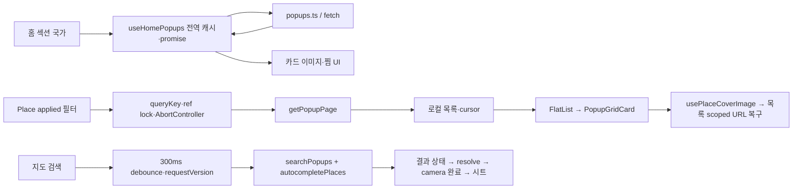

# POPKU RN Architecture & Performance Audit

> 진단일: 2026-10-08 / 대상: `C:\dev\popku-rn`의 현재 작업 트리 / 방식: 정적 분석, 기존 테스트, TypeScript 검사, 파일을 만들지 않는 mock 기반 코드 진단.
> iPhone·Xcode·Instruments 실행, 실제 API 호출, 실제 반복 시나리오 및 FPS 측정은 수행하지 않았다. 소스·설정·패키지·테스트를 수정하지 않았으며 본 보고서만 생성했다.
> 파일 근거의 줄 번호는 진단 당시 기준이다. 범위 표기 `파일:시작–끝`은 코드 구간을 뜻한다.

## 1. Executive Summary

전체적으로 화면별 AbortController, 요청 generation, 동기 ref lock, 이벤트 구독 해제와 커뮤니티 mutation version 방어가 구현돼 있다. Native Stack과 지도 시트 Reanimated는 유지할 구조다. 다만 출시 설정, Native Stack의 화면 이탈 방어, 인증 작업 완료 시 세션 격리와 기존 테스트의 유효성은 출시 전에 정리해야 한다.

사용자가 관찰한 약 1GB는 **실기기 관찰 정보**이며 본 진단의 측정값이 아니다. 정상적인 탭 유지, 이미지 디코딩·캐시·blur surface, 지도 SDK 리소스, 디버그 환경이 함께 포함될 수 있다. 코드에서 지속 증가 가능한 JS 캐시도 찾았지만, 이것이 1GB의 주원인이라는 근거는 없다.

| 분류 | 항목 수 | 판단                                               |
| ---- | ------: | -------------------------------------------------- |
| P0   |       0 | 현재 근거로 치명적 출시 차단을 확정하지 않음       |
| P1   |       4 | 출시 전 수정·정리 강력 권장                        |
| P2   |       8 | 데이터 일관성·확장 성능 개선 대상                  |
| P3   |       3 | 측정 또는 정책 확인 후 판단할 관찰 항목            |
| 합계 |      15 | 결함 확정 수와 같지 않음. P2/P3에는 위험 후보 포함 |

가장 먼저 처리할 세 가지는 F01 개발 LAN 주소 고정, F02 Native Stack과 직접 beforeRemove 방어의 호환성, F03 이전 인증 작업이 새 세션을 변경하는 경로다. F04 테스트 회복을 함께 진행해야 이 변경들의 회귀를 검증할 수 있다.

- **코드 경로와 mock 진단으로 확인:** 이전 logout 완료가 새 세션을 삭제한다(F03).
- **구현·라이브러리 근거로 확인:** 작성 화면 세 곳이 Native Stack에서 직접 beforeRemove.preventDefault를 사용한다(F02).
- **정적 사실:** 확대 지도는 viewport 밖을 포함한 전체 필터 마커를 만들고, 닫힌 시트도 마운트된다(F06/F11).
- **정상 방어 확인:** 빠른 검색·필터·페이지 요청, 좋아요 rollback, 기존 GET의 늦은 좋아요/댓글 수 응답 보호, 많은 401 generation 방어.
- **검증 결과:** TypeScript 통과. 기존 38개 테스트 파일 실행에서 runner 기준 350건 중 245 통과, 105 실패. 일부 파일은 초기화 실패로 내부 테스트가 실행되지 않았다.

## 2. Project Architecture

### 2.1 라우팅과 화면 유지

```text
Root Native Stack — src/app/_layout.tsx
├─ (tabs) — Bottom Tabs + FloatingTabBar
│  ├─ index → HomeScreen
│  ├─ places → 하위 Native Stack → index → PlaceScreen
│  ├─ map → MapScreen.native (web은 별도 구현)
│  ├─ community → CommunityScreen
│  └─ profile → 하위 Native Stack
│     ├─ index / login / signup / favorites
│     ├─ posts / reviews / settings / withdrawal / nickname / password
│     ├─ inquiries/index / inquiries/[id] / inquiries/write
│     └─ notices/index / notices/[id]
├─ places/[id] → 팝업 상세
├─ community/[id] / community/write
├─ reviews/[id] / reviews/write
└─ profile/policies/index / terms / privacy / location
   (명시적 Stack.Screen 선언 없이 파일 라우팅으로 포함)
```

| 구조                | 코드 근거                                                                                          | 유지·복귀 방식                                                                                          |
| ------------------- | -------------------------------------------------------------------------------------------------- | ------------------------------------------------------------------------------------------------------- |
| Root                | `src/app/_layout.tsx:7–43`                                                                         | Stack import는 설치 Expo Router의 Native Stack. 상세 push 동안 이전 route는 유지, pop 시 해당 상세 제거 |
| Native 구현 확인    | `node_modules/expo-router/build/layouts/StackClient.js:9–18`                                       | createNativeStackNavigator 사용. JS Stack 복귀 제안 없음                                                |
| 하위 Stack          | `src/app/(tabs)/places/_layout.tsx:4`, `profile/_layout.tsx:4`                                     | 헤더 숨긴 Native Stack                                                                                  |
| Bottom Tabs         | `src/app/(tabs)/_layout.tsx:7–17`                                                                  | 방문한 탭을 보존. profile만 popToTopOnBlur=true                                                         |
| 설치 탭 기본 동작   | `node_modules/expo-router/build/react-navigation/bottom-tabs/views/BottomTabView.js:75–85,175–202` | lazy=true로 첫 방문 전 미렌더링. 방문 후 loaded에 남음. native 화면 detach와 JS unmount는 다른 동작     |
| 지도                | `src/screens/MapScreen.native.tsx:602–758`                                                         | focus 조건 없이 MapView 렌더. 홈 이동 후 React 트리·map ref 유지 가능                                   |
| 지도에서 홈         | `MapScreen.native.tsx:907`                                                                         | router.replace("/")로 탭 홈 이동. Root의 상세 pop과 동일하지 않음                                       |
| 상세에서 지도       | `src/app/places/[id].tsx`의 지도 Pressable, `tests/mapSearch.test.cjs:519–551`                     | dismissTo로 기존 탭까지 POP_TO 후 popupId 전달. 기존 지도 key 보존 테스트 통과                          |
| 중복 상세 이동 방지 | `src/hooks/usePopupNavigation.ts:7–19`                                                             | focus별 ref lock, focus에서 해제                                                                        |
| FloatingTabBar      | `src/components/navigation/FloatingTabBar.tsx:205–222,342`                                         | tabPress 이벤트 먼저 발행. 같은 탭이면 이동 없이 이벤트 전달. 지도 탭에서는 탭바 자체 미렌더            |
| 바텀시트·모달       | `MapScreen.native.tsx:759–780`, `PlaceFilterSheet.tsx:103–155`, `CommunityPostMenu.tsx:16–64`      | 지도 시트는 overlay View, 필터·게시글 메뉴는 별도 Modal/Animated 구조                                   |

탭 및 push 아래 화면이 유지되는 것은 정상적인 내비게이션 동작이다. 이전 화면의 이미지·MapView·타이머가 계속 필요한지는 별도 자원 정책 문제다. detachInactiveScreens가 뷰를 분리해도 지도 SDK 자원까지 해제된다고 단정할 수 없다. 앱 코드에 enableFreeze 또는 명시적 freezeOnBlur 설정은 없으며, 이것만으로 모든 네이티브 동작을 단정하지 않는다.

스크롤 복원은 대부분 별도 직렬화 없이 **동일 화면·목록 인스턴스 유지**에 의존한다. 앱 프로세스 종료 뒤 필터·목록·스크롤을 복원하는 저장 구현은 확인되지 않았다. 문의·공지 목록은 focus 때 첫 페이지로 초기화한다.

### 2.2 상태·캐시 계층

앱 소스에서 사용자 정의 createContext/useReducer, Redux/Zustand/TanStack Query/axios는 확인되지 않았다. React useState/useRef, useSyncExternalStore와 모듈 단위 store/listener Set을 조합한다. 라우터·SafeArea 등의 Context는 라이브러리 제공 Context다.

| 소유자                   | 상태·저장 위치                                         | 수명·공유                                                                                   |
| ------------------------ | ------------------------------------------------------ | ------------------------------------------------------------------------------------------- |
| auth.ts                  | authUser, authGeneration, serialized tokenWrites       | 프로세스 전역. Access/Refresh Token은 SecureStore                                           |
| favoriteCache.ts         | popups, favoriteIds, generation/sessionGeneration      | 전역 찜 데이터. 로그인·로그아웃·identity 변경 시 초기화                                     |
| communityFeedRefresh.ts  | likes, counts, postChanges, deletions, reads, revision | 전역 mutation 동기화. liked/count 최근 기록 일부는 256 tail, postChanges에는 크기 제한 없음 |
| useHomePopups.ts         | section:country별 cache/requests/listeners             | 전역 4개 key, TTL 10분, 진행 promise 공유                                                   |
| useHomeMainBanners.ts    | locale별 cache/requests/listeners                      | 전역 언어별, freshness 4분                                                                  |
| filterOptions.ts         | KR/JP regions, tags, 공유 promise                      | 전역, TTL 없음. 현재 언어·국가 범위는 제한적                                                |
| PlaceScreen              | applied/draft 필터, 검색어, 목록·cursor·request        | 화면 로컬. filter queryKey별 기존 요청 abort 및 초기화                                      |
| PlaceWeeklySection       | Map<국가·주, 데이터·fetchedAt>                         | useRef, 화면 수명 동안 누적, freshness 4분은 삭제 정책이 아님                               |
| MapScreen + useMapPopups | 지도 전체 데이터, 위치·bounds·태그·검색·선택·시트      | 탭 화면 로컬, 첫 방문 후 유지                                                               |
| CommunityScreen          | posts/cursor/카테고리/요청 generation                  | 화면 로컬. 작성 revision·세션·필터 변경 시 첫 페이지                                        |
| 상세·작성 화면           | 상세 응답, 댓글, 폼, 업로드 attempt                    | 로컬. 작성 초안의 영속 저장소 없음                                                          |
| MapPopupPreviewCard      | imageAspectRatios Map<URL, ratio>                      | 모듈 전역, eviction 없음                                                                    |

국가 선택은 앱 전역 단일 상태가 아니다. 홈 인기/신규 섹션의 selectedCountry는 각각 독립이고 Place의 country, 지도의 selectedTag·camera도 독립이다. 제품상 동기화 요구가 확정되지 않았으므로 이를 결함으로 판단하지 않는다.

### 2.3 API 및 주요 데이터 흐름

공통 base URL만 `src/constants/api.ts:1`에서 공유한다. 도메인별 fetch 함수가 헤더·JSON 검증·오류를 각각 처리한다. 공통 timeout·refresh interceptor·모든 요청을 포괄하는 취소 관리자는 없다. 공개 API는 기본 무인증 또는 선택적 Bearer, 개인 API는 Bearer, JSON mutation에는 Content-Type을 사용한다.



```text
커뮤니티 GET 시작 → beginCommunityRead의 version 등록
→ 선택적 세션 포함 fetch → 서버 응답 파싱
→ like/count/edit/delete version 병합 → 화면 목록/상세 state → UI
→ finally/abort에서 read 등록 해제

좋아요 press → 전역 type:id lock → 세션 확인 → optimistic publish
→ POST like → 서버 상태 publish 또는 rollback → feed/detail 구독 갱신

이미지 작성 → picker → 순차 native decode/resize/release
→ presign → 로컬 ArrayBuffer → S3 PUT → uploadToken 포함 commit
→ revision/patch publish → 이전 화면 복귀
```

주요 근거: `src/lib/community.ts:73–84,121–153,182–206`, `communityFeedRefresh.ts:51–62,110–164`, `communityLikes.ts:14–45`, `communityImages.ts:35–57,101–181`.

### 2.4 문서·의존성 기준

package.json 기준 Expo ~57.0.25, RN 0.86.3, React 19.2.3, Expo Router ~57.0.23, Reanimated 4.5.1, react-native-maps 1.27.2, Supercluster 8.0.1이다. `app.json`의 reactCompiler=true도 확인했다. useMemo/useCallback의 부재만으로 문제를 판정하지 않았으며 실제 compiler 산출물 최적화 범위는 미검증이다.

`docs/ARCHITECTURE.md:5`, `docs/DECISIONS.md:7`은 Flutter를 기술하여 현재 구현과 다르다. `docs/IOS_PROMOTION_60HZ_ISSUE.md`의 JS Stack 관련 과거 조사도 현재 Root Native Stack과 구분한다. 문서는 이번 작업에서 수정하지 않았다. API 문서의 signed GET 5분·커서 계약은 문서 근거이고 서버 구현을 감사한 결과가 아니다.

## 3. Memory Analysis

### 3.1 근거 수준 및 화면 생명주기

| 대상             | 시작 작업                                              | 정리·방어                                                                                             | blur 이후 유지 가능 자원                                                                      |
| ---------------- | ------------------------------------------------------ | ----------------------------------------------------------------------------------------------------- | --------------------------------------------------------------------------------------------- |
| 홈               | 배너/인기/신규 GET, 찜 session 조회                    | hook timer clear, store unsubscribe                                                                   | 화면·이미지·4/10분 갱신 timer. 공유 GET은 controller를 보관하지 않아 unmount 때도 취소 안 됨  |
| Place            | regions/tags, 종료 임박, 주간, 전체 진입 시 페이지     | queryKey/unmount abort, cover reset, 옵션 active guard, interval clear                                | 목록·주간 캐시·숨긴 탐색 이미지, 서울 날짜 60초 timer                                         |
| 지도             | map GET, 위치 권한 조회, Keyboard listener             | map GET unmount abort, 검색 debounce/abort/version, keyboard remove, resolve abort, 애니메이션 cancel | MapView·마커·시트 FlatList·검색 상태. 일반 blur cleanup 없음                                  |
| 팝업 상세        | session → 상세 GET                                     | id/authUser/locale effect abort                                                                       | push 아래에 남아 있는 동안 hero·정보/리뷰 탭. pop 이후 React 상태는 제거 대상                 |
| 커뮤니티 목록    | focus 조건 충족 시 feed GET, 60초 clock, mutation 구독 | unmount abort/generation++, 구독 해제                                                                 | blur에도 목록·GET 유지. clock은 AppState active면 탭 비활성에도 tick                          |
| 게시글/리뷰 상세 | 상세 GET, 댓글 GET, clock, typed mutation 구독         | GET effect abort·unsubscribe·clock 정리                                                               | 추가 push 시 기존 상세 유지. 단순 back으로 제거된 상세가 JS store에 전체 캐시되는 구조는 없음 |
| PopupReviews     | 탭 선택으로 mount 시 GET, 리뷰/세션 구독               | unmount/ID/revision abort, clock 정리                                                                 | 리뷰 탭 동안 받은 모든 페이지·이미지. 정보 탭으로 전환하면 해당 subtree 제거                  |
| 찜 목록          | 매 focus GET                                           | blur abort/active=false                                                                               | 전역 찜 cache 및 현재 ScrollView 이미지                                                       |
| 내가 쓴 글       | 첫 focus GET, 필요 시 next page                        | blur abort, session reset, typed 이벤트 unsubscribe                                                   | 완료 데이터·cursor 유지                                                                       |
| 내가 쓴 리뷰     | mount/revision GET                                     | unmount abort, session reset                                                                          | 상세 push 중 요청·목록 유지                                                                   |
| 문의/공지        | focus GET                                              | blur abort, 개인 문의는 session generation 검증                                                       | 화면 로컬 데이터. focus 복귀 때 목록 reset                                                    |
| 작성             | picker/변환·presign·PUT·commit                         | mounted guard 일부, beforeRemove 구독 해제, native image release                                      | 요청 취소/전체 timeout 없음. 이탈 시 mutation 자체는 계속될 수 있음                           |
| 가입             | 단계·카운트다운·메일/닉네임 요청                       | timer clear, requestVersion, nickname abort                                                           | 메일 전송·검증·가입 mutation에 AbortSignal 없음                                               |
| 계정 설정        | focus, availability/PATCH                              | blur abort, 세션 변경 abort·비밀번호 삭제                                                             | 성공 응답도 auth generation 검증. 현재 방어 유지                                              |

근거: `useHomePopups.ts:20–62`, `useHomeMainBanners.ts:17–55`, `PlaceScreen.tsx:151–244`, `MapScreen.native.tsx:293–348,503–586`, `useMapPopups.ts:37–48`, `CommunityScreen.tsx:101–222`, `useCommunityNow.ts:7–15`, `PopupReviews.tsx:27–65`, `AccountSettingsScreen.tsx:49–62`, `profile/signup.tsx:178–204`.

앱 독자적인 watchPosition 구독은 없고 getCurrentPositionAsync는 일회성이다. AppState는 상대시간 hook에 사용하며 홈·지도·Place의 데이터 refresh를 총괄하지 않는다. 등록된 구독·키보드·AppState·타이머의 반복 누적을 확정할 만한 해제 누락은 주요 경로에서 발견하지 못했다. 다만 일회성 위치/이미지 size promise의 실제 네이티브 작업은 boolean guard로 취소되지 않는다.

### 3.2 이미지 전수 분류

표에서 RN Image는 앱의 명시적 memory/disk 정책이 없는 기본 네이티브 이미지 파이프라인을 뜻한다. 캐시가 전혀 없다는 의미가 아니다. expo-image의 설치 타입은 cachePolicy 기본 disk, allowDownscaling 기본 true다(`node_modules/expo-image/src/Image.types.ts:240–254,411–419`). 명시적 resize 코드가 없다는 이유로 원본 전체가 항상 decode된다고 단정할 수 없다.

| 이미지             | 컴포넌트·근거                                                                   | 캐시/프리로드                                           | 중복·화면 밖·실패·원본 크기                                                                                                                               |
| ------------------ | ------------------------------------------------------------------------------- | ------------------------------------------------------- | --------------------------------------------------------------------------------------------------------------------------------------------------------- |
| 홈 인기 썸네일     | `PopupRankingCard.tsx:2,33`, `HomeTrendingSection.tsx:38,70–90`                 | RN Image, URI, 명시적 prefetch 없음                     | 최대 10개를 View로 전부 렌더. URL 없으면 placeholder, 네트워크 onError fallback 없음. remote 픽셀 크기 확인 필요                                          |
| 홈 신규 썸네일     | `NewPopupCard.tsx:2,36`, `HomeNewPopupSection.tsx:69–95`                        | RN Image, URI                                           | 최대 7개 표시, 수평 ScrollView 비가상화. URL 없을 때만 placeholder                                                                                        |
| 홈 배너            | `HomeBanner.tsx:32–44,118–132,156–203`                                          | expo-image memory-disk, 서버 cacheKey                   | 모든 배너를 ScrollView에 생성, 동일 cover의 blur 배경+포스터. onError로 이미지 숨김. decode/surface 공유 여부는 측정 필요                                 |
| Place 전체 썸네일  | `PopupGridCard.tsx:64–72`, `usePlaceCoverImage.ts:19–53`                        | memory-disk + 서버 key, stale disk 확인/URL 복구        | FlatList viewport window. 이미지 identity guard·목록 scoped 1회 복구. fresh URL의 일반 오류에는 visible fallback 보장 없음                                |
| Place 주간         | `PlaceWeeklyPopupList.tsx`의 Image, `PlaceWeeklySection.tsx:138,301`            | RN Image, URI                                           | 최대 9개·3개씩 page, API 추가 요청 없는 내부 페이지. remote 원본·TTL 실패 확인 필요                                                                       |
| 종료 임박          | `TodayOpeningCarousel.tsx:64–78,199–250`                                        | expo-image 기본 disk, URI. getCachePathAsync는 DEV 진단 | 최대 7개, 기본 FlatList 첫 render window가 전체를 포함할 수 있음. 배경+BlurView+포스터, 서버 key 미사용. DEV onError는 로그, 사용자 fallback 아님         |
| 상세 대표          | `PopupHeroImage.tsx:17–33`, `places/[id].tsx:447–452`                           | RN Image, 서버 key 전달 없음                            | 동일 URI cover+blur/contain 두 뷰. 전경 onError placeholder. 실제 duplicate download/decode는 미확인                                                      |
| 상세 추가          | `IntroductionImageCarousel.tsx:17–34,45–79`                                     | RN Image, 모든 URI에 getSize. 명시적 prefetch 없음      | 화면 표시 1/배치1/window3. size는 모든 이미지에 미리 요청, 네이티브 작업 취소 API 없음. 실패 문구, 원본 비율에 따라 매우 긴 높이 가능                     |
| 커뮤니티 게시글    | `CommunityPostItem.tsx:312–315`, `CommunityImageCarousel.tsx:20–36`             | RN Image, URI                                           | feed 첫 이미지 및 상세 carousel. 상세 이미지 수 최대5 생성 경로, 기본 initial window로 여러 이미지 유지 가능. carousel onError UI 없음                    |
| 방문 리뷰          | `CommunityPostItem.tsx:49,263–290`, `reviews/[id].tsx:302–370`                  | RN Image, URI                                           | feed 최대3장, 상세 carousel. PopupReviews는 받은 행 전부 렌더. 업로드는 최대5장/long edge1600, 서버 전체 이미지 크기를 보장한 검증은 아님                 |
| 프로필·작성자      | `CommunityAuthor.tsx:17–20`, `CommunityPostItem.tsx:104–106`                    | RN Image 또는 아이콘                                    | Author는 실패 UserRound. feed 작성자 이미지의 별도 실패 처리 확인 필요. 현재 My Page에는 실제 profile Image 참조가 없으므로 avatar API 호출로 채우지 않음 |
| 카테고리 배너      | `PlaceInterestSection.tsx:24–40,68–72`                                          | 로컬 WebP, memory-disk                                  | 4개 모두 렌더, prefetch/onError 없음. 아래 파일 header 크기 확인                                                                                          |
| 지역 배너          | `PlaceRegionSection.tsx:84–85,118`, `placeRegionMocks.ts:18–49`                 | 로컬 PNG 8개, memory-disk                               | KR/JP 두 page 모두 initialNumToRender, clipping=false로 유지. 고정8개이므로 무한 증가 구조는 아님                                                         |
| 지도 목록/미리보기 | `MapPopupListSheet.tsx:64–70,111–121`, `MapPopupPreviewCard.tsx:18,30–51,69–73` | RN Image, URL ratio Map                                 | 닫힌 시트도 FlatList 존재. preview getSize guard, URL 단위 ratio eviction 없음. 이미지 실패 placeholder 전환 없음                                         |
| 상세 정적 지도     | `StaticMapImage.tsx:15–28`                                                      | RN Image, Google Static Maps URL                        | size 최대640×200, scale2 → 요청 최대1280×400. JS API 클라이언트 호출이 아닌 Image URL 로드. 실패 안내 없음                                                |

명시적 Image.prefetch/라우트 prefetch 호출은 앱 소스에서 발견하지 못했다. getSize는 표시 전 메타데이터 조회지만 전송·decode 비용이 없다고 보장할 수 없다. RN Image와 expo-image 간 캐시 공유도 앱 코드만으로 보장되지 않는다.

**압축 크기와 decode 메모리:** 32bit RGBA 한 버퍼의 대략적 크기는 픽셀 너비×높이×4다. 1600×1600은 약9.77MiB, 4000×3000은 약45.78MiB다. 이는 메모리 예시이며 실제 앱 allocation 측정값이 아니다. 표시 dp에 device pixel ratio가 적용되며 downsampling, GPU texture, blur intermediate, native cache에 따라 달라진다. WebP 파일이 작아도 픽셀 수가 같으면 RGBA 예시는 동일하다. WebP 재적용을 권장하지 않는다.

로컬 파일 header에서 읽은 수치(디코딩하지 않음):

| 로컬 이미지                     | 압축 bytes | 픽셀      | 전체 RGBA 버퍼 예시 MiB |
| ------------------------------- | ---------: | --------- | ----------------------: |
| categories/anime-character.webp |     26,264 | 768×338   |                    0.99 |
| categories/beauty.webp          |     18,522 | 1024×539  |                    2.11 |
| categories/fashion.webp         |     35,674 | 840×609   |                    1.95 |
| categories/game-digital.webp    |     13,512 | 960×325   |                    1.19 |
| regions/seongsu.png             |    818,426 | 750×500   |                    1.43 |
| regions/hongdae.png             |  1,753,126 | 1280×853  |                    4.17 |
| regions/yeouido.png             |    769,588 | 852×584   |                    1.90 |
| regions/gangnam.png             |  1,491,679 | 1152×648  |                    2.85 |
| regions/tokyo.png               |  1,816,508 | 1100×733  |                    3.08 |
| regions/osaka.png               |  1,165,772 | 800×534   |                    1.63 |
| regions/kyoto.png               |  2,185,735 | 1448×1086 |                    6.00 |
| regions/nagoya.png              |  1,228,545 | 1000×667  |                    2.54 |

지역8개의 전체 원본 RGBA 예시 합계는 약23.6MiB다. 실제 downsample 결과가 더 작을 수 있으며 이 수치로 1GB를 설명할 수 없다. remote cover/content/avatar의 크기·Content-Length·cache hit는 확인 필요다.

이미지 첨부 변환은 full-resolution EXIF decode 후 resize하므로 순간 peak는 1600 이미지보다 클 수 있다. 그러나 `communityImages.ts:35–57,80–90`은 순차 변환 및 rendered/context.release를 구현했다. 이를 해제 누락으로 판정하지 않는다.

### 3.3 지도 메모리·이벤트

| 항목          | 확인 결과                                              | 의미                                                                                      |
| ------------- | ------------------------------------------------------ | ----------------------------------------------------------------------------------------- |
| 마운트        | MapView provider=Google, focus gate 없음               | 최초 지도 방문 후 탭 유지 동안 native 객체 점유 가능                                      |
| map 데이터    | GET /api/popups/map 전체 결과를 로컬 state 유지        | 페이지·viewport 서버 조회 아님. 실제 N은 확인 필요                                        |
| 마커          | latitudeDelta <0.20이면 모든 valid filteredPopups 생성 | viewport 밖 마커도 포함(F06)                                                              |
| 큰 범위       | Supercluster + bounds getClusters, memoized index      | 기존 방어 유지. 작은 범위 분기에도 viewport 적용 검토                                     |
| 마커 뷰       | View/Text/SVG/MaterialIcons, tracksViewChanges=false   | remote marker image 없음. 네이티브 snapshot/texture 비용은 남을 수 있음                   |
| 마커 key      | popup.id-isSelected, cluster tag/id/count              | 선택 상태 시 remount는 marker snapshot 갱신 목적 가능. 무조건 stable id만으로 바꾸지 않음 |
| markerHeights | id-selected별 높이 record                              | 현 데이터 N에서 대략 최대2N 종류. refresh로 ID가 늘면 정리 없음                           |
| camera        | onRegionChange는 ref, complete에서 region/bounds state | 매 frame React setState 구조는 아님. 완료마다 전체 marker subtree 재평가 가능             |
| 이벤트        | MapView props, Keyboard listener 2개, location 1회     | Keyboard remove 있음. 사용자 JS watch subscription 없음                                   |
| 검색          | 300ms, 두 API 병렬, version+abort, resolve lock        | 정상적인 stale 응답 방어                                                                  |
| 시트          | Reanimated translateY, 닫혀도 View/FlatList 유지       | pointerEvents=none은 메모리 해제가 아님                                                   |
| 재진입        | useMapPopups focus는 실패 상태만 재시도                | 성공한 map 데이터/서명 URL은 자동 fresh 재조회하지 않음                                   |
| tile/cache    | 앱에 native tile cache limit/flush 구현 없음           | Google SDK 내부 메모리·tile/Metal cache는 JS 분석으로 확정 불가                           |

관련 근거: `MapScreen.native.tsx:208–269,293–346,550–587,649–778`, `useMapPopups.ts:12–48`. 카메라 완료의 console.log가 DEV 조건 밖에 있다(`MapScreen.native.tsx:655`). 이벤트별 한 번이므로 실제 프레임 병목을 단정하지 않으며 trace에서 확인한다.

### 3.4 메모리 반복 시나리오 A–F

아래는 실제 10회 실행 결과가 아니라 **코드 기준 유지 추적**이다.

| 시나리오                    | 화면·이미지                                                                                                       | 이벤트·상태·API                                                                                                 | 판단·실기기 확인                                                                       |
| --------------------------- | ----------------------------------------------------------------------------------------------------------------- | --------------------------------------------------------------------------------------------------------------- | -------------------------------------------------------------------------------------- |
| A 홈→상세→복귀×10           | home 유지, 매 상세 mount 후 pop. hero 두 layer·추가 size/정적지도는 각 상세에서 로드, native cache는 남을 수 있음 | 상세 GET abort cleanup. 정상 back에서 상세10개가 stack에 쌓이는 경로 아님. 홈 shared timer 계속                 | 같은 ID와 서로 다른 ID를 별도 실행. 정상 캐시 plateau인지 live 상세 객체 증가인지 확인 |
| B 홈→지도→홈×10             | 일반 탭 전환에서 지도 한 인스턴스 및 tile/marker/list 이미지 유지                                                 | map 최초 GET, 성공 후 focus만으로 반복 GET 없음. 홈 timer·지도 keyboard listener 유지                           | 10개의 MapView 생성으로 단정하지 않음. native view 수와 반환 후 plateau 확인           |
| C 지도→시트→상세→지도×10    | 시트 닫기 상태와 관계없이 FlatList 존재. 지도는 상세 아래 유지                                                    | openPopup focus lock; back 후 지도 상태/scroll 유지; 상세 GET별 cleanup                                         | 확대 전체마커·시트 이미지·SDK 합산 peak 조사                                           |
| D community→상세→복귀×10    | feed 유지, detail/comments pop 시 제거. 이미지 native cache 가능                                                  | 상세/댓글 GET, clock·구독 cleanup. 일반 focus feed refetch 없음                                                 | 상세 native 객체/listener 개수 plateau와 cache 구분                                    |
| E Place 국가/지역/태그 반복 | 현재 query 목록 교체, hidden explore 이미지 유지. 주 이동도 하면 week cache 누적                                  | queryKey abort + cursor reset, 옵션 promise 공유, 빠른 태그 draft는 API 없음                                    | 동일 필터 반복은 무한 cache key 생성 아님. 고유 주·URL 증가 패턴 따로 측정             |
| F 로그인→로그아웃→재로그인  | 개인 favorite/like 전역 데이터 삭제, 공개 home/filter cache 유지                                                  | generation 및 serialized writes 방어. 늦은 logout은 새 login 삭제 가능(F03); Root 인증 이동은 새 tabs 가능(F05) | 순차와 네트워크 지연·탭 이탈을 섞은 교차 시나리오 구분                                 |

## 4. Rendering & Animation

### 4.1 렌더링 평가

실제 frame time/JS commit time을 측정하지 않았으므로 **실측 성능 문제는 확인하지 못했다**. 다음은 구현으로 확인한 비용 구조와 병목 후보다.

| 분류                 | 근거                                                                                       | 평가                                                                                                                          |
| -------------------- | ------------------------------------------------------------------------------------------ | ----------------------------------------------------------------------------------------------------------------------------- |
| 비용 증가 경로 확인  | `MapScreen.native.tsx:238–262,671–756`                                                     | 작은 delta에서 전체 N marker 생성. dense 데이터에서 native snapshot·bridge/UI 비용 후보                                       |
| 비용 증가 경로 확인  | `profile/favorites.tsx:67–98`, `PopupReviews.tsx:103–115`, `CommunityComments.tsx:337–460` | 받은 목록 전체 렌더, 데이터가 많으면 이미지·레이아웃 누적(F07)                                                                |
| 정상적인 작은 목록   | `HomeTrendingSection.tsx:38`, `HomeNewPopupSection.tsx`                                    | 최대10/7, 고정 수라 ScrollView만으로 결함 아님                                                                                |
| 가상화 정상          | Place/Community/MyPosts/MyReviews/문의/공지/지도시트                                       | FlatList, 안정적 publicId/type:id/id key. 별도 window 설정이 없다는 이유만으로 문제 아님                                      |
| 추가이미지 정상 방어 | `IntroductionImageCarousel.tsx:56–60`                                                      | initial1/batch1/window3/getItemLayout. 전체 getSize와는 별도                                                                  |
| 의도적 자원 유지     | `PlaceRegionSection.tsx:83–85`                                                             | 지역2page 고정 유지. zero layout 시 복원 목적. 실측 없는 일괄 clipping 변경 금지                                              |
| 부모 상태 전파 후보  | `CommunityScreen.tsx:282–334`, `PlaceScreen.tsx:397–540`                                   | inline renderItem/extraData 및 now·favorite 변경으로 visible 행 재평가 가능. React Compiler 효과와 실제 commit을 측정 후 결정 |
| clock 비용           | `useCommunityNow.ts:8–12`                                                                  | 화면별 한 timer, 60초 한 번. 모든 행별 timer 구조가 아님                                                                      |
| 렌더 계산            | Place 검색 filter, 리뷰 append.some, 댓글 sort/group, 지도 filter/index                    | Place 검색은 받은 페이지 전체 대상 O(N). 리뷰 append는 O(N×page), 댓글 insert는 그룹화 반복. 실제 규모 필요                   |
| scroll 상태          | `PlaceScreen.tsx:417–421`, `places/[id].tsx:441–444`                                       | 매 이벤트 setter 호출하지만 동일 boolean이면 React bailout 가능. 매 frame 실제 전체 commit으로 단정하지 않음                  |
| layout 비용          | `MapScreen.native.tsx:716–722`, `IntroductionImageCarousel.tsx:38–41`                      | marker onLayout은 동일 height guard. 이미지 page 비율 변경은 viewport height 재계산                                           |

useMemo는 Supercluster index·visiblePopups 등에 이미 쓰인다. callback/memo를 추가하는 권고는 profiler에서 반복 commit이 확인되는 항목으로 제한한다. key에 selected가 포함된 marker는 기존 시각 갱신을 검증한 뒤 변경해야 한다.

### 4.2 애니메이션 및 내비게이션

| 대상                        | 실행 방식·cleanup                                        | 평가                                                                                                                                                |
| --------------------------- | -------------------------------------------------------- | --------------------------------------------------------------------------------------------------------------------------------------------------- |
| Root/하위 Native Stack      | UIKit/native-stack 기본 card·horizontal gesture          | 현재 정상 구조 유지. 이번 FPS 측정 없음. 사용자 제공 120FPS 확인과 신규 진단 결과 구분                                                              |
| 지도 시트                   | `MapScreen.native.tsx:280–283,550–557`                   | shared value + UI worklet withTiming, cleanup cancelAnimation. 관련 기존 코드/mock 검사 통과; 실제 open/close 프레임 측정 없음                      |
| 지도 preview/action         | `MapScreen.native.tsx:572–587`                           | Animated native driver, cleanup stopAnimation, 종료 때만 preview state 삭제                                                                         |
| FloatingTabBar spring/scale | `FloatingTabBar.tsx:80–99,138–159,303–333`               | native driver, scale listener remove, indicator effect animation.stop. 직접 시작한 일부 finite scale/snap animation에는 일괄 unmount stop 없음(F14) |
| 탭바 drag                   | `FloatingTabBar.tsx:224–268`                             | PanResponder move가 JS에서 indicator.setValue/nearestIndex. previewIndex는 값 변경 때만 갱신. JS block 시 drag 영향 후보, native spring과 구분      |
| 주 선택 drag                | `PlaceWeeklySection.tsx:150–209`                         | PanResponder JS 입력, native timing 후 selectedWeek 변경. animation 매 frame setState 아님. 포괄 stop cleanup 없음(F14)                             |
| PlaceFilterSheet            | `PlaceFilterSheet.tsx:103–155`                           | 기존 animation.stop, native driver, unmount cleanup. drag 입력은 JS                                                                                 |
| CommunityPostMenu           | `CommunityPostMenu.tsx:28–57`                            | native driver, translate/opacity.stopAnimation cleanup. iOS Modal dismiss 후 action 실행                                                            |
| SkeletonBlock               | 단순 View 스타일                                         | 독자 반복 애니메이션/timer 없음                                                                                                                     |
| 작성 화면 이탈 방어         | community/write:75, reviews/write:60, inquiries/write:15 | 직접 beforeRemove.preventDefault는 native-stack에서 완전 지원되지 않음(F02)                                                                         |

직접 beforeRemove 방어의 한계는 설치된 `useDismissedRouteError.js:45–49`와 [React Navigation navigation-events](https://reactnavigation.org/docs/navigation-events/)에서도 확인된다. 네이티브 swipe로 화면이 제거된 뒤 JS state가 남는 충돌 가능성이 있어 실제 작성 중 swipe 테스트가 필요하다. **Native Stack을 유지한 채** 지원되는 usePreventRemove 경로를 검토한다.

## 5. API Inventory

총 **59개 호출 단위**를 분류했다. 같은 endpoint라도 화면의 생명주기·상태 방어가 다르면 별도 행으로 기록했다. 전체 API 서버 명세가 아니라 RN의 활성 호출 경로 목록이며, 사용처가 없는 `getPopups`(`src/lib/popups.ts:147`)은 제외했다. 행 A29는 HTTP 서버 요청 외 로컬 이미지 읽기도 명시한다. 이미지 CDN·Google static-map 요청은 이미지 컴포넌트가 수행하므로 §3의 이미지 표로 분리했다.

표를 두 개로 나눴으며 **동일 ID를 연결하면 요청당 16개 조사 항목을 모두 확인할 수 있다.** '없음'은 해당 경로의 구현에서 찾지 못했다는 뜻이다. 서버 내부 캐시·중복 처리·SDK 내부 네트워크는 확인 필요다. 아래 경로의 query 이름은 생략 표기하며 실제 값은 코드가 encode한다.

### 5.1 호출 경로·조건

| ID  | 화면·함수 / 근거                                                                                                                                                                 | Method              | API 경로                                                                                          | 호출 시점·effect 의존성                                                                                                   | focus / 필터 재호출                               |
| --- | -------------------------------------------------------------------------------------------------------------------------------------------------------------------------------- | ------------------- | ------------------------------------------------------------------------------------------------- | ------------------------------------------------------------------------------------------------------------------------- | ------------------------------------------------- |
| A01 | 홈 배너 / getMainBanners<br>`src/lib/mainBanners.ts:13`, `src/hooks/useHomeMainBanners.ts:16–61`                                                                                 | GET                 | /api/main-banners?languageCode                                                                    | mount·언어 변경·4분 타이머; [languageCode], [entry,languageCode]                                                          | focus 전용 없음 / 언어                            |
| A02 | 홈 인기 / getNowHotPopups<br>`src/lib/popups.ts:219`, `src/hooks/useHomePopups.ts:20–69`                                                                                         | GET                 | /api/home-curations/NOW_HOT?countryCode                                                           | mount·국가·10분 타이머; [section,country], [entry,section,country]                                                        | 없음 / 국가                                       |
| A03 | 홈 신규 / getNewPopups<br>`src/lib/popups.ts:214`, `src/hooks/useHomePopups.ts:20–69`                                                                                            | GET                 | /api/popups?countryCode&openingFrom&openingTo&homeNew=true&limit=8                                | A02와 동일                                                                                                                | 없음 / 국가                                       |
| A04 | 지도 / getPopupMap<br>`src/lib/popups.ts:125`, `src/hooks/useMapPopups.ts:12–49`                                                                                                 | GET                 | /api/popups/map                                                                                   | mount·명시 refresh; effect [refresh]                                                                                      | 실패했을 때만 focus / 지도 필터는 로컬            |
| A05 | 지도 팝업 검색 / searchPopups<br>`src/lib/popups.ts:136`, `src/screens/MapScreen.native.tsx:304–346`                                                                             | GET                 | /api/popups/search?q&limit=10                                                                     | 검색 모드·입력 300ms 후; [isSearchMode,searchQuery]                                                                       | 없음 / 입력                                       |
| A06 | 지도 장소 추천 / autocompletePlaces<br>`src/lib/placeSearch.ts:42`, `src/screens/MapScreen.native.tsx:304–346`                                                                   | POST                | /api/place-search/autocomplete                                                                    | A05 입력 debounce 동일                                                                                                    | 없음 / 입력·검색 모드                             |
| A07 | 지도 장소 선택 / resolvePlace<br>`src/lib/placeSearch.ts:47`, `src/screens/MapScreen.native.tsx:348–424`                                                                         | POST                | /api/place-search/resolve                                                                         | 추천 선택; effect가 아닌 handler                                                                                          | 없음 / 선택                                       |
| A08 | 플레이스 종료 임박 / getEndingSoonPopups<br>`src/lib/popups.ts:190`, `src/screens/PlaceScreen.tsx:229–244`                                                                       | GET                 | /api/popups?endingSoon=true&countryCode                                                           | effect [country,today]                                                                                                    | 없음 / 국가·서울 날짜                             |
| A09 | 플레이스 주간 / getWeeklyPopups<br>`src/lib/popups.ts:184`, `src/components/place/PlaceWeeklySection.tsx:119–148`                                                                | GET                 | /api/popups?weekStart&weekEnd&countryCode                                                         | effect [weekKey,isActive,retry]; 탐색 내부 탭·주 이동                                                                     | navigation focus 기준 아님 / 주·국가              |
| A10 | 플레이스 전체 / getPopupPage<br>`src/lib/popups.ts:163`, `src/screens/PlaceScreen.tsx:183–222`                                                                                   | GET                 | /api/popups?limit=10&countryCode&regionIds&tagIds&status&visitPeriod&openingFrom&openingTo&cursor | all 선택·queryString 변경·endReached; [queryKey], [selectedTab,queryKey]                                                  | 없음 / 적용 국가·지역·태그·기간·상태; 검색은 로컬 |
| A11 | 필터 지역 / getRegions<br>`src/lib/filterOptions.ts:22`, `src/screens/PlaceScreen.tsx:151–175,267–281`                                                                           | GET                 | /api/regions?countryCode                                                                          | 필터 sheet 열기·국가; [filterOptionsCountry,isFilterSheetOpen]; 지역 배너 handler                                         | 없음 / sheet 국가                                 |
| A12 | 필터 태그 / getTags<br>`src/lib/filterOptions.ts:35`, `src/screens/PlaceScreen.tsx:151–175`                                                                                      | GET                 | /api/tags                                                                                         | 필터 sheet 열 때 A11과 병렬; 동일 deps                                                                                    | 없음 / sheet 열기                                 |
| A13 | 플레이스 표지 복구 / getPopupDetail<br>`src/lib/placeCoverRecovery.ts:21–53`, `src/hooks/usePlaceCoverImage.ts:19–53`                                                            | GET                 | /api/popups/{publicId}?languageCode                                                               | 오래된 표지 URL·disk miss/오류; [item identity,복구 함수]                                                                 | focus 재조회 없음 / 이미지 identity               |
| A14 | 팝업 상세 / getPopupDetail<br>`src/lib/popups.ts:195`, `src/app/places/[id].tsx:204–259`                                                                                         | GET                 | /api/popups/{publicId}?languageCode                                                               | effect [id,authUser,languageCode]                                                                                         | 복귀 focus 재조회 없음 / id·사용자·언어           |
| A15 | 홈/플레이스 찜 hydration / getFavoritePopups<br>`src/lib/favorites.ts:57`, `src/hooks/usePopupFavorites.ts:10–53`                                                                | GET                 | /api/users/me/favorites                                                                           | focus에서 토큰 확인; cache null 시 load; hook focus callback                                                              | 예 / 화면 데이터 필터와 무관                      |
| A16 | 홈·플레이스·상세 찜 / favoritePopup,unfavoritePopup<br>`src/lib/favorites.ts:16–55`, `src/hooks/usePopupFavorites.ts:55–97`, `src/app/places/[id].tsx:268–315`                   | POST / DELETE       | /api/popups/{publicId}/favorite                                                                   | 버튼 handler; effect 없음                                                                                                 | 없음 / 없음                                       |
| A17 | 찜한 팝업 / getFavoritePopups<br>`src/lib/favorites.ts:57`, `src/app/(tabs)/profile/favorites.tsx:34–54`                                                                         | GET                 | /api/users/me/favorites                                                                           | 매 focus                                                                                                                  | 예 / 없음                                         |
| A18 | 커뮤니티 목록 / getCommunityFeed<br>`src/lib/community.ts:178`, `src/screens/CommunityScreen.tsx:161–268`                                                                        | GET                 | /api/community/feed?category&sort&limit=14&cursor                                                 | focus·필터·retry·refresh·more; [category,sort,retryKey,updateNow], focus [category,sort,retryKey,loadFirstPage,updateNow] | params/revision 변경 때 / 카테고리; sort=LATEST   |
| A19 | 게시글 상세 / getCommunityPost<br>`src/lib/community.ts:73`, `src/app/community/[id].tsx:202–225`                                                                                | GET                 | /api/community/posts/{id}                                                                         | effect [id,retry]                                                                                                         | 단순 focus GET 없음 / id                          |
| A20 | 게시글·리뷰 좋아요 / changeCommunityLike→toggleCommunityPostLike/ReviewLike<br>`src/lib/communityLikes.ts:9–45`, `src/lib/community.ts:137–153`                                  | POST                | /api/community/{posts&#124;reviews}/{id}/like                                                     | 카드·상세 handler; effect 없음                                                                                            | 없음 / 없음                                       |
| A21 | 게시글·리뷰 댓글 / getCommunityComments<br>`src/lib/communityComments.ts:34`, `src/components/community/CommunityComments.tsx:118–141`                                           | GET                 | /api/community/{posts&#124;reviews}/{id}/comments                                                 | effect [postId,targetType,retry]                                                                                          | 단순 focus 없음 / id·type                         |
| A22 | 댓글 작성 / createCommunityComment<br>`src/lib/communityComments.ts:50`, `src/components/community/CommunityComments.tsx:171–228`                                                | POST                | /api/community/{posts&#124;reviews}/{id}/comments                                                 | 작성 handler                                                                                                              | 없음 / 없음                                       |
| A23 | 댓글 삭제 / deleteCommunityComment<br>`src/lib/communityComments.ts:63`, `src/components/community/CommunityComments.tsx:230–282`                                                | DELETE              | /api/community/{posts&#124;reviews}/{id}/comments/{commentId}                                     | 삭제 handler                                                                                                              | 없음 / 없음                                       |
| A24 | 게시글 수정 초안 / getCommunityPostForEdit<br>`src/lib/community.ts:104`, `src/app/community/write.tsx:50–68`                                                                    | GET                 | /api/community/posts/{id}/edit                                                                    | effect [editing,postId,loadRetry]                                                                                         | 없음 / edit id                                    |
| A25 | 게시글 등록 / createCommunityPost 또는 publishPostWithImages<br>`src/lib/community.ts:156`, `src/app/community/write.tsx:115–154`                                                | POST                | /api/community/posts                                                                              | 등록 handler                                                                                                              | 없음 / 없음                                       |
| A26 | 게시글 수정 저장 / updateCommunityPost<br>`src/lib/community.ts:112`, `src/app/community/write.tsx:115–154`                                                                      | PATCH               | /api/community/posts/{id}                                                                         | 수정 handler                                                                                                              | 없음 / 없음                                       |
| A27 | 게시글 삭제 / deleteCommunityPost<br>`src/lib/community.ts:117`, `src/app/community/[id].tsx:131–150`                                                                            | DELETE              | /api/community/posts/{id}                                                                         | 삭제 확인 handler                                                                                                         | 없음 / 없음                                       |
| A28 | 게시글 업로드 URL / uploadPostImages<br>`src/lib/communityImages.ts:101–126`                                                                                                     | POST                | /api/community/post-image-uploads                                                                 | 이미지 포함 등록·수정 handler에서 순차                                                                                    | 없음 / 없음                                       |
| A29 | 게시글·리뷰 바이너리 / uploadPostImages<br>`src/lib/communityImages.ts:128–148`                                                                                                  | GET(로컬 URI) / PUT | 선택 이미지 file URI / 서버 제공 signed uploadUrl                                                 | A28/A37 이후 이미지별 순차; effect 없음                                                                                   | 없음 / 없음                                       |
| A30 | 게시글 임시 업로드 정리 / cancelUpload<br>`src/lib/communityImages.ts:96–99,159–211`                                                                                             | DELETE              | /api/community/post-image-uploads (body: uploadToken)                                             | 실패·취소된 attempt 정리; 401은 fire-and-forget 경로                                                                      | 없음 / 없음                                       |
| A31 | 팝업 방문 리뷰 / getPopupReviews<br>`src/lib/reviews.ts:90`, `src/components/place/PopupReviews.tsx:27–65`                                                                       | GET                 | /api/popups/{publicId}/reviews?cursor                                                             | mount·publicId·리뷰 revision·more                                                                                         | 부모에서 reviews 탭 재마운트 시 / publicId        |
| A32 | 방문 리뷰 상세 / getReviewDetail<br>`src/lib/reviews.ts:50`, `src/app/reviews/[id].tsx:121–145`                                                                                  | GET                 | /api/community/reviews/{id}                                                                       | effect [id,retry]                                                                                                         | 단순 focus 없음 / id                              |
| A33 | 방문 리뷰 수정 초안 / getReviewDetail(edit=true)<br>`src/lib/reviews.ts:50`, `src/app/reviews/write.tsx:37–59`                                                                   | GET                 | /api/community/reviews/{id}/edit                                                                  | effect [routePublicId,reviewId,editing,retry]                                                                             | 없음 / edit id                                    |
| A34 | 방문 리뷰 등록 / createReview,publishReviewWithImages<br>`src/lib/reviews.ts:109,141`, `src/app/reviews/write.tsx:74–102`                                                        | POST                | /api/popups/{publicId}/reviews                                                                    | 등록 handler                                                                                                              | 없음 / 없음                                       |
| A35 | 방문 리뷰 수정 저장 / updateReview,updateReviewWithImages<br>`src/lib/reviews.ts:123,134`, `src/app/reviews/write.tsx:74–102`                                                    | PATCH               | /api/community/reviews/{id}                                                                       | 수정 handler                                                                                                              | 없음 / 없음                                       |
| A36 | 방문 리뷰 삭제 / deleteReview<br>`src/lib/reviews.ts:118`, `src/app/reviews/[id].tsx:186–207`                                                                                    | DELETE              | /api/community/reviews/{id}                                                                       | 상세 removeReview handler                                                                                                 | 없음 / 없음                                       |
| A37 | 리뷰 업로드 URL / uploadPostImages(reviewRequest)<br>`src/lib/reviews.ts:134–145`, `src/lib/communityImages.ts:101`                                                              | POST                | /api/popups/{publicId}/review-image-uploads                                                       | 리뷰 이미지 포함 저장                                                                                                     | 없음 / 없음                                       |
| A38 | 리뷰 임시 업로드 정리 / cancelUpload(reviewRequest)<br>`src/lib/reviews.ts:134–157`, `src/lib/communityImages.ts:96`                                                             | DELETE              | /api/popups/{publicId}/review-image-uploads (body: uploadToken)                                   | 리뷰 attempt 실패 정리                                                                                                    | 없음 / 없음                                       |
| A39 | 내 게시글 / getMyPosts<br>`src/lib/myPosts.ts:10`, `src/app/(tabs)/profile/posts.tsx:28–81`                                                                                      | GET                 | /api/users/me/posts?cursor                                                                        | 첫 focus·retry·more; focus callback [load,revision]                                                                       | 미초기화 때만 / session 변경 reset                |
| A40 | 내 리뷰 / getMyReviews<br>`src/lib/myReviews.ts:13`, `src/app/(tabs)/profile/reviews.tsx:28–74`                                                                                  | GET                 | /api/users/me/reviews?cursor                                                                      | mount·revision·session·retry·more; effect [load,revision]                                                                 | focus hook 없음 / session reset                   |
| A41 | 문의 목록 / getMyInquiries<br>`src/lib/inquiries.ts:44`, `src/app/(tabs)/profile/inquiries/index.tsx:21–37`                                                                      | GET                 | /api/inquiries/me?cursor                                                                          | 매 focus·retry·more; load [session.ready,session.authenticated,session.generation], focus [load,retry]                    | 예 / session                                      |
| A42 | 문의 상세 / getInquiry<br>`src/lib/inquiries.ts:50`, `src/app/(tabs)/profile/inquiries/[id].tsx:12–16`                                                                           | GET                 | /api/inquiries/{id}                                                                               | focus [id,session.ready,authenticated,generation,retry]                                                                   | 예 / session·id                                   |
| A43 | 문의 작성 / createInquiry<br>`src/lib/inquiries.ts:61`, `src/app/(tabs)/profile/inquiries/write.tsx:17–22`                                                                       | POST                | /api/inquiries                                                                                    | submit handler                                                                                                            | 없음 / 없음                                       |
| A44 | 공지 목록 / getNotices<br>`src/lib/notices.ts:18`, `src/app/(tabs)/profile/notices/index.tsx:11–19`                                                                              | GET                 | /api/notices?cursor                                                                               | 매 focus·retry·more                                                                                                       | 예 / 없음                                         |
| A45 | 공지 상세 / getNotice<br>`src/lib/notices.ts:22`, `src/app/(tabs)/profile/notices/[id].tsx:10`                                                                                   | GET                 | /api/notices/{id}                                                                                 | focus [id,retry]                                                                                                          | 예 / id                                           |
| A46 | 이메일 로그인 / login<br>`src/lib/auth.ts:105`, `src/app/(tabs)/profile/login.tsx:20–63`                                                                                         | POST                | /api/auth/login                                                                                   | 로그인 버튼 handler                                                                                                       | 없음 / 없음                                       |
| A47 | 사용자 정보 / getCurrentUser,refreshAuthUser<br>`src/lib/auth.ts:91–137`, `src/app/(tabs)/profile/index.tsx:80`, `login.tsx:44`, `signup.tsx:306`                                | GET                 | /api/users/me                                                                                     | profile focus; 로그인 토큰 저장 직후; Google 가입 완료 직후                                                               | profile 예 / auth 작업 완료                       |
| A48 | 로그아웃 / logout<br>`src/lib/auth.ts:178–214`, `src/app/(tabs)/profile/settings.tsx:29–44`                                                                                      | POST                | /api/auth/logout                                                                                  | 설정 logout handler; refreshToken 있으면 호출                                                                             | 없음 / 없음                                       |
| A49 | Google 로그인 / authenticateWithGoogle<br>`src/lib/googleAuth.ts:50`, `src/app/(tabs)/profile/login.tsx:65–117`                                                                  | POST                | /api/auth/google                                                                                  | Google SDK token 취득 후                                                                                                  | 없음 / 없음                                       |
| A50 | Google 가입 완료 / completeGoogleSignup<br>`src/lib/googleAuth.ts:66`, `src/app/(tabs)/profile/signup.tsx:285–347`                                                               | POST                | /api/auth/google/complete                                                                         | 약관·닉네임 submit                                                                                                        | 없음 / 없음                                       |
| A51 | 이메일 중복 확인 / checkEmailAvailability<br>`src/lib/emailVerification.ts:13`, `src/app/(tabs)/profile/signup.tsx:389–405`                                                      | GET                 | /api/users/check-email?email                                                                      | 이메일 인증 요청 handler                                                                                                  | 없음 / 입력 변경 시 결과 invalidation             |
| A52 | 인증 메일 발송 / sendEmailVerification<br>`src/lib/emailVerification.ts:26`, `src/app/(tabs)/profile/signup.tsx:389–435`                                                         | POST                | /api/auth/email-verifications                                                                     | 중복 확인 성공 또는 재발송                                                                                                | 없음 / 입력 변경 invalidation                     |
| A53 | 이메일 코드 확인 / verifyEmailCode<br>`src/lib/emailVerification.ts:36`, `src/app/(tabs)/profile/signup.tsx:416–448`                                                             | POST                | /api/auth/email-verifications/verify                                                              | 코드 확인 handler                                                                                                         | 없음 / 이메일·코드                                |
| A54 | 닉네임 중복 확인 / checkNicknameAvailability<br>`src/lib/nicknameAvailability.ts:3`, `src/app/(tabs)/profile/signup.tsx:247`, `src/components/profile/AccountSettingsScreen.tsx` | GET                 | /api/users/check-nickname?nickname                                                                | 가입 닉네임 확인/설정 저장 전 확인; handler                                                                               | 없음 / 입력 변경 invalidation                     |
| A55 | 이메일 회원가입 / registerUser<br>`src/lib/signup.ts:34`, `src/app/(tabs)/profile/signup.tsx:285–347`                                                                            | POST                | /api/users                                                                                        | 가입 submit                                                                                                               | 없음 / 없음                                       |
| A56 | 회원 탈퇴 / withdrawAccount<br>`src/lib/auth.ts:141`, `src/app/(tabs)/profile/withdrawal.tsx:25`                                                                                 | DELETE              | /api/users/me                                                                                     | 최종 탈퇴 handler                                                                                                         | 없음 / 없음                                       |
| A57 | 닉네임 변경 / updateMyNickname<br>`src/lib/accountSettings.ts:31`, `src/components/profile/AccountSettingsScreen.tsx:76–112`                                                     | PATCH               | /api/users/me/nickname                                                                            | 설정 save handler                                                                                                         | 없음 / session 변경 취소                          |
| A58 | 비밀번호 변경 / changeMyPassword<br>`src/lib/accountSettings.ts:45`, `src/components/profile/AccountSettingsScreen.tsx:76–112`                                                   | PATCH               | /api/users/me/password                                                                            | 설정 save handler                                                                                                         | 없음 / session 변경 취소                          |
| A59 | 리뷰 작성의 팝업 제목 / getPopupDetail<br>`src/lib/popups.ts:195`, `src/app/reviews/write.tsx:37–59`                                                                             | GET                 | /api/popups/{publicId}?languageCode                                                               | 신규 리뷰 write effect [routePublicId,reviewId,editing,retry]                                                             | 없음 / routePublicId                              |

### 5.2 취소·응답 보호·UI·저장·중복

로딩·오류·빈 상태는 같은 칸에 각각 표시했다. mutation의 빈 상태는 '해당 없음'이다. 캐시는 JS 데이터 캐시와 이미지 디스크 캐시를 혼동하지 않는다.

| ID  | 요청 취소                                         | 오래된 응답 방어                                                     | 로딩 / 오류 / 빈 상태                                        | 데이터 위치 / 캐시                               | 중복 호출 가능성                                              |
| --- | ------------------------------------------------- | -------------------------------------------------------------------- | ------------------------------------------------------------ | ------------------------------------------------ | ------------------------------------------------------------- |
| A01 | signal 전달하나 hook에서 취소하지 않음            | 언어별 key·동일 key promise                                          | hook status loading/error/ready; stale 유지; []은 배너 없음  | 모듈 언어별 캐시, 4분                            | 동일 언어 dedup; 다른 언어 동시 정상                          |
| A02 | signal 전달, hook 취소 없음                       | section:country key                                                  | loading/error/ready; stale 유지; [] 빈 섹션                  | 모듈 4개 key 최대, 10분                          | key별 promise dedup                                           |
| A03 | A02 동일                                          | A02 동일                                                             | A02 동일                                                     | A02 동일; 날짜는 cache key 아님                  | A02 동일; 자정 즉시 무효화 아님                               |
| A04 | unmount abort, blur 유지                          | active+aborted+동일 controller                                       | status loading/error/ready; 오류 overlay·재진입 retry; []    | hook popups; 별도 TTL 없음                       | 진행 중 promise 재사용                                        |
| A05 | 변경·종료·unmount abort                           | requestVersion+signal                                                | searchLoading/searchError; 검색 결과 0건                     | 화면 searchResults; 캐시 없음                    | debounce·버전; autocomplete와 병렬은 의도                     |
| A06 | A05 controller 공유                               | A05 버전                                                             | 장소 추천 loading/error/empty                                | 화면 suggestions; 영구 캐시 없음                 | A05와 병렬; 이전 입력 abort                                   |
| A07 | 새 선택·검색 변경·unmount abort                   | resolve version+controller                                           | 선택 처리·오류; 빈 좌표는 이동 거절                          | 화면 selectedPlace/pending camera                | 이전 선택 취소                                                |
| A08 | effect cleanup abort                              | signal 검사                                                          | 섹션 로딩/오류/빈 데이터                                     | 화면 endingSoon; 최대 7개 표시                   | 다른 섹션 GET과 별개                                          |
| A09 | effect cleanup abort                              | signal+선택 key                                                      | 섹션 status·retry·빈 주간 안내                               | ref Map 주:국가, freshness 4분; eviction 없음    | 현재 effect 취소; key별 캐시                                  |
| A10 | query 변경·unmount abort                          | latest query key+signal+동기 ref lock                                | 초기·추가 로딩/오류; empty 및 retry                          | 화면 popups/cursor refs; 영구 캐시 없음          | lock+ID Set; 같은 cursor 반복 차단 없음                       |
| A11 | 실제 abort 없음                                   | effect active; 지역 선택 generation                                  | 옵션 로딩/실패; 목록 []                                      | 모듈 KR/JP 캐시; TTL 없음                        | 국가별 promise dedup                                          |
| A12 | 없음                                              | effect active                                                        | 옵션 상태·오류; []                                           | 모듈 1개 캐시; TTL 없음                          | 단일 promise dedup                                            |
| A13 | 복구 reset·화면 cleanup abort                     | identity+cancelled+recovery generation                               | 이미지 skeleton/fallback; 별도 사용자 API 오류 없음          | 복구 ref 캐시·pending/attempted; signed URL 갱신 | identity별 dedup·한 번 복구 제한                              |
| A14 | effect cleanup abort                              | signal; 401 clearTokens(captured generation)                         | requestState loading/error/ready; 오류 시 재진입 필요        | 화면 detail; 공유 detail cache 없음              | 401 후 재시도; authUser 변경에 의한 추가 GET 가능             |
| A15 | signal 미전달; blur active=false                  | cache/session generation; UI active                                  | favoriteIds null 동안 disabled; non401 실패 UI 없음; [] 정상 | 공유 favoriteCache                               | 전역 promise dedup이나 세션 key 없음(F12)                     |
| A16 | 12초 timeout fetch; 응답 body 전체 timeout은 아님 | API session+cache gen; detail mutation gen                           | pending/disabled; 오류·로그인 이동; empty 해당 없음          | favoriteCache 및 detail 로컬, 서버 성공 후 반영  | hook 전역 pending ID; detail 자체 ref lock; 두 lock 범위 다름 |
| A17 | blur abort                                        | signal+API favorite generation                                       | loading/error/empty; cached 항목 유지 가능                   | 화면 list+favoriteCache                          | A15 공유 promise에 참여하지 않아 동시 GET 가능                |
| A18 | 교체·unmount abort; 일반 blur 유지                | generation+signal; mutation version merge                            | 초기/refresh/more 로딩·각 오류/빈 안내                       | 화면 posts/cursor; 전역 mutation patch만 공유    | ref lock; type:id dedup; 같은 cursor 종료                     |
| A19 | cleanup abort                                     | signal+read version+mutation patch; auth 이벤트 retry                | loading/error/404/ready, retry                               | 화면 post; 공유 likes/counts/patch               | 401 current-session retry 1회 가능                            |
| A20 | 없음; timeout 없음                                | typed busy lock+likeSession; REVIEW auth gen                         | optimistic 상태; 실패 rollback·401 처리; 빈 해당 없음        | 전역 typed likes+구독 UI                         | 같은 type:id 전역 단일 mutation                               |
| A21 | cleanup abort                                     | request generation+signal; 삭제 tombstone·count version              | loading/error/retry/empty                                    | 컴포넌트 items; 공유 count/deletion              | 첫 GET 1개; 서버 cursor 없음                                  |
| A22 | 없음                                              | component generation+community session; REVIEW auth gen              | sending·오류; 성공 local insert·초안 clear                   | 로컬 comments+전역 count                         | sync ref lock; 성공 뒤 별도 GET 하지 않음                     |
| A23 | 없음                                              | generation+session; count/deletion publication                       | 삭제 pending/오류; 성공 row 제거                             | 로컬 items+전역 count/tombstone                  | 진행 중 삭제 lock; 작성과 동시 여부 코드 정책                 |
| A24 | cleanup abort                                     | signal; 401 auth gen                                                 | 초안 loading/error/retry; 빈 content는 서버 결과             | 화면 content/retained images                     | id effect 교체 취소                                           |
| A25 | 없음                                              | mounted+immutable attempt; 401 captured generation                   | registering·error; 성공 publish+back                         | 화면 draft/attempt; 전역 feed revision           | sync busy lock; unknown outcome 재사용                        |
| A26 | 없음                                              | mounted+attempt snapshot                                             | registering/error; 성공 patch publish                        | 화면 draft; 전역 postChanges                     | busy lock; 업로드 commit 재사용                               |
| A27 | 없음                                              | deleting ref·focused back 조건; read tombstone                       | deleting/error; 성공 feed patch                              | 전역 tombstone/revision                          | 동기 삭제 lock                                                |
| A28 | 없음                                              | immutable attempt·upload 응답 구조 검증                              | 작성 화면 pending/error; empty 이미지일 때 생략              | uploadToken·임시 upload 배열                     | busy lock; 새 attempt만 요청                                  |
| A29 | 없음                                              | 순차 실행·실패 throw; mounted는 호출 화면에서                        | 작성 pending/error; empty 생략                               | 일시 ArrayBuffer·uploadToken; 캐시 아님          | 이미지 한 장씩; unknown commit과 재업로드 구분                |
| A30 | 없음                                              | best-effort catch; auth gen는 domain request                         | 사용자 별도 loading/empty 없음; 실패 흡수                    | 서버 임시 객체 정리; JS attempt 해제             | cleanup와 재로그인 사이 순서 별도 보장 없음                   |
| A31 | cleanup abort                                     | signal; typed read version; lock                                     | loading/error/empty/more retry                               | 컴포넌트 items/cursor; 전역 typed mutation       | lock+기존 items 비교; 같은 cursor 방어 없음                   |
| A32 | cleanup abort                                     | signal+typed mutation merge                                          | loading/error/404/ready; retry                               | 화면 detail+typed 전역 patch                     | public 401 current-session 재시도                             |
| A33 | cleanup abort                                     | signal+mutation merge; 401 gen                                       | loading/error/retry                                          | 화면 rating/content/retained images              | effect 교체 취소                                              |
| A34 | 없음                                              | mounted+attempt snapshot; domain auth gen                            | registering/error; 성공 reviewsCreated+back                  | 화면 draft; 전역 review revision                 | sync lock; unknown attempt 재사용                             |
| A35 | 없음                                              | mounted+attempt                                                      | pending/error; 성공 typed patch                              | 화면 draft; 전역 postChanges REVIEW              | sync lock+immutable attempt                                   |
| A36 | 없음                                              | deleting ref·focused 조건; tombstone                                 | pending/error; 성공 back                                     | 전역 REVIEW tombstone/revision                   | 삭제 ref lock                                                 |
| A37 | 없음                                              | A28와 동일; review auth generation                                   | 리뷰 작성 pending/error                                      | attempt uploadToken                              | sync lock; A29 PUT 재사용                                     |
| A38 | 없음                                              | best effort; auth gen                                                | 별도 UI 없음; 실패 흡수                                      | 서버 임시 객체; 화면 attempt                     | A30와 동일                                                    |
| A39 | blur/unmount abort                                | controller+auth session reset; patch/count read version              | loading/error/retry/empty/more                               | 화면 items/cursor; 전역 patch                    | lock+ID Set·같은 cursor 종료                                  |
| A40 | cleanup abort                                     | controller+auth session; typed post patch                            | loading/error/retry/empty/more                               | 화면 items/cursor                                | lock+ID Set·같은 cursor 종료                                  |
| A41 | blur abort                                        | signal+API session gen after JSON                                    | loading/error/retry/empty/auth 필요                          | 화면 items/cursor; cache 없음                    | lock+ID Set·같은 cursor 종료                                  |
| A42 | blur abort                                        | signal+session after JSON                                            | loading/error/retry/404/auth 필요                            | 화면 detail                                      | focus cleanup 교체                                            |
| A43 | 없음                                              | mounted+ref lock; API session after JSON                             | pending/error; 실패 draft 유지                               | 화면 draft; 성공 뒤 목록 focus reset             | busy ref                                                      |
| A44 | blur abort                                        | controller/signal                                                    | loading/error/retry/empty/more                               | 화면 items/cursor                                | lock+ID Set·같은 cursor 종료                                  |
| A45 | blur abort                                        | signal                                                               | loading/error/retry/404                                      | 화면 detail                                      | focus 교체 취소                                               |
| A46 | 없음                                              | UI loading state만; 완료 session guard 없음(F03)                     | loading/error; empty 해당 없음                               | SecureStore tokens+전역 authUser                 | 이메일 loading은 동기 ref lock 아님; 빠른 호출 추가 검증      |
| A47 | 없음                                              | refreshAuthUser active+generation; login/signup 후속 호출 guard 없음 | profile/user 상태; 로그인 error clearTokens 경로             | 전역 authUser; SecureStore token                 | profile focus+로그인 GET 겹침 가능; 의미 있는 변경만 publish  |
| A48 | 없음; timeout 없음                                | UI ref lock; finally unconditional clearTokens(F03)                  | pending/error; 성공 profile 이동                             | tokens·authUser·개인 cache clear                 | 동일 버튼 lock; 다른 세션 완료 순서 미보호                    |
| A49 | 없음                                              | Google UI ref lock; 완료 auth gen 미보호                             | loading/error; 가입 필요 분기                                | tokens/user 또는 임시 Google signup token        | 동일 handler lock                                             |
| A50 | 없음                                              | join ref lock; saveTokens 이후 gen 미보호                            | joining/error                                                | SecureStore/authUser; Google 임시 토큰 clear     | 동기 가입 lock                                                |
| A51 | 없음                                              | requestVersion 및 입력 일치                                          | requesting/error; available false 메시지                     | signup 로컬 상태                                 | request ref lock                                              |
| A52 | 없음                                              | requestVersion                                                       | 메일 pending/error; cooldown 타이머                          | signup 로컬 emailStatus                          | ref lock+재발송 cooldown                                      |
| A53 | 없음                                              | requestVersion·입력 상태                                             | verifying/error; signupProof 보관                            | signup 로컬 proof                                | ref lock                                                      |
| A54 | controller abort                                  | 입력/request generation; 설정 session                                | checking/error/available 메시지                              | 화면 닉네임 검증 상태                            | ref lock                                                      |
| A55 | 없음                                              | join ref lock; UI 완료 guard는 추가 검증                             | joining/error; 성공 로그인 화면                              | 서버 user; 이메일 가입 즉시 session 저장 아님    | join ref lock                                                 |
| A56 | 없음                                              | 요청 session gen 반환; caller clearTokens(gen)                       | pending/error; 성공 세션 clear                               | SecureStore/auth·개인 cache                      | 동기 pending ref                                              |
| A57 | blur/session abort                                | email+generation after JSON; caller generation                       | saving/error; 성공 authUser 반영                             | 전역 authUser                                    | save ref lock                                                 |
| A58 | blur/session abort                                | caller session gen; clearTokens(gen)                                 | saving/error; 성공 재로그인                                  | SecureStore clear; 비밀번호 화면 clear           | save ref lock                                                 |
| A59 | cleanup abort                                     | signal                                                               | 초기 제목 loading/error/retry                                | 작성 화면 popupTitle; detail 캐시 공유 없음      | 부모 상세 GET과 별개의 필요한 요청                            |

### 5.3 공통 판단

- 표준화된 단일 interceptor client는 없다. 도메인별 fetch wrapper가 Bearer/JSON/error를 처리한다. `communityRequest`·`reviewRequest`는 HTTP 오류에 captured authGeneration을 담지만, 모든 호출에 timeout·취소·성공 후 세션 guard가 자동 적용되는 것은 아니다.
- 공개 커뮤니티 GET의 401 후 재시도는 **현재 세션을 다시 읽는다**(`src/lib/community.ts:121–134`). 이전 요청의 generation으로 clear를 시도하므로 새 로그인 토큰을 무조건 지우는 구현과 구분해야 한다.
- API AbortController가 이미지 CDN 다운로드 또는 Native Maps 리소스를 해제하는 것은 아니다.
- 지도 카메라 이동 자체는 `/api/popups/map` 재호출 조건이 아니다. 상세에서 지도 복귀도 매번 전체 GET을 만들지 않는다.
- 홈 캐시는 유한 key로 요청을 dedup하지만 blur와 AppState를 고려하지 않는다. 화면 유지 상태에서 TTL이 만료하면 숨은 탭에서도 갱신할 수 있다(F11).
- 상세 GET 실패 UI와 찜 hook hydration 실패 UI는 복구 수준이 다르다. 찜 hook non401 실패는 조용히 종료되어 버튼 비활성 상태가 남을 수 있다(F12).

## 6. State Management

### 6.1 상태 소유권과 동기화

| 상태                | 소유자·근거                                                                                                                                                     | 갱신·동기화                                                                                       | 판단                                                                                                                |
| ------------------- | --------------------------------------------------------------------------------------------------------------------------------------------------------------- | ------------------------------------------------------------------------------------------------- | ------------------------------------------------------------------------------------------------------------------- |
| 인증 사용자·로그인  | `src/lib/auth.ts:39–101`; SecureStore access/refresh + 모듈 authUser/session generation                                                                         | saveTokens→setAuthUser; useSyncExternalStore·session 구독; clear 시 개인 cache 무효화             | 사용자 객체와 token을 별도 단계로 갱신; 완료 guard 일부 누락 F03                                                    |
| 국가                | `src/components/home/HomeTrendingSection.tsx:33`, `HomeNewPopupSection.tsx:47`, `src/screens/PlaceScreen.tsx:64–94`, `src/screens/MapScreen.native.tsx:173–208` | 화면 로컬 선택; 전 앱 단일 country store는 아님                                                   | 화면별 국가 유지가 제품 의도인지 확인 필요; 임의로 전역화할 필요 없음                                               |
| 지역·태그·기간·상태 | `src/screens/PlaceScreen.tsx:64–127,305–365`; 지도 별도 filter 상태                                                                                             | sheet draft→적용 filters; 국가 변경·query 변경 시 cursor/reset; 지도는 받은 데이터 로컬 filtering | 빠른 적용 시 최신 query guard. 미적용 draft는 목록을 바꾸지 않음                                                    |
| 팝업 목록           | 홈 module cache, Place popups, 지도 hook popups                                                                                                                 | 각 GET 결과·표지 recovery·local filter                                                            | 서로 다른 데이터 계약으로 중복 소유; 통합 cache가 없다는 이유만으로 결함 아님                                       |
| 팝업 상세           | `src/app/places/[id].tsx:175–259` detail 로컬                                                                                                                   | id/authUser/언어 effect; favorite 성공 patch                                                      | 동일 id 재진입마다 새 데이터. focus 복귀 GET 없음                                                                   |
| 찜                  | `src/lib/favoriteCache.ts:9–62` list+ReadonlySet; 상세 detail.isFavorited 별도                                                                                  | API 성공 후 cache publish; hook subscribe; favorite page focus GET                                | 상세는 shared cache subscribe 안 함. retained detail은 외부 찜 변경과 어긋날 가능성; 직접 상세 mutation은 정상 반영 |
| 좋아요              | `src/lib/communityFeedRefresh.ts:119–155` typed POST/REVIEW map                                                                                                 | optimistic publish→서버 authoritative→실패 rollback; 카드/상세 구독                               | typed lock·session·read version으로 보호                                                                            |
| 댓글 수             | `src/lib/communityFeedRefresh.ts:85–116` typed count patch                                                                                                      | 작성/삭제 응답 count publish; 기존 GET과 version merge                                            | 피드·상세·PopupReviews·내 게시글 구독. 내 리뷰는 해당 구독 없음                                                     |
| 리뷰 개수·평균 별점 | `src/app/places/[id].tsx:430–431` detail의 aggregate                                                                                                            | 최초 detail GET 기준; PopupReviews 변화와 별개                                                    | 리뷰 작성/수정/삭제 뒤 부모 aggregate 갱신 없음(F10)                                                                |
| 커뮤니티 게시글     | 목록/상세 각 state + `communityFeedRefresh.ts:63–84` patch/tombstone                                                                                            | edit/delete publish·feed revision·read merge                                                      | 정상적인 중복 snapshot이나 patch Map eviction 없음(F09)                                                             |
| 글·리뷰 작성 초안   | `src/app/community/write.tsx:18–47`, `src/app/reviews/write.tsx`                                                                                                | local content/images/rating·retained IDs·immutable attempt                                        | 오류 시 유지; 재인증 이후 route 복구·영속 초안은 없음(F05)                                                          |
| 지도 검색           | `src/screens/MapScreen.native.tsx:173–201,304–424`                                                                                                              | 입력→debounce→두 검색→추천 resolve→카메라 pending                                                 | 취소+version 정상. 지도 화면이 유지되면 결과도 유지                                                                 |
| cursor              | 목록 screen state/ref, PopupReviews state                                                                                                                       | 필터 reset, 성공 nextCursor, same-cursor 종료 일부                                                | Place 전체·PopupReviews는 same-cursor 종료 미구현                                                                   |
| 현재 시간           | `src/hooks/useCommunityNow.ts:4–17`; Place 날짜 interval                                                                                                        | 60초 타이머+AppState; unmount 정리                                                                | blur 유지 시 관련 화면도 업데이트(F11)                                                                              |

계정 변경 때 auth 모듈은 favorites와 커뮤니티 shared mutation 상태를 비운다. 홈 공개 캐시·지도 공개 데이터·필터 metadata는 사용자별 정보가 아니므로 계정 변경 후 유지 자체는 문제가 아니다. 화면 로컬 private 목록은 auth session 구독으로 abort/reset하는 경로를 확인했다. 단, 모든 async mutation 완료가 자동으로 현재 세션에 한정되지는 않는다(§7).

### 6.2 요청 경쟁 A–J

| 상황                 | 코드 흐름·기존 방어                                                                                            | 판정·남은 조건                                                                                                     |
| -------------------- | -------------------------------------------------------------------------------------------------------------- | ------------------------------------------------------------------------------------------------------------------ |
| A 한국→일본→한국     | Place query key+abort; home country cache 별도 key; weekly country/week key; 지역 handler selection generation | 주요 GET 역전 방어 확인. metadata HTTP 자체는 취소 안 되지만 active/selection guard로 옛 옵션 적용 억제            |
| B 지역 연속 변경     | draft/적용 구분; queryString reset→abort; 최신 query 일치한 page만 반영(`PlaceScreen.tsx:183–217`)             | 정상 방어. 내부 지역 fetch 완료 전에 다른 country 선택도 generation 체크                                           |
| C 태그 연속 선택     | 선택은 로컬 draft; 적용 시 queryString 바뀜; 기존 page abort                                                   | 정상. 매 탭 클릭마다 서버 GET을 보내는 구조 아님                                                                   |
| D 검색 연속 변경     | Map 300ms debounce+AbortController+version(`MapScreen.native.tsx:304–346`); Place는 로컬 filter                | 지도 정상 방어, 관련 기존 mapSearch 테스트 통과. Place 검색은 이미 받은 페이지만 대상으로 한다는 UX 범위 확인 필요 |
| E more 도중 filter   | Place 최신 query key 검사·이전 controller abort·cursor reset; community generation/lock                        | 주요 목록 정상. 서버 같은 cursor 반환은 일부 목록에서 반복 GET 가능, cursor 경계 정책은 §8                         |
| F 요청 중 상세 왕복  | retained 탭 GET은 계속될 수 있음; 상세별 GET은 unmount abort                                                   | 탭 목록 완료는 정상 상태 복원일 수 있음. 모든 blur를 abort하면 복귀 로딩·스크롤에 회귀 가능                        |
| G 빠른 좋아요        | typed global busy lock·optimistic·rollback·communityLikeSession(`communityLikes.ts:14–45`)                     | 같은 대상 중복 mutation 방어. 늦은 GET은 pending/최신 version merge. UI mock 일부 실패라 화면 전체 검증은 남음     |
| H 홈 찜→상세 해제    | hook cache publish; detail API 성공은 로컬+cache 갱신; favorite 페이지 focus GET                               | 일반 시나리오 동기화 정상. retained detail이 외부 cache 변경을 구독하지 않는 범위, old shared hydration 실패 F12   |
| I 댓글 직후 재조회   | 현재 submit은 POST 응답 local insert+count publish; 별도 GET 없음(`CommunityComments.tsx:171–228`)             | 기존 진행 중 GET이 최신 count/deletion을 덮지 않게 version merge. 삽입 순서 O(N²)는 대량 댓글에서 성능 후보        |
| J 로그아웃→다른 계정 | token 직렬 쓰기·auth gen·cache reset·다수 401 gen                                                              | **logout finally와 login 후속 완료의 gen 미보호는 F03**. 다른 API의 정상 늦은 401 방어와 구분                      |

### 6.3 실제 불일치 시나리오

- 리뷰 작성 후 팝업 상세로 돌아오면 새 리뷰 row는 나타나지만 상단 리뷰 수·평균 별점은 최초 detail 값일 수 있다. 별점 수정·삭제도 같은 문제다(F10).
- 내 리뷰 목록에서 상세로 가 댓글을 남긴 뒤 복귀하면 해당 목록은 commentCount 구독과 focus 재조회가 없어 이전 수를 유지할 수 있다(`src/app/(tabs)/profile/reviews.tsx:59–75`, `src/lib/myReviews.ts:13–44`). F10의 관련 동기화 누락으로 함께 개선한다.
- 초기 찜 목록 GET이 네트워크 오류로 실패하면 빈 캐시(null)와 실제 빈 목록([])을 구분한 상태가 그대로 남아, 홈/Place 찜 버튼이 disabled될 수 있다. favorite 화면의 오류 UI와 다른 경로다(F12).
- 로그인 중 사용자 조회가 늦게 끝난 경우 토큰은 B인데 authUser는 A가 되는 경로, 옛 auth 작업 catch가 B 토큰을 지우는 경로가 있다(F03). 성공 후 state update도 세션 guard 대상이다.
- 서버 데이터가 다른 기기에서 변경되면 focus refresh 없는 상세·지도·내 리뷰는 즉시 알 수 없다. 외부 동기화 주기는 미확정 정책이며 전 화면 무조건 re-fetch를 제안하지 않는다.

## 7. Authentication Session

### 7.1 세션 전환과 401

| 상황                  | 확인한 구현                                                                                 | 평가                                                                                                    |
| --------------------- | ------------------------------------------------------------------------------------------- | ------------------------------------------------------------------------------------------------------- |
| Access Token 만료     | 인증 API 오류→세대 지정 clear; 공개 콘텐츠는 재시도; private 화면 로그인 이동               | 일관성을 위해 logout 상태로 바꾸는 경로 다수. Refresh 자동 사용 없음                                    |
| Refresh Token         | SecureStore 저장, logout body에 사용(`auth.ts:156–214`)                                     | 앱에서 /auth/refresh 호출 발견 안 됨. 요구 정책 확인 F15                                                |
| 동시 401              | `clearTokens(expectedGeneration)` mismatch=false, 같은 invalidation 공유(`auth.ts:216–238`) | 기존 generation 테스트 통과; 새 세션 보호 정상                                                          |
| 시작 시 사용자 복원   | profile focus→refreshAuthUser; 토큰 read와 user store 분리                                  | root에서 모든 화면에 즉시 user 복원을 보장하는 단일 provider는 없음. 실제 콜드스타트 경로는 실기기 확인 |
| 이전 /me 완료         | refreshAuthUser는 active+gen 확인                                                           | 정상. login/Google signup 직접 getCurrentUser→setAuthUser는 예외(F03)                                   |
| logout 요청 지연      | refresh read→POST await→finally clearTokens()                                               | 새 session과 관계 없이 invalidate하는 경로 확인(F03)                                                    |
| private cache         | saveTokens/clearTokens/setAuthUser 의미 변경 시 favorites/community clear                   | 주요 공유 cache는 격리. 개인 screen abort/reset 및 old-success guard는 별도 검토해야 함                 |
| 인증 필요 화면        | 찜·내 활동·문의·계정 관리·작성/수정·like/comment mutation                                   | 공개 목록/상세 열람과 구분. comment 권한·owner는 auth 이벤트에서 초기화                                 |
| 동일 토큰 다시 저장   | saveTokens 매번 generation advance                                                          | 동일 accessToken 값이어도 세션 전환을 구별하는 정상 방어                                                |
| SecureStore 쓰기 경쟁 | tokenWrites promise queue; 실패 시 부분 access 정리                                         | 정상. queue는 API 완료 순서나 authUser update까지 보장하지 않음                                         |

### 7.2 기존 세 가지 후보 재검증

| 후보                                           | 분류                                                                          | 근거·조건·검증 한계                                                                                                                                                                                                                                                                                                                                                         |
| ---------------------------------------------- | ----------------------------------------------------------------------------- | --------------------------------------------------------------------------------------------------------------------------------------------------------------------------------------------------------------------------------------------------------------------------------------------------------------------------------------------------------------------------- |
| A 이미지 첨부 글 중 401이면 즉시 내용 소실     | **해결됨(즉시 초안 삭제 가설의 코드 경로)** / 재인증 복귀는 **잠재 위험 F05** | `community/write.tsx:115–154` catch는 content/images를 비우지 않는다. `communityImages.ts:159–183`는 unknown outcome이면 attempt를 보존. router.push login은 현재 write를 root history에 남긴다. 로그인 후 replace home에는 returnTo가 없어 사용자가 초안을 되찾는 UX는 확인 필요. 기존 UI 재인증 테스트는 theme mock 실패로 실행되지 않아 실기기 해결 완료를 주장하지 않음 |
| B 응답 역전으로 like/comment count 되돌아감    | **해결됨(조사한 공통 mutation/read 보호 경로)**                               | `communityFeedRefresh.ts:51–62,85–145`, `community.ts:73–101,178–206`, `communityComments.ts:34–47`의 requestVersion+pending/authoritative patch+typed key; pure 기존 tests 통과. 각 화면 구독 누락(F10), cache 장기 eviction(F09), 서버 측 순서 자체는 별도 범위                                                                                                           |
| C 옛 세션의 늦은 일반 401이 새 로그인 로그아웃 | **해결됨(세대 지정된 일반 API 401 경로)**                                     | clearTokens(capturedGen) mismatch 무시; 공개 GET retry 시 현재 session 읽음. POST likes/comments는 community session도 검사. **옛 logout finally 및 로그인 후속 catch의 unconditional clearTokens는 별개 재현 경로 F03**이며 C 전체를 무조건 해결로 일반화하면 안 됨                                                                                                        |

**파일을 만들지 않은 mock 진단:** 실제 `auth.ts`를 TypeScript transpile로 메모리에서 실행하고 SecureStore/fetch를 mock했다. A session에서 logout POST를 대기시킨 뒤 B saveTokens+setAuthUser 완료, A 응답 해제 시 B token/user가 모두 삭제됐다. 관찰: before newSession=true, after=false, user=null, generation 증가. 백엔드·기기·실제 계정에 요청하지 않았다. 이는 모듈 수준 재현이며 UI에서 해당 순서를 만들 수 있는 빈도는 추가 검증 대상이다.

로그인/회원가입의 고정 DEVICE_ID(`src/lib/auth.ts:9`)도 확인했다. 서버가 이 값을 세션 식별에 어떻게 사용하는지 확인하지 못했으므로 프론트 세션 결함으로 단정하거나 새로운 정책을 정하지 않는다.

## 8. Pagination & Lists

| 목록           | cursor·다음 페이지 / 중복                                                   | 갱신·scroll·key                                                                | 빈 상태·오류·빠른 이동                                                                                                  |
| -------------- | --------------------------------------------------------------------------- | ------------------------------------------------------------------------------ | ----------------------------------------------------------------------------------------------------------------------- |
| 홈             | 인기·신규 고정 섹션; cursor 없음                                            | TTL/key cache, outer ScrollView 유지; popup publicId                           | 섹션별 loading/error, stale 유지; blur HTTP 유지                                                                        |
| Place 전체     | limit10, nextCursor ref, onEndReached; query reset+abort+lock; Set ID dedup | 적용 filter 때 scroll/reset; 상세 복귀 유지; publicId                          | 초기/추가 오류 retry, empty; 같은 cursor 종료 없음(`PlaceScreen.tsx:188–222,397–540`)                                   |
| 지도 목록 시트 | 전체 map 데이터를 bounds/filter한 로컬 목록, cursor 없음                    | 닫아도 mounted FlatList; 상세 복귀 map 유지; publicId                          | 0건 표시, map error와 분리; 스크롤은 mounted state로 유지                                                               |
| 커뮤니티       | limit14·cursor; type:id Map dedup; 같은 cursor면 null                       | category/revision focus load; mutation patch/delete; FlatList type:id          | pull refresh·retry·more 오류; 일반 왕복 시 목록·scroll 유지(`CommunityScreen.tsx:161–335`)                              |
| 댓글           | 서버 전체 items 응답; cursor 없음                                           | 새 댓글 local insert·삭제 local remove; id key; ScrollView                     | retry/empty; cleanup abort; 대량은 F07                                                                                  |
| 팝업 방문 리뷰 | cursor·수동 더보기·ref lock; 기존 row 비교 dedup                            | reviewsCreated/auth revision reset; edit/delete patch; id key; 부모 ScrollView | retry/empty; 정보 탭 전환 unmount; 같은 cursor·동일 incoming page 내부 중복 방어 없음(`PopupReviews.tsx:53–65,103–114`) |
| 찜 목록        | 서버 전체 배열; pagination 없음                                             | focus GET+shared cache; ScrollView publicId                                    | loading/error/empty, blur abort; 대량 F07                                                                               |
| 내 게시글      | cursor·lock·Set append·같은 cursor 종료                                     | 첫 focus load; edit/delete/count patch; auth reset; FlatList id                | retry/empty/more, blur abort; loaded snapshot·scroll 유지                                                               |
| 내 리뷰        | cursor·lock·Set append·같은 cursor 종료                                     | mount/revision load; review patch; auth reset; FlatList id                     | retry/empty/more; 일반 focus refresh/count 구독 없음(F10)                                                               |
| 문의           | cursor·lock·Set append·같은 cursor 종료                                     | 매 focus 초기화→새 글 복귀 갱신; FlatList id                                   | auth 필요/empty/retry; blur abort. 복귀 scroll 초기화는 현재 구현                                                       |
| 공지           | cursor·lock·Set append·같은 cursor 종료                                     | 매 focus 초기화; FlatList id                                                   | empty/retry/404; blur abort. detail 왕복 scroll 초기화                                                                  |

근거: `src/lib/myPosts.ts:44`, `myReviews.ts:47`, `inquiries.ts:67`, `notices.ts:26`; 해당 profile 화면은 §5 A39–A45 참조.

서버 중복 cursor·페이지 내부 중복·데이터 삽입/삭제 중 cursor 안정성은 실제 서버 응답을 확인하지 않았다. Place/PopupReviews에서 같은 cursor를 반복하는 것은 **서버가 같은 non-null cursor를 반환할 때만** 발생하는 방어 부족 후보이며 현재 서버 오류로 확정하지 않는다. 별도 P1로 올리지 않고 F07의 목록 개선 검증에 포함한다.

문의·공지의 focus reset은 최신 데이터를 얻는 대신 상세 복귀 scroll을 잃는다. 제품 정책 미확정이므로 '상태 복원 버그'로 단정하지 않는다. 일반 탭 유지·root push/back의 scroll 보존과 구분해야 한다. 자동 화면 상태 복원/영속화는 없으며 프로세스 종료 후 동일 scroll 복원을 보장하지 않는다.

## 9. User Scenario Tracing

아래는 모두 **정적 흐름 분석**이다. 반복 횟수를 실제 실행하지 않았으며 정상 방어 테스트와 기기 검증을 분리한다. 메모리 A–F 반복 분석은 §3.4를 함께 참조한다.

| #·시나리오 / 관련 파일                                                                                         | 생명주기·상태·API·캐시                                                                                     | 위험 / 현재 방어                                                                                 | 실기기 확인                                          |
| -------------------------------------------------------------------------------------------------------------- | ---------------------------------------------------------------------------------------------------------- | ------------------------------------------------------------------------------------------------ | ---------------------------------------------------- |
| 1 홈→상세→back<br>`HomeScreen.tsx`, `usePopupNavigation.ts:7–19`, `app/places/[id].tsx:204–259`                | home retained, detail push/pop. detail GET; 홈 cache/scroll 유지. 상세 favorite 성공 시 공유 cache         | 정상 stack 유지. 디코딩 이미지·캐시 release 시점 F08/F13. ref navigation lock·detail abort       | 10회 live allocation·기존 scroll·back gesture        |
| 2 지도→이 지역 팝업→상세→지도<br>`MapScreen.native.tsx:550–575,759–892`, `places/[id].tsx`                     | 동일 MapView 유지; 시트 UI-thread 이동; detail GET. dismissTo(map)로 기존 root까지 복귀                    | 정상 map route 복귀 test 통과. 닫힌 sheet/image 유지 F11; 마커 F06                               | route 수·MapView 수·camera/scroll·메모리 plateau     |
| 3 Place 국가→지역→태그<br>`PlaceScreen.tsx:127–281,305–365`, `filterOptions.ts`                                | local country/draft/applied 변경; regions/tags dedup; query GET abort/reset cursor; endingSoon/weekly 별도 | latest key/selection gen 방어. 불필요한 숨은 section 유지 F11; signed cover F08                  | 빠른 필터, old page append 없음, scroll reset        |
| 4 커뮤니티→상세→like→comment→back<br>`CommunityScreen.tsx`, `community/[id].tsx`, `CommunityComments.tsx`      | feed retained; post/comments GET; optimistic POST like; POST comment→insert/count; parent subscribers 갱신 | version+typed lock+rollback 정상. UI test mock gap F04; 대량 comments F07                        | 느린 응답 순서·실패 rollback·count 즉시 일치         |
| 5 홈 favorite→상세 unfavorite→favorites<br>`usePopupFavorites.ts`, `favoriteCache.ts`, `profile/favorites.tsx` | 성공 때 cache+IDs publish; 상세 로컬 patch; favorite 화면 focus GET                                        | 기본 동기화 정상. hydration 실패/old promise F12; 외부 상세 patch 미구독                         | 요청 실패 후 retry·실제 empty·버튼 disabled 회복     |
| 6 login→logout→B login<br>`auth.ts:156–238`, `profile/login.tsx:20–117`, `settings.tsx:29–44`                  | SecureStore 직렬 writes·gen 증가·user 및 private cache reset. /login,/me,/logout                           | 일반 401 guard 정상. logout late completion mock 재현 F03                                        | slow logout 중 tab 이탈/재로그인·새 token/user 일치  |
| 7 이미지 글→작성 중 만료<br>`community/write.tsx:115–154`, `communityImages.ts:101–211`, `profile/login.tsx`   | presign→local bytes→S3PUT→create/patch; 401 draft 유지·captured gen clear·login push                       | immutable attempt/unknown outcome 보호. beforeRemove F02·재인증 route F05                        | 완료/실패/unknowncommit별 초안 복귀·중복 글·스와이프 |
| 8 목록 scroll→상세→back<br>Place/community/myPosts/favorites/notice/inquiry 해당 화면                          | retained FlatList 기본 scroll; focus reset인 notices/inquiries는 재초기화. detail unmount abort            | 일반 보존 정상; profile popToTopOnBlur는 subroute 제거. index key 사용 작은 고정 carousel만 확인 | 목록별 기존 위치·재조회 정책·삭제한 항목 위치        |
| 9 빠른 탭 전환<br>`(tabs)/_layout.tsx:7–17`, `FloatingTabBar.tsx:138–333`                                      | lazy 최초 mount 뒤 탭 유지; tabPress event, profile blur pop; native icon/indicator와 JS PanResponder      | listener/indicator cleanup 정상. request/timer retained F11; auth 완료 guard F03                 | 중복 route·animation overlap·profile 입력 유지 정책  |
| 10 지도↔홈 반복<br>`useMapPopups.ts:37–49`, `MapScreen.native.tsx:602–714`, home hooks                         | 정상 탭 전환이면 MapView 1개 유지, API는 실패 focus 때 재시도. home cache TTL 계속                         | route 수 증가 증거 없음. map tiles/native buffers·imagecache·blur F13                            | cold 첫 지도 비용과 warm 10/20회 plateau, bg/fg      |

위 경로는 정상 back 동작과 재인증처럼 새로운 tabs tree를 root push하는 특수 경로를 구분한다. 일반 home↔map 반복만으로 MapView가 10개 생성된다고 주장할 근거는 없다.

## 10. Findings

분류 원칙: '확인'은 코드 또는 명시된 mock 검사로 확인한 범위다. 네이티브 메모리·FPS·제스처는 별도 실기기 근거가 필요하다. 관련 테스트는 §13과 함께 평가했으며 UI mock 초기화 실패를 실제 결함 증거로 사용하지 않았다.

F02의 외부 근거: React Navigation 공식 문서는 native-stack의 beforeRemove.preventDefault 호환 문제와 usePreventRemove 사용을 설명한다. 설치된 라이브러리도 같은 경고/연결 구조를 확인했다. 현재 SDK는 `expo-router/react-navigation`에서 동일 bundled context의 usePreventRemove를 export한다(`node_modules/expo-router/react-navigation.js:1`, `build/react-navigation/core/index.js:143–146`). 후속 수정에서 별도 React Navigation 패키지를 추가하기보다 이 기존 경로를 우선 검토한다. [Navigation events](https://reactnavigation.org/docs/navigation-events/), [usePreventRemove](https://reactnavigation.org/docs/use-prevent-remove/).

### F01. API base URL이 개발 LAN 주소에 고정

| 항목                 | 내용                                                                                                                                                       |
| -------------------- | ---------------------------------------------------------------------------------------------------------------------------------------------------------- |
| 문제 ID              | F01                                                                                                                                                        |
| 우선순위             | P1                                                                                                                                                         |
| 문제 제목            | API base URL이 개발 LAN 주소에 고정                                                                                                                        |
| 상태                 | 확인된 설정 사실 / 실제 배포 artifact는 확인 필요                                                                                                          |
| 관련 파일 및 줄 번호 | `src/constants/api.ts:1`; `eas.json:5–19`; `src/lib/auth.ts:107`; `src/lib/popups.ts:174`                                                                  |
| 발생 조건            | 현재 작업 트리로 production 앱을 빌드해 개발 LAN 밖에서 실행                                                                                               |
| 코드 근거            | 모든 주요 client가 API_BASE_URL=http://192.168.50.146:8080을 import. EAS production에 주소 전환 정의가 없고 client에 별도 runtime base URL 분기 없음.      |
| 사용자 영향          | 일반 사용자 네트워크에서 로그인·목록·상세 등 API 접근 불가 가능성. 주소를 임의 추측해 바꾸면 다른 환경 회귀.                                               |
| 기존 방어 로직       | 개발 환경에서 해당 서버가 동작할 수 있음. 빌드 외부에서 별도 소스 주입 여부는 확인하지 못함.                                                               |
| 권장 수정 방법       | 운영 API 주소와 환경 선택 정책을 먼저 확정하고, 기존 client들이 쓰는 단일 base 설정에 개발/production 구분을 연결. 배포 산출물 URL과 실서비스 연결을 검증. |
| 예상 수정 범위       | src/constants/api.ts 및 확정된 기존 환경 설정 경로만; 필요 시 eas.json. 실제 수정 미수행.                                                                  |
| 회귀 위험            | 중간 — preview·개발 서버가 잘못 production을 향할 수 있음.                                                                                                 |
| 검증 방법            | LAN 밖 Release에서 홈·login·detail GET; 실제 bundle의 base URL 확인. 운영 endpoint 미제공이므로 본 진단에서는 접속하지 않음.                               |

### F02. Native Stack에서 작성 중 이탈 방어가 beforeRemove.preventDefault에 의존

| 항목                 | 내용                                                                                                                                                                                                                                                   |
| -------------------- | ------------------------------------------------------------------------------------------------------------------------------------------------------------------------------------------------------------------------------------------------------ |
| 문제 ID              | F02                                                                                                                                                                                                                                                    |
| 우선순위             | P1                                                                                                                                                                                                                                                     |
| 문제 제목            | Native Stack에서 작성 중 이탈 방어가 beforeRemove.preventDefault에 의존                                                                                                                                                                                |
| 상태                 | 재현 가능한 호환성 문제 코드 경로 확인 / 실제 iOS 제스처 재현 필요                                                                                                                                                                                     |
| 관련 파일 및 줄 번호 | `src/app/community/write.tsx:75–77`; `src/app/reviews/write.tsx:60–62`; `src/app/(tabs)/profile/inquiries/write.tsx:15`; `src/app/_layout.tsx:7`; `node_modules/expo-router/build/react-navigation/native-stack/utils/useDismissedRouteError.js:45–49` |
| 발생 조건            | 업로드·submit·unknown outcome attempt가 남은 동안 iOS swipe back 또는 navigator pop                                                                                                                                                                    |
| 코드 근거            | 작성 세 화면이 직접 beforeRemove listener에서 preventDefault. Native Stack 내부는 usePreventRemove context를 native dismissal에 연결하며 직접 beforeRemove는 호환 제한 경고. cleanup으로 listener는 해제되므로 listener 누수 문제는 아님.              |
| 사용자 영향          | 작업 중 route 제거·진행 중 async mutation의 뒤늦은 완료·초안 접근 상실 또는 native/JS navigation 불일치 위험.                                                                                                                                          |
| 기존 방어 로직       | busy/attempt ref, 버튼 disabled, mounted guard, listener unsubscribe. Native dismissal 차단 자체는 별도 경로 필요.                                                                                                                                     |
| 권장 수정 방법       | 현재 Native Stack 유지. 기존 pending/attempt 조건을 usePreventRemove에 연결하고 승인된 완료·login 이동 때만 해제. unknown outcome은 기존 immutable attempt 보존.                                                                                       |
| 예상 수정 범위       | 세 작성 화면의 navigation guard; 관련 기존 write/navigation tests만.                                                                                                                                                                                   |
| 회귀 위험            | 중간 — 성공 back/login 이동까지 막지 않도록 allowLeave 순서 검증.                                                                                                                                                                                      |
| 검증 방법            | 느린 S3PUT·create·문의 submit에서 swipe/system back/tab 이탈. 취소 뒤 중복 생성과 unknown outcome 재시도. mock navigation만으로 native gesture 검증 안 됨.                                                                                             |

#### F02 후속 수정 기록 — 2026-10-08

아래 기록이 F02의 최신 상태다. 최초 정적 분석은 당시 근거로 보존한다.

| 항목 | 결과 |
| --- | --- |
| 최종 상태 | **수정 완료·실기기 검증 대기**. 단위 테스트와 타입 검사는 통과했지만 수정 후 iPhone 스와이프를 직접 재검증하지 않았다. |
| 실기기 재현 근거 | **사용자 확인:** 실제 iPhone에서 커뮤니티 글 작성 화면에 내용을 입력한 뒤 왼쪽 가장자리에서 오른쪽으로 스와이프하면 확인창 없이 이전 화면으로 이탈했다. 에이전트가 기기로 재현한 결과와 구분한다. |
| 원인 | 기존 세 화면의 직접 beforeRemove.preventDefault는 Native Stack의 네이티브 dismiss 방어와 연결되지 않는 방식이었다. 기존 조건도 busy/attempt만 검사하여 요청 전 입력·이미지 초안을 보호하지 않았다. |
| 지원 API 확인 | 설치된 Expo Router **57.0.23**, react-native-screens **4.26.2**. 별도 React Navigation 패키지가 아닌 Expo Router에 포함된 API를 사용한다. expo-router/react-navigation.d.ts:1 → build/react-navigation/index.d.ts:1 → native/core export의 usePreventRemove 경로를 확인했다. |
| 네이티브 연결 근거 | node_modules/expo-router/build/react-navigation/core/usePreventRemove.js:53–71은 prevent-remove context와 beforeRemove를 함께 등록한다. native-stack/views/NativeStackView.native.js:148,214,310–317은 context 값을 preventNativeDismiss에 전달하고 네이티브 dismiss 취소 시 POP 액션을 dispatch한다. |
| 실제 앱 수정 파일 | src/app/community/write.tsx:46–103,157–176; src/app/reviews/write.tsx:33–86,108–124; src/app/(tabs)/profile/inquiries/write.tsx:15–36 |
| 수정 방식 | 세 화면에서 usePreventRemove로 route 제거를 통합 처리한다. 취소는 아무 이동도 하지 않고, 나가기는 전달받은 **원래 data.action**을 navigation.dispatch로 재실행한다. 별도 navigate/back 재작성으로 원래 POP/REPLACE 의도를 잃지 않는다. |
| 요청 보호 | 제출 중, 이미지 선택·변환 중, 인증 복구가 필요하지 않은 미확정 업로드 attempt는 이탈을 차단한다. 기존 synchronous busy ref·중복 제출 차단·immutable attempt·이미지 업로드 흐름을 유지한다. 확인창 중복과 이전 확인창의 늦은 나가기 콜백도 차단한다. |
| 성공·401 | 등록/수정 성공은 allowLeave ref를 먼저 세우고 열린 확인창을 무효화한 뒤 확인창 없이 back한다. 커뮤니티는 history가 없을 때 기존 헤더와 같은 community fallback으로 replace한다. 401은 기존 generation 기반 clearTokens와 login push를 유지하고, 복귀한 dirty draft의 확인 절차를 영구 해제하지 않는다. F05의 재인증 route 구조는 수정하지 않았다. |
| 변경하지 않은 구조 | Root Native Stack·전환 옵션·FloatingTabBar·지도 Reanimated·토큰/세션/API 코드는 작업 전 SHA-256과 동일. 세 작성 화면의 기존 스타일도 유지했다. |

React Navigation의 [usePreventRemove 공식 설명](https://reactnavigation.org/docs/use-prevent-remove/)에서 원래 action 재실행과 스와이프/route 제거 지원을 교차 확인했다. 앱을 강제 종료하거나 상위 컴포넌트가 navigation 상태와 무관하게 unmount하는 경우의 초안 영속 저장은 이번 수정 범위가 아니다.

**초안·수정 여부 판정**

| 화면 | 신규 작성 | 편집 및 원복 |
| --- | --- | --- |
| 커뮤니티 | 공백 제외 본문 또는 이미지가 있으면 dirty. 카테고리 선택만 있고 본문·이미지가 없으면 정상 이탈. | 편집 GET 응답을 원본 snapshot으로 저장한다. 본문과 유지 이미지 ID의 개수·순서를 비교하고 새 이미지/삭제도 변경으로 판단한다. 원본 내용을 불러왔다는 이유만으로 dirty가 되지 않는다. 카테고리는 기존대로 편집 불가. |
| 방문 리뷰 | 본문·사진 또는 선택한 별점이 있으면 dirty. 조회된 팝업 제목만 있으면 clean. | 원본 본문·별점·이미지 ID와 비교한다. 본문/별점을 원복하면 clean이며 사진 제거/추가는 dirty. 팝업은 기존대로 읽기 전용. |
| 문의 | 공백 제외 제목 또는 내용이 있으면 dirty. 유형만 선택한 빈 문의는 정상 이탈. | 기존 앱에 문의 편집 화면은 없어 적용 대상 아님. |

**검증 결과**

| 검사 | 결과 및 한계 |
| --- | --- |
| tests/writeNavigation.test.cjs | 신규 **23/23 통과**. 세 화면의 빈/dirty draft, swipe·hardware·header에서 생성되는 제거 액션, 계속 작성/나가기, 반복 확인창, 중복 제출, 요청 중 이탈, 실패 후 초안, 성공 back/direct-entry replace, 오래된 확인창의 늦은 실행을 검사. POST/REVIEW는 원본 대비 수정·원복·사진 추가/제거와 원복·변경 없는 편집의 저장 중 잠금·변환 중 잠금·401 복귀도 검사. |
| 실제 라이브러리 실행 | tests/helpers/preventRemove.cjs:1–50는 설치된 usePreventRemove·useLatestCallback·shouldPreventRemove를 실행한다. React/context/native emitter 경계를 제어한다. native context 등록/cleanup 및 원래 액션 재실행 후 재차 확인창이 생기지 않는 것을 검증한다. **실제 iOS 제스처/네이티브 렌더러 실행은 아님.** |
| 기존 작성·인증 회귀 | communityPost/communityStability/communityMutations/reviews/inquiries 테스트에서 신규 hook 경계로 교체. 401 이후에는 즉시 무확인 이탈이 아니라 확인·계속 작성이 가능함을 검증한다. 기존 업로드·미확정 outcome 재시도·draft·중복 방어 검증은 보존. 이 파일들의 기존 테스트는 전체 실행에서 모두 통과. |
| F03 | tests/authLogout.test.cjs **16/16 통과**, src/lib/auth.ts와 해당 테스트 hash는 작업 전과 동일. **F03 상태는 변경하지 않는다.** |
| TypeScript | 설치된 TypeScript로 tsc --noEmit --incremental false 실행, **exit 0**. 패키지 설치·설정 생성 없음. |
| 전체 테스트 | **404개: 396 통과 / 8 실패 / skip 0 / cancelled 0**. 남은 실패와 기존 기준선 비교는 아래 F04 후속 기록 참조. F02 관련 신규 실패 없음. |

**실기기 재검증 체크리스트**

1. 커뮤니티·리뷰·문의 각각 빈 작성 화면에서 헤더 뒤로/왼쪽 끝 스와이프: 확인 없이 이전 화면.
2. 본문·제목·별점·사진을 넣고 스와이프 → 계속 작성: 화면·내용·사진 유지. 다시 스와이프 → 나가기: 원래 이전 화면으로 한 번만 이동. 헤더 버튼도 같은 동작.
3. POST/REVIEW 편집에서 원본만 로드한 상태는 정상 back. 본문/별점 변경 및 사진 제거/추가는 확인. 본문·별점 원복 시 불필요한 확인 없음.
4. 느린 이미지 변환/S3PUT/등록·수정·문의 요청 중 스와이프/헤더/반복 제출: 이탈·중복 제출 없음. 실패 후 초안 유지, 재시도 성공은 확인 없이 이동.
5. 401로 로그인 화면을 push한 뒤 작성 화면 복귀: 입력·사진·업로드 attempt 유지, dirty draft에는 이탈 확인. 미확정 outcome 재시도에서 중복 게시글/리뷰 생성 없음.
6. iOS native/JS 화면 불일치나 화면이 사라졌다 다시 나타나는 현상 없음. Android 기기에서 하드웨어·시스템 뒤로가기의 route 제거도 동일 정책. 앱 강제 종료는 별도 범위.

### F03. 이전 logout·login 완료가 새 인증 세션을 변경

| 항목                 | 내용                                                                                                                                                                                                                                                        |
| -------------------- | ----------------------------------------------------------------------------------------------------------------------------------------------------------------------------------------------------------------------------------------------------------- |
| 문제 ID              | F03                                                                                                                                                                                                                                                         |
| 우선순위             | P1                                                                                                                                                                                                                                                          |
| 문제 제목            | 이전 logout·login 완료가 새 인증 세션을 변경                                                                                                                                                                                                                |
| 상태                 | logout 모듈 mock 재현 완료 / login 후속 성공·catch는 코드 경로 확인                                                                                                                                                                                         |
| 관련 파일 및 줄 번호 | `src/lib/auth.ts:178–214,216–238`; `src/app/(tabs)/profile/login.tsx:20–117`; `src/app/(tabs)/profile/signup.tsx:303–324`; `src/app/(tabs)/profile/settings.tsx:29–44`                                                                                      |
| 발생 조건            | A logout POST 대기→B saveTokens/setAuthUser 완료→A finally; 또는 A 로그인 /me 대기 중 세션 B 전환→A setAuthUser/catch                                                                                                                                       |
| 코드 근거            | logout finally는 clearTokens()에 captured generation 미전달. login/Google signup의 saveTokens 후 getCurrentUser→setAuthUser 및 catch clearTokens()도 gen/mounted guard 없이 실행. 테스트용 실제 auth 모듈 실행에서 B token/user 삭제 확인.                  |
| 사용자 영향          | 새 사용자 강제 로그아웃 또는 토큰과 표시 사용자 불일치. private cache가 의도와 다른 시점에 초기화될 수 있음.                                                                                                                                                |
| 기존 방어 로직       | SecureStore writes queue, clearTokens(expectedGen), refreshAuthUser의 gen guard, 화면 busy ref. 다수 일반 API 401는 이미 보호됨.                                                                                                                            |
| 권장 수정 방법       | logout 시작 세션 generation을 고정해 finally clearTokens(expectedGen). 로그인 operation을 시작부터 식별하고 token 저장·/me·user publish·catch·navigation 각 단계가 같은 현재 operation/session인지 검사. 전체 API 뒤에 무조건 global clear를 추가하지 않음. |
| 예상 수정 범위       | auth.ts, profile/login.tsx, Google 경로 profile/signup.tsx; authNavigation/communityStability 등 기존 테스트.                                                                                                                                               |
| 회귀 위험            | 중간–높음 — token queue와 현재 generation 전환의 의미를 유지해야 함.                                                                                                                                                                                        |
| 검증 방법            | A logout 지연 중 B login, A /me 성공·401 중 B login, 동일 token 재저장, 동시 401, storage delete failure. 유닛 race + 실제 iOS 설정 이탈 경로.                                                                                                              |

#### F03 후속 수정 기록 — 이전 logout 완료의 세션 격리

위 표는 최초 감사 당시의 분석이며 그대로 보존한다. 이번 작업은 **이전 logout의 비동기 완료가 새 세션을 삭제하는 경로만** 수정했다. 원래 F03에 함께 기록된 login·Google signup 후속 성공/catch 경로는 이번 수정 범위에 포함하지 않는다.

| 항목 | 후속 결과 |
| --- | --- |
| 상태 | **수정 완료·검증 대기 (logout 범위)**. 신규 회귀 테스트와 타입 검사는 통과했지만, 기존 회귀 묶음의 선행 실패 11개 및 실기기 검증이 남아 있어 F03 전체를 해결 완료로 표시하지 않는다. |
| 수정 날짜 | 2026-10-08 |
| 원인 | 기존 `logout()`은 refresh token 조회 및 POST 완료 후 `finally`에서 세대 인자 없이 `clearTokens()`를 실행했다. 그 사이 `saveTokens()`가 새 세대를 만들면 옛 logout이 새 토큰·authUser·개인 캐시까지 초기화했다. refresh token 조회 자체가 지연되면 새 세션의 refresh token을 서버 logout으로 보내는 경로도 있었다. |
| 실제 수정 파일 | `src/lib/auth.ts:178–205`, 신규 `tests/authLogout.test.cjs:1`, 이 문서의 F03 후속 기록. 화면·내비게이션·지도·테마·다국어·기존 테스트는 변경하지 않았다. |
| 수정 내용 | 첫 await **이전**에 `authGeneration`을 캡처하고, refresh token 조회 뒤 세대가 바뀌었으면 POST를 생략한다. `finally`는 `clearTokens(generation)`을 호출하여 기존 세대 검사와 invalidation 공유를 재사용한다. |
| 유지한 동작 | 정상 logout의 POST 경로·method·payload, 성공/실패 시 같은 세션의 로컬 정리, 서버/저장소 오류 전파, 토큰 저장·삭제 직렬 큐, authUser/session 알림과 개인 캐시 초기화 흐름을 유지한다. 새 세션이 생긴 경우에만 옛 작업의 삭제·캐시 초기화·알림을 차단한다. |
| 인증 처리와의 관계 | `saveTokens():156–168`, `refreshAuthUser():91–103`, `clearTokens():219–241`의 기존 동작을 수정하지 않았다. 같은 access token 문자열을 다시 저장해도 세대가 달라지므로 보호된다. 자동 refresh-token 갱신 API는 기존에 없으며 이번 작업에서도 추가하지 않았다. |

**재현 및 검증**

테스트는 실제 `auth.ts`를 TypeScript로 메모리 내 변환해 실행한다. 서버와 SecureStore를 deferred Promise로 지연·실패시켜 순서를 고정했으며, sleep에 의존하지 않는다. 새 로그인도 실제 `login → saveTokens → getCurrentUser → setAuthUser` 호출 순서로 실행한다. 토큰뿐 아니라 authUser, 세대 번호, 개인 캐시 초기화 및 세션 알림도 검사한다.

| 시나리오 | 검증 위치 | 결과 |
| --- | --- | --- |
| 일반 로그인 → 로그아웃; refresh token 없는 로컬 logout | `tests/authLogout.test.cjs:93,112` | 두 토큰·사용자 제거, 기존 POST payload 및 로컬 정리 유지 |
| 서버 HTTP 500 / 네트워크 실패, 새 세션 없음 | `tests/authLogout.test.cjs:119` | 기존처럼 로컬 세션 정리 후 원래 오류 전파 |
| logout 지연 중 빠른 동일 계정 재로그인 / A → B 계정 로그인 | `tests/authLogout.test.cjs:133` | 새 토큰·사용자·세대 보존; 옛 완료의 삭제·캐시 초기화·알림 없음. 동일 access token 문자열 재사용도 검증 |
| 옛 logout HTTP 500 / 네트워크 실패 후 새 로그인 | `tests/authLogout.test.cjs:150` | 새 세션 유지, 원래 logout 오류 전파 |
| refresh token 조회 지연 중 B 로그인 / 조회 실패 | `tests/authLogout.test.cjs:166,176` | B refresh token을 logout API로 보내지 않음; 조회 실패도 B 로컬 세션 삭제하지 않음 |
| SecureStore 삭제 진행 중 새 로그인, 삭제 실패 뒤 새 로그인 | `tests/authLogout.test.cjs:186,237` | 기존 쓰기 큐로 새 토큰 저장이 삭제 뒤 수행됨; 실패 후 큐가 회복하고 새 세션 보존 |
| 같은 세션의 동시 logout | `tests/authLogout.test.cjs:197` | 서버 요청은 기존처럼 각각 진행; 로컬 삭제·익명 상태 알림은 한 번 |
| 옛 사용자 조회 성공/401 + logout 지연 + B 로그인 | `tests/authLogout.test.cjs:208` | 기존 profile 세대 방어와 충돌 없이 새 토큰·사용자 유지 |
| 현재 세션 동시 사용자 조회 401 + logout 지연 + 후속 로그인 | `tests/authLogout.test.cjs:223` | 공동 invalidation으로 한 번 삭제·알림, 이후 로그인 정상 |

| 검사 | 수정 전 | 수정 후 |
| --- | --- | --- |
| 신규 `node --test tests/authLogout.test.cjs` | **16개 중 6 통과 / 10 실패**. 새 세션 삭제·잘못된 refresh token 전송·중복 삭제를 재현 | **16 통과 / 0 실패 / 0 취소 / 0 생략**, 종료 코드 0 |
| 기존 인증 관련 회귀 묶음: `authNavigation`, `recovery`, `communityStability`, `accountWithdrawal`, `accountSettings` | **63개 중 52 통과 / 11 실패** | **52 통과 / 11 실패**. 실패 테스트·위치·오류가 수정 전과 동일하며 새 실패 없음 |
| `node node_modules/typescript/bin/tsc --noEmit --incremental false` | 이번 작업의 수정 전 재실행은 생략 | **통과**, 종료 코드 0. 출력·증분 캐시 생성 없음 |

기존 회귀 묶음의 실패는 다음과 같다. 해당 테스트나 검증 조건을 수정·삭제하지 않았다.

| 기존 실패 | 근거 | 이번 처리 |
| --- | --- | --- |
| 설정 화면의 communityColors mock 누락 2개 | `tests/accountSettings.test.cjs:92`, `tests/accountWithdrawal.test.cjs:226` | 수정 전·후 동일. 이번 F03 범위 밖 |
| 커뮤니티 작성 이미지/초안 테스트의 `undefined.text` 7개 | `tests/communityStability.test.cjs:255,272,292,304,335,345` (345행은 두 조건) | 수정 전·후 동일. 이 오류만으로 실제 작성 기능의 원인을 확정하지 않음 |
| 프로필 및 지도 화면 mock 누락 2개 | `tests/recovery.test.cjs:61,166` (`expo-blur`, `../home/HomeNewPopupSection`) | 수정 전·후 동일. 화면·mock 수정하지 않음 |

**남은 위험과 확인 사항**

- 실기기/API 서버 검증은 실행하지 않았다. iOS/Android에서 네트워크를 지연시킨 뒤 A logout 진행 중 B 로그인, 같은 계정 재로그인, logout 성공/500/오프라인을 실행하고 새 계정의 인증 필요 API와 사용자 표시가 유지되는지 확인한다. 서버의 refresh-token 폐기 범위가 해당 token에 한정되는지는 RN mock만으로 확인할 수 없다.
- 무기한 지연 요청의 timeout·취소는 기존처럼 없다. 새 세션 보존은 검증했지만 이전 요청 완료 및 설정 화면 pending 해제는 서버 응답에 의존한다.
- `src/app/(tabs)/profile/settings.tsx:29–44`의 옛 handler 완료 후 화면 이동/오류 안내는 그대로다. 화면을 떠나 새 로그인한 뒤 지연 응답이 오는 실제 경로의 화면 이동도 확인해야 한다. 이번 수정은 토큰·인증 상태 보호에 한정한다.
- 최초 F03의 login/Google signup 후속 `setAuthUser` 및 무조건 `clearTokens()` 후보는 별도 작업이 필요하다. 이번 결과를 해당 경로까지 해결된 것으로 일반화하지 않는다.
- 기존 회귀 실패 11개는 별도 복구 후 재검증이 필요하다. F01/F02/F04 및 P2 항목의 코드·분석은 이번 작업에서 수정하지 않았다.

### F04. 기존 테스트의 다수 mock·기대값 불일치로 출시 회귀 확인이 약함

| 항목                 | 내용                                                                                                                                                                                                                                  |
| -------------------- | ------------------------------------------------------------------------------------------------------------------------------------------------------------------------------------------------------------------------------------- |
| 문제 ID              | F04                                                                                                                                                                                                                                   |
| 우선순위             | P1                                                                                                                                                                                                                                    |
| 문제 제목            | 기존 테스트의 다수 mock·기대값 불일치로 출시 회귀 확인이 약함                                                                                                                                                                         |
| 상태                 | 현재 작업 트리 테스트 실패 확인 / 모두 앱 결함으로 분류하지 않음                                                                                                                                                                      |
| 관련 파일 및 줄 번호 | `tests/communityComments.test.cjs`; `tests/communityStability.test.cjs`; `tests/placePagination.test.cjs`; `tests/mainBanners.test.cjs`; `tests/profileFavoritesUi.test.cjs`; `tests/accountSettings.test.cjs (세부 실패 위치는 §13)` |
| 발생 조건            | 현재 38개 테스트 파일 전체 실행                                                                                                                                                                                                       |
| 코드 근거            | runner 350건 중 105 실패. theme/dependency mock 누락, **DEV** 미정의, 현재 font/icon/layout 기대값 차이. 일부 파일 init 실패로 실제 작성·pagination 시나리오 진입 안 됨.                                                              |
| 사용자 영향          | 새 세션·재인증·UI·필터 회귀를 테스트 통과 기준으로 평가할 수 없음. 실제 런타임에서 해당 기능이 실패한다는 직접 증거는 아님.                                                                                                           |
| 기존 방어 로직       | TypeScript 통과; mapSearch·이미지 업로드·핵심 version/401 등 일부 유효 테스트 통과.                                                                                                                                                   |
| 권장 수정 방법       | 실패를 환경/mock, 사양 불일치, 실제 로직 실패로 분리. 먼저 로딩 mock 복원 후 각 assertion을 현재 확정 디자인/동작에 맞게 검토. 단순 expected 갱신으로 기능 검증을 우회하지 않음.                                                      |
| 예상 수정 범위       | 관련 tests/\*.test.cjs 및 기존 mock helper; 소스 수정은 실제 결함 확인 때만.                                                                                                                                                          |
| 회귀 위험            | 낮음–중간 — 과도한 mock으로 중요한 guard를 검증하지 못할 위험.                                                                                                                                                                        |
| 검증 방법            | 같은 no-write runner로 전부 재실행; F02/F03 race/gesture 관련 테스트의 실효성 별도 확인. 과거 HEAD 실행은 하지 않았으므로 역사적 실패 여부는 확인 필요.                                                                               |

#### F04 후속 복구 기록 — 2026-10-08

최초 감사의 F04 분석과 §13 결과는 당시의 기준선으로 보존한다. 이번 결과는 F03 logout 보호 수정이 포함된 **현재 사용자 작업 트리**에서 실행한 결과다. 과거 commit의 테스트 결과로 일반화하지 않는다.

| 항목 | 결과 |
| --- | --- |
| 상태 | **부분 수정·검증 대기**. 환경·Mock의 명확한 실패를 복구했지만 전체 테스트 실패 17개가 남아 있어 F04를 해결 완료로 표시하지 않는다. |
| 수정 날짜 | 2026-10-08 |
| 수정 전 기준선 | 테스트 파일 39개, **366개 중 261 통과 / 105 실패 / 0 취소 / 0 skip**, 종료 코드 1 |
| 수정 후 결과 | 동일 39개 파일, **379개 중 362 통과 / 17 실패 / 0 취소 / 0 skip**, 종료 코드 1 |
| 건수 증가 이유 | `mainBanners.test.cjs`의 모듈 초기화 실패가 파일 수준 실패 **1건**으로 집계됐으나 복구 후 원래 있던 **14개 테스트**가 실행돼 총 13건 증가했다. 이 파일은 11 통과 / 3 실패이며 테스트를 신규 추가하거나 제거해서 건수를 바꾼 것이 아니다. |
| 수정한 테스트 | 아래 파일별 표 중 `endingSoonCarousel`, `placeFavoriteUi`를 제외한 **21개 테스트 파일** |
| 추가 helper | `tests/helpers/uiDependencies.cjs:1`, `tests/helpers/uiTree.cjs:1`, `tests/helpers/profileMenu.cjs:1` |
| 수정한 앱 코드 | **없음**. 모든 앱 소스·설정·번역·디자인 문서·기존 F03 `auth.ts`/`authLogout.test.cjs`는 작업 시작 시 파일 hash와 동일하다. |
| 문서 변경 | 이 F04 후속 기록만 추가. 최초 분석과 다른 F 항목, **F03 상태는 그대로 보존**한다. |
| 검사 | 관련 8개 파일 최종 재실행 **105개 중 92 통과 / 13 실패** → 전체 재실행 **362/17**. `node node_modules/typescript/bin/tsc --noEmit --incremental false` 통과(종료 코드 0). |
| 신뢰성 보호 | 기존 테스트·assertion을 skip/비활성화하지 않았다. 커서·중복 요청·초안 보존·401 세대 보호·롤백·리소스 정리 검증은 유지했다. 없는 기능은 명시적 존재 assertion으로 실패 이유를 드러냈다. |

**실행 기준**

설치돼 있던 Node **v22.23.3** 및 TypeScript로 `node --test --test-reporter=tap`에 `rg --files tests -g '*.test.cjs'`의 39개 파일을 전달했다. 각 파일은 Node runner의 별도 프로세스에서 실행한다. 설치·빌드·설정 생성은 하지 않았고 타입 검사에 `--incremental false`를 지정했다. 테스트 결과와 hash 비교는 메모리 내 집계했다.

초기 탐색 중 `node:test.run()` API로 만든 임시 메모리 내 집계 방식이 파일 시작 실패만 표시해 폐기했다. 위 기준선과 최종 결과는 모두 **표준 Node CLI runner**로 확인한 값이며 그 임시 실행의 39건 오류를 앱/테스트 결함으로 합산하지 않았다.

**원인별 분류**

건수는 하나의 실패 테스트를 중복 집계하지 않는 **최초 차단 원인** 기준이다. 같은 테스트 안에서 Mock 복구 후 기능/디자인 문제를 추가로 발견할 수 있으므로 최초와 최종 분류를 구분한다.

| 분류 | 수정 전 105건 | 최종 잔여 17건 | 기준과 처리 |
| --- | ---: | ---: | --- |
| A 오래된 테스트 기대값 | 1 | 0 | 내 리뷰 메뉴의 소스 regex가 줄바꿈·`as Href`를 허용하지 않음. 실제 메뉴 실행으로 로그인 시 경로, 익명 시 disabled/onPress 부재를 검증 |
| B Mock 데이터/구현 오류 | 92 | 0 | 토큰·색상 export/의존성, React Hook, Router params, Blur/SVG/native list, 잘못된 JSX/스타일 선택자. 실제 코드의 호출 계약과 비교 후 복원 |
| C 테스트 환경/설정 오류 | 8 | 0 | `__DEV__` 미정의 7건, 스타일 eval의 `colors` 인자 누락 1건. 로컬 평가 환경만 보완. `placePeriodFilter`에서 B 복구 후 드러난 `__DEV__`도 함께 수정했으나 최초 분류에 중복 합산하지 않음 |
| D 실제 코드가 기존 기능/확정 디자인 기준을 만족하지 않음 | 3 | 11 | 최초 3건은 기간 글자 14→13, 주간 하트 18→22, 초기 높이 372→276. 복구 뒤 좋아요·댓글·정렬 등 코드 경로 문제 추가 확인. 앱 동작 변경이 필요해 이번에는 별도 보고 |
| E 추가 조사/의도 확인 필요 | 1 | 6 | 처음에는 종료 배지 색상 1건. 배너 기하·퀵 메뉴·리뷰 말줄임·cold session 실패 안내의 결정 근거가 추가 필요해 기대값을 억지로 코드 값에 맞추지 않음 |
| 합계 | **105** | **17** | D는 명세/코드 차이와 기능 경로를 확인했다는 의미이며 실기기 재현·사용자 변경의 의도까지 검증했다는 뜻은 아님 |

**파일별 분류 및 수정 범위**

다음 건수는 최초 실패와 최종 실패를 뜻한다. 파일 내부의 초기화·선행 assertion 실패로 아직 뒤쪽 조건을 실행하지 못한 경우는 완전한 기능 검증으로 간주하지 않는다.

| 테스트 파일 | 수정 전 실패 | 최초 원인 | 수정 후 실패 | 수정/판단 |
| --- | ---: | --- | ---: | --- |
| `tests/accountSettings.test.cjs` | 1 | B 1 | 0 | 실제 theme/communityColors 누락 복원 |
| `tests/accountWithdrawal.test.cjs` | 1 | B 1 | 0 | 설정 화면 theme/communityColors 누락 복원 |
| `tests/communityComments.test.cjs` | 27 | B 27 | 1 | 실제 색상·토큰, 스타일 배열 평탄화; REVIEW 댓글 연결 검증 유지 |
| `tests/communityDetail.test.cjs` | 2 | B 2 | 1 | 실제 토큰, 닉네임 표시·0장 이미지 영역 생략 검증; 좋아요 검증 유지 |
| `tests/communityFeed.test.cjs` | 2 | B 2 | 2 | 실제 토큰, 외부 상태 Hook 및 로그인 fixture; 정렬·REVIEW 줄 수 검증 유지 |
| `tests/communityLikes.test.cjs` | 3 | B 3 | 3 | 실제 토큰·Hook·인증 읽기 Mock; POST 좋아요 존재/토글 검증 유지 |
| `tests/communityMutations.test.cjs` | 7 | B 7 | 0 | 실제 토큰과 누락된 순수 communityTime 의존성 복원 |
| `tests/communityPost.test.cjs` | 7 | B 7 | 0 | 빈/부분 토큰 Mock을 실제 상수로 교체 |
| `tests/communityRefresh.test.cjs` | 4 | B 4 | 1 | 실제 토큰·Hook 및 단일 Text 상대시간 선택자 복원 |
| `tests/communityStability.test.cjs` | 7 | B 7 | 0 | 빈/부분 토큰 Mock 복원; 실제 인증·업로드 코드로 초안/401 검증 |
| `tests/endingSoonCarousel.test.cjs` | 1 | E 1 | 1 | 수정하지 않음; 색상 결정 근거 추가 확인 필요 |
| `tests/mainBanners.test.cjs` | 1 | B 1 | 3 | 모듈 초기화 의존성 및 Ionicons Mock 복원; 14개 실제 테스트가 실행됨 |
| `tests/myPosts.test.cjs` | 6 | B 6 | 0 | 실제 communityColors 의존성 복원 |
| `tests/myReviews.test.cjs` | 4 | A 1, B 3 | 0 | 색상 Mock 및 소스 regex 대신 실제 메뉴의 인증/비인증 동작 검증 |
| `tests/notices.test.cjs` | 1 | B 1 | 0 | 색상 Mock 및 실제 공지 메뉴 이동·익명 접근 검증 |
| `tests/placeFavoriteUi.test.cjs` | 2 | D 2 | 2 | 수정하지 않음; 확정 디자인과 코드 수치 불일치 유지 |
| `tests/placePagination.test.cjs` | 15 | B 7, C 7, D 1 | 1 | __DEV__, SVG, FlatList 및 native scroll event Mock; 캐시·커서 조건 유지 |
| `tests/placePeriodFilter.test.cjs` | 1 | B 1 | 0 | Router params·__DEV__ 환경 복원; 필터 검증 유지 |
| `tests/popupCategoryPolicy.test.cjs` | 1 | B 1 | 0 | Router·Store 아이콘·실제 popupOperatingStatus(날짜 고정) 의존성 복원 |
| `tests/popupFavoriteDetail.test.cjs` | 1 | C 1 | 0 | 스타일 표현식 평가에 누락된 colors 전달; 실제 communityColors 사용 |
| `tests/profileFavoritesUi.test.cjs` | 6 | B 6 | 0 | Blur/ref, 실제 메뉴 실행 및 정확한 날짜 노드 선택자 |
| `tests/recovery.test.cjs` | 2 | B 2 | 1 | Blur와 순수 날짜 formatter 의존성 복원; 기존 false-login 안내 방어 검증 유지 |
| `tests/reviews.test.cjs` | 3 | B 3 | 1 | 순수 communityTime 및 실제 토큰, 닉네임·상대시간 출력 검증; 댓글 잠금 검증 유지 |

**Mock과 검증 방법을 바꾼 근거**

- `uiDependencies.cjs`는 실제 `src/theme/tokens.ts:1`, `src/theme/communityColors.ts:1`를 읽어 사용한다. 빈 색상 객체에 임의의 값을 추가하지 않았다. 누락된 순수 `communityTime`만 실제 `communityTime.ts:3`/`locales/index.ts:35`와 JSON으로 실행한다. 허용된 네 개의 순수 모듈 외 import는 기존 loader의 명시적 Mock 검사에서 실패한다. API·인증·Navigation·애니메이션을 공통 helper에서 자동 Mock하지 않는다.
- `uiTree.cjs`는 JSX children과 FlatList의 실제 header/footer/empty element를 탐색하고, RN 스타일 배열을 순서대로 평탄화한다. 댓글 mention의 `[styles.mention, false]`를 단일 객체로 오인하던 테스트를 복구했다. `CommunityComments.tsx:386–393,562–564`의 실제 fontWeight 700과 본문 Body 굵기 검증은 유지한다.
- `profileMenu.cjs`는 사전 인증 복원된 profile의 실제 `MenuRow`를 실행한다(`profile/index.tsx:39–61`). 날짜/타이포그래피·라우트 식별자를 regex로만 검사하던 방식 대신 실제 버튼의 활성 상태와 호출 경로를 검사한다. focus의 인증 복원은 이 helper가 담당하지 않으며 `recovery` 테스트가 별도로 수행한다.
- Card의 외부 상태 Hook Mock은 해당 렌더의 실제 snapshot 함수를 호출한다. 구독 변경이 목적이 아닌 정적 카드 시험에는 명시적 익명/로그인 fixture를 사용하며, 세션 전환 검증은 기존 실제 auth 모듈 테스트로 유지한다. snapshot을 강제로 “로그인 성공” 값으로 바꾸어 401/초안 테스트를 우회하지 않았다.
- `placePagination.test.cjs`는 측정 이벤트로 실제 pager 폭을 설정하고 FlatList `renderItem`의 전달 데이터를 확인한다(`PlaceWeeklySection.tsx:294–355`). 점 버튼이 native `scrollToOffset`를 부르면 기록된 offset을 실제 `onScroll`에 전달한다. page state를 직접 바꾸지 않으며 old list key 이벤트는 새 list에 전달하지 않는다. 9개 상한·3개씩 페이지·API 추가 호출 없음·국가별 캐시·4분 경계·stale 응답·빈 결과 재사용을 유지해 검증한다. native smoothness/FPS는 이 Mock으로 검증하지 않았다.
- 변경된 실제 UI의 닉네임·상대시간 출력은 유지해 확인하고, 0장 이미지는 존재하지 않는 Mock component 대신 실제 영역 생략을 확인한다. `communityDetail`의 좋아요, `reviews`의 댓글 mutation 잠금 등 사라진 기능은 **검증을 유지하여 실패**하도록 했다.

**남은 실패와 별도 앱 변경 검토**

| ID / 분류 | 실패 테스트(현재 줄 번호) / 건수 | 코드 근거와 사용자 영향 | 다음 작업과 최소 검증 |
| --- | --- | --- | --- |
| R01 / D | `communityComments.test.cjs:130`, `reviews.test.cjs:484` / **2** | `src/app/reviews/[id].tsx:301–370`은 상세 본문만 ScrollView에 렌더하고 CommunityComments를 mount하지 않음. `docs/DESIGN.md:156–158`의 REVIEW 댓글 조회·작성/답글·수 동기화 및 삭제 중 댓글 잠금 계약을 충족하지 못함 | 리뷰 상세 댓글 연결 복원 범위를 별도 검토. root/답글 작성·삭제, 401, 댓글 count 동기화, 삭제 중 mutation 잠금을 두 테스트와 실기기로 검증 |
| R02 / D | `communityDetail.test.cjs:101`; `communityLikes.test.cjs:242,319,358` / **4** | `CommunityPostItem.tsx:63–111`의 QUESTION/FREE 조기 return에 좋아요 버튼이 없고 `app/community/[id].tsx:334–345`도 general post를 제외. `DESIGN.md:143–144,163`의 기존 좋아요 표시/토글 및 화면 간 동기화 계약과 불일치 | POST 카드·상세의 UI 의도 확인 후 기능 복원 범위 결정. POST/REVIEW 동일 id 분리, optimistic/reconcile/rollback, stopPropagation 및 세션 오류 검증을 유지 |
| R03 / D | `communityFeed.test.cjs:66` / **1** | `CommunityScreen.tsx:77`은 sort setter 없이 LATEST만 저장하고 `378–420` header에는 인기순 버튼이 없음. `DESIGN.md:137`의 최신순/인기순 선택 불가 | 정렬 정책 확정 후 기존 POPULAR API 호출 경로를 최소 복원. category/cursor 초기화·abort·중복 요청·스크롤 유지 조건 재검증 |
| R04 / D | `communityRefresh.test.cjs:156` / **1** | `CommunityPostItem.tsx:63–111` 조기 return에 조회수 및 좋아요 수가 없음. 기존 fresh 데이터는 state에 반영되지만 `DESIGN.md:144`의 표시 조건은 충족하지 못함 | 기존 일반 글 통계 UI 계약을 재확인하고 R02와 함께 검토. refresh 후 서버의 counts/content/liked 표시와 pagination merge를 검사 |
| R05 / D | `placeFavoriteUi.test.cjs:101,205` / **2** | `PopupGridCard.tsx:297–305` 기간 13px, `PlaceWeeklyPopupList.tsx:147` 하트 22px. `DESIGN.md:26,129` 및 기존 assertion은 각각 14px/18px | 사용자 디자인 변경의 의도와 확정 기준을 확인한 뒤 스타일 또는 문서/테스트를 별도 작업에서 일치시킨다. 이번에는 expected를 13/22로 교체하지 않음 |
| R06 / D | `placePagination.test.cjs:431` / **1** | `PlaceWeeklySection.tsx:40` 초기 높이는 276. `DESIGN.md:28`과 기존 검증은 372. initial assertion 실패로 이후 “직전 높이 유지/오류/짧은 결과” 조건의 전체 통과는 아직 확인하지 못함 | 카드 크기와 initial reserve 기준 결정 후 검사. 기존 372→408→128 및 오류/로딩 높이 유지 assertion은 유지 |
| R07 / E | `communityFeed.test.cjs:329` / **1** | `CommunityPostItem.tsx:307` REVIEW 본문은 2줄, 테스트는 3줄. `DESIGN.md:141`의 일반 본문 최대 3줄 규칙이 현재 REVIEW compact 표현에도 그대로 적용되는지 추가 확인 필요 | REVIEW에 별도 2줄 규칙이 승인된 것인지 확인. 승인 근거 없이 값 변경하지 않고 사진 collage·별점·팝업 이동 검증도 보존 |
| R08 / E | `endingSoonCarousel.test.cjs:37` / **1** | `TodayOpeningCarousel.tsx:379` 배지는 `#ff2f47`, 테스트는 `#FF5A6E`. 현재 문서만으로 이 배지의 새 색상 승인 여부를 확정할 수 없음 | 종료 배지 고유색의 확정 근거 확인. D-5/D-1/오늘 종료 및 cross-year 기간 조건은 그대로 유지 |
| R09 / E | `mainBanners.test.cjs:287,308` / **2** | `HomeBanner.tsx:300` 하단 28 vs 테스트 32. `HomeBanner.tsx:21,62–78` gradient 위치는 190/235.6/288.8/380 vs 테스트 220.4/266/311.6/380. stop opacity 0/0.15/0.4/0.8은 같음 | 승인된 hero 디자인 확인 후 geometry 기준 확정. 이미지 containment/cache/오류 격리와 흰색 title/date/location 검증은 유지 |
| R10 / E | `mainBanners.test.cjs:335` / **1** | `HomeScreen.tsx:15–22`는 Banner/Trending/New 세 영역만 렌더하고 QuickMenu는 없음. 테스트는 QuickMenu를 포함한 기존 구성 보존을 요구 | 퀵 메뉴 제거가 제품 결정인지 확인. 복원/사양 갱신 전 existing-section 보존 assertion을 삭제하지 않음 |
| R11 / E | `recovery.test.cjs:62` / **1** | cold session에서 token은 있으나 /me 네트워크 실패로 user가 null이면 `profile/index.tsx:195–223`에 로그인 안내와 오류가 함께 표시됨. token은 보존된다. hydrated user의 nickname/token 보존 조건은 통과 | 유효 token+미복원 user의 오류 UI 정책 확인. 네트워크 실패를 실제 로그아웃처럼 보이지 않도록 하는 기존 assertion은 유지. offline cold launch와 retry/focus를 실기기로 확인 |
| 합계 | **17 (D 11 / E 6)** | B/C를 제거한 뒤 보이는 실제 차이이며, source를 바꾼 데서 생긴 실패는 아님 | 기능/디자인 의도 확인을 먼저 수행 |

**기존 실패와 새 실패의 비교·남은 한계**

- 최초 105건 중 실제 test case 실패는 104건, 파일 초기화 실패는 1건이다. 기존 104건에서 **90건이 통과로 전환**, 14건은 같은 이름의 테스트에서 여전히 실패한다. file-level 실패 복구로 추가 실행된 mainBanners 14건은 11 통과·3 실패다. 따라서 261 + 90 + 11 = **362 통과**, 14 + 3 = **17 실패**다.
- 새로 보이는 mainBanners 3건은 **기존 초기화 실패에 가려져 미실행됐던 검증**이다. 처음에 통과하던 테스트가 새로 실패한 사례는 발견되지 않았다. 일부 B 복구 후 D/E로 바뀐 실패는 app source가 그대로인 상태에서 드러났다.
- `tests/authLogout.test.cjs` 16건은 전체 실행에서 모두 통과한다. F03 generation/refresh-read 방어 소스 및 테스트 hash는 작업 전과 동일하다. **F03 문서 상태는 승격하지 않는다.**
- 아직 실패하는 복합 테스트는 첫 assertion 이후의 경로를 모두 실행하지 못한다. 이는 UI 동작을 복원한 뒤 전체 테스트를 다시 실행해야 하는 이유다. 기존 숫자·기능 검증을 지우거나 다른 타입의 데이터로 대체해 통과시키지 않았다.
- 실기기·운영 API·뒤로 스와이프·Liquid Glass·지도 바텀시트 FPS는 이번 Node/타입 검사로 검증하지 않았다. Root Native Stack, FloatingTabBar, 지도 Reanimated 및 API/인증 상태관리 코드는 변경하지 않았다.
- 권장 후속 순서: **R01 리뷰 댓글 및 R02 POST 좋아요 → R03 정렬/R04 통계 → R05/R06 명세 일치 → E 항목의 승인된 동작 확인 → 관련/전체 테스트 재실행 및 실기기 검증**. 이번에 실제 앱 동작을 무리하게 일괄 변경하지 않았다.

#### F04 사용자 확정 정책 및 후속 정리 — 2026-10-08

이 기록은 위 R01~R06의 의도가 미확정이던 분류를 **사용자 확정 정책**으로 갱신한다. 원래 분석·기준선·잔여 목록은 삭제하지 않는다. 위 기록의 “기능 복원 검토”는 아래 항목에 더 이상 적용하지 않는다.

| 항목 | 사용자 확정 정책 | 이번 처리 및 검증 |
| --- | --- | --- |
| R01 | 방문 리뷰 댓글은 의도적으로 제거, 추후 구현 예정 | REVIEW 상세에 댓글 composer가 없고 댓글 GET도 시작하지 않음을 검사. 유지된 REVIEW 댓글 API/공용 컴포넌트의 독립 호환 테스트 및 typed count·POST 동일 ID 격리는 보존한다. REVIEW 삭제 잠금은 현재 지원하는 좋아요/메뉴와 삭제 실패·재시도로 검사한다. 앱에 댓글 UI를 복원하지 않았다. |
| R02 | 일반 게시글 좋아요는 의도적으로 제거, 추후 구현 예정 | POST 카드·상세의 하트/좋아요 UI 부재를 명시적으로 검사하고 본문·댓글·화면 복귀·목록 보존을 계속 검사한다. 유지하는 REVIEW의 세 화면 optimistic/reconcile/rollback·중복 요청·401·stopPropagation 및 같은 ID POST 격리 검증은 보존한다. |
| R03 | 커뮤니티 인기순 정렬은 의도적으로 제거 | POPULAR UI가 없고 LATEST를 유지함을 검사. 제거된 버튼 클릭 단계는 지원되는 목록 갱신으로 교체하여 category/cursor·pagination·중복 요청·abort·늦은 응답 방어 assertion을 계속 실행한다. 기존 API의 POPULAR 파라미터 호환 단위 테스트는 유지하되 UI 지원으로 간주하지 않는다. |
| R04 | 일반 게시글 조회수·좋아요 수 UI는 의도적으로 제거 | 화면의 좋아요/조회수 부재와 fresh 본문/사진/댓글 데이터 표시를 검사한다. 서버 counts를 포함한 전체 state 교체·cursor 교체·같은 ID pagination merge·focus 목록 참조/스크롤 유지 assertion은 그대로 보존한다. |
| R05 | PopupGridCard 기간 **13px**, PlaceWeeklyPopupList 하트 **22px** 유지 | DESIGN.md:26,129–130의 수치와 해당 테스트 기대값만 갱신. tests/placeFavoriteUi.test.cjs:205,216에 여러 폭의 기간 출력과 두 찜 상태의 22px·toggle·stopPropagation 검증을 추가해 **2/2 통과**. 기존 복합 검사에서 뒤에 가려졌던 다른 여백/색상 실패 2건은 별도 잔여로 기록한다. 앱 스타일은 변경하지 않았다. |
| R06 | PlaceWeeklySection 초기 예약 높이 **276px** 유지 | DESIGN.md:28, tests/placePagination.test.cjs:432의 초기 기대값 갱신. 기존 276→측정 408 유지→짧은 결과→측정 128, 로딩/오류 높이 보존 검증은 통과. 앱 코드는 변경하지 않았다. |

**변경 범위**

- 디자인 문서: docs/DESIGN.md:26,28,129–144,156–166,221–225. 사용자 확정 지원 범위와 수치만 반영했다. F04 테스트 수치 이외의 숨겨진 스타일 차이는 임의 확정하지 않았다.
- 정책 관련 테스트: tests/communityComments.test.cjs, communityDetail.test.cjs, communityFeed.test.cjs, communityLikes.test.cjs, communityRefresh.test.cjs, reviews.test.cjs, placeFavoriteUi.test.cjs, placePagination.test.cjs.
- F02 hook 연결 회귀 테스트: tests/communityPost.test.cjs, communityStability.test.cjs, communityMutations.test.cjs, reviews.test.cjs, inquiries.test.cjs. 새 파일은 tests/writeNavigation.test.cjs와 tests/helpers/preventRemove.cjs.
- 앱 코드는 **F02의 세 작성 화면만 수정**. R01~R06 기능/디자인 소스, Root Native Stack, 지도, FloatingTabBar, F03 인증 세션 보호는 수정하지 않았다. 기존 사용자 변경사항을 되돌리지 않았다.
- 테스트를 skip/비활성화하지 않았다. 미지원 UI 존재를 전제하는 assertion은 현재 지원 계약의 부재·유지 기능으로 교체했고, 유지 기능의 검증과 미확정 스타일 assertion은 보존했다.

**검사 기준선과 결과**

| 항목 | 수정 전 | 수정 후 |
| --- | --- | --- |
| 전체 테스트 파일 | 39 | 40 (작성 이탈 회귀 파일 1개 추가) |
| 전체 test case | 379 | 404 |
| 통과 / 실패 | **362 / 17** | **396 / 8** |
| skip / cancelled | 0 / 0 | 0 / 0 |
| 기존 실패의 변화 | R01~R04 8건 + R06 1건 | **9건 통과 전환**. R05 기존 두 test case는 수치 검증 다음의 여백/색상 assertion에서 계속 실패. |
| 신규 검증 | 없음 | F02 23건 + R05 2건 = **25건 전부 통과** |
| TypeScript | 이번 기준선에서는 별도 재실행 전 기존 통과 기록 | 수정 후 tsc --noEmit --incremental false **통과(exit 0)** |
| F03 인증 회귀 | 16/16 통과 | **16/16 통과**, hash 및 문서 상태 보존 |

실행: 설치된 Node v22.23.3에서 rg --files tests -g '*.test.cjs'의 모든 파일을 node --test --test-reporter=tap으로 실행했다. related test 재실행 후 전체 테스트를 다시 실행했고, 실패 이름과 assertion을 최초 기준선과 비교했다. 전체 runner 자체 exit는 **1**이므로 전체 통과로 보고하지 않는다. 처음 통과하던 테스트의 신규 실패는 확인되지 않았다. 362 + 기존 실패 회복 9 + 신규 검증 25 = **396**다.

**남은 8개 실패 — 무리한 기대값 완화 없이 보존**

| 잔여 | 파일·줄 | 현재 실패 및 발생 경위 | 다음 조치 |
| --- | --- | --- | --- |
| R07 / 1 | tests/communityFeed.test.cjs:355 | REVIEW 본문 최대 3줄 기대, 실제 2줄. 최초 기준선과 동일. | 2/3줄 의도 확인 후 관련 명세/기대값 정리. R01~R04 지원 범위 결정으로 대신 확정하지 않음. |
| R08 / 1 | tests/endingSoonCarousel.test.cjs:53 | 배지 #FF5A6E 기대, 실제 #ff2f47. 최초와 동일. | 배지 디자인 확정 필요. |
| R09 / 2 | tests/mainBanners.test.cjs:304,316 | Hero bottom 32 기대 vs 28, gradient 위치 불일치. 최초와 동일. | Hero 배치/gradient 기준 확정 필요. |
| R10 / 1 | tests/mainBanners.test.cjs:350 | HomeQuickMenu 존재 기대, 현재 제거. 최초와 동일. | 홈 메뉴 지원 정책 확인. |
| R11 / 1 | tests/recovery.test.cjs:79 | cold session의 /me 네트워크 오류에 로그인 안내 표시. token 보존과 hydrated user 검증은 유지됨. 최초와 동일. | cold launch 오류 UI 정책을 별도 확인. F03 logout 보호 변경으로 해결된 것으로 간주하지 않음. |
| R05 추가 차이 / 1 | tests/placeFavoriteUi.test.cjs:156; src/components/place/PopupGridCard.tsx:298 | 13px 기대값 통과 뒤 period marginTop 6 기대 vs 실제 3에서 실패. 이전 첫 assertion 실패에 가려졌던 기존 차이. | 이번 확정 수치 13/22와 구분. 지정되지 않은 여백을 임의 변경하지 않음. |
| R05 추가 차이 / 1 | tests/placeFavoriteUi.test.cjs:237; src/components/place/PlaceWeeklyPopupList.tsx:148–149 | 22px 통과 뒤 미찜 색 #111827 기대 vs #6B7280에서 실패. 기존 검사에는 찜 색 #22C55E vs 실제 #FF5A6E, shadow/터치 영역 검증도 이어짐. | 해당 색상·shadow·터치 영역 명세를 별도 검토. 22px·toggle·stopPropagation의 신규 검증은 통과. |

R01~R04는 앱 버그 복원이 아닌 **현재 지원 범위와 오래된 테스트 계약의 정합성 정리**다. R05/R06의 지정 수치는 명세와 일치시켰다. 남은 8건은 F02에서 유발한 회귀가 아니지만, 복합 테스트가 첫 실패 뒤 검사를 모두 실행하지 못하는 한계는 남는다. **F04 최종 상태: 부분 정리 완료·잔여 검증 필요**. 전체 실패가 남았으므로 해결 완료로 표시하지 않는다. 다음 순서는 F02 iPhone 재검증 → 나머지 디자인/제품 정책 확정 → 해당 검사 수정·전체 재실행이다.

### F05. 로그인 후 리뷰 작성 복귀 및 작성 중 재인증 초안 유지

| 항목 | 내용 |
| --- | --- |
| 문제 ID / 우선순위 | F05 / P2 |
| 최종 상태 | **수정 완료·실기기 검증 대기** (2026-10-09) |
| 실제 원인 | 비로그인 리뷰 작성 버튼은 팝업 식별자·작성 목적지 없이 `/profile/login`으로 이동했고, 이메일/Google 로그인 성공은 항상 `replace('/(tabs)')`였다. root 작성 화면의 401 재인증도 tab 내부 login을 push하여 기존 작성 route를 남기면서 추가 tabs tree를 만들고 초안 복귀 경로를 제공하지 않았다. 초안이 즉시 사라지는 문제와는 구분한다. |
| 확정 정책: 방문 리뷰 | 비로그인 버튼은 `로그인하고 리뷰 작성하기`; 로그인 성공 시 해당 팝업 작성 화면으로 자동 이동, 취소 시 원래 상세로 복귀. 로그인 상태는 기존 `방문 리뷰 작성` 및 직접 작성 이동 유지. 팝업 식별자는 기존 API/route 명칭인 `publicId`를 사용한다. |
| 확정 정책: 커뮤니티·문의 | 비로그인 커뮤니티 글쓰기 버튼 숨김, 공개 목록·상세 유지. 비로그인 문의 작성 버튼 숨김, `로그인이 필요합니다` 안내 유지. 두 곳 모두 별도 로그인 유도 버튼 없음. 로그인 상태의 기존 작성 버튼 유지. |
| 변경 전 데이터 흐름 | 상세/작성 화면 → tab 내부 `/profile/login` → 로그인 API → 기존 토큰 저장 → `/me` → `replace('/(tabs)')`. 출발 팝업 및 작성 route와 연결되지 않음. |
| 변경 후: 신규 리뷰 | 상세 → root `/login?intent=review&publicId=…` → 기존 이메일 또는 Google 인증 → 기존 토큰 저장·`/me` 성공 → `replace('/reviews/write', { publicId })`. 로그인 바로 아래 상세 route의 `id`와 목적지 `publicId`가 일치해야 적용. 로그인 route를 작성 route로 교체하여 기존 상세·tabs 상태 유지. 취소는 기존 back으로 상세 복귀. |
| 변경 후: 기존 초안 | 리뷰/커뮤니티 작성의 기존 인증 검사에서 401 → 현재 작성 route key를 root login에 `intent=resume&resumeKey=…`로 전달 → 인증 성공 후 바로 아래 작성 route key·이름을 검증하고 `back()`. 작성 화면을 재생성하지 않아 본문·별점·이미지·등록 시도와 F02 이탈 방어 유지. 불일치는 작성 화면으로 이동시키지 않고 안전한 back/profile 복귀. |
| Google 가입 콜백 | 기존 가입 UI를 root `/signup` alias로 재사용하고 같은 목적지를 전달. Google 가입·인증 성공은 세션 generation 완료표시와 함께 기존 root login으로 `dismissTo`; login이 현재 generation·사용자 확인 후 목적지를 한 번 적용. 가입 취소·가입 토큰 만료도 같은 root login으로 복귀. 이메일 가입은 기존대로 로그인 화면 복귀 후 로그인해야 작성 이동. 일반 가입·일반 로그인 경로는 기존 목적지 유지. |
| 중복·오래된 요청 보호 | 공통 인증 사용자 snapshot 구독으로 버튼 정책 갱신. 로그인 시도 ref로 이메일/Google 동시 제출 억제, 화면 focus 수명·목적지 scope·F03 auth generation으로 늦은 응답 무효화, 성공 이동 ref로 중복 처리 방지. 취소/실패 후 자신이 저장한 미완료 세션만 generation 조건으로 정리. 목적지를 전역/영속 저장하지 않아 다음 로그인이나 로그아웃 이후 재사용하지 않음. |
| 구현 파일 | `src/lib/loginReturn.ts`, `src/hooks/useLoginAttempt.ts`, `src/lib/auth.ts`(기존 generation 읽기만 추가), `src/app/login.tsx`, `src/app/signup.tsx`, `src/app/(tabs)/profile/login.tsx`, `src/app/(tabs)/profile/signup.tsx`, `src/components/place/PopupReviews.tsx`, `src/screens/CommunityScreen.tsx`, `src/app/(tabs)/profile/inquiries/index.tsx`, `src/app/reviews/write.tsx`, `src/app/community/write.tsx`. Root Native Stack 설정·FloatingTabBar·지도 시트·토큰 저장/API 계약 변경 없음. 새 root route를 반영하도록 로컬 Expo 생성 타입만 재생성. |
| 테스트 파일 | 신규 `tests/loginReturn.test.cjs`. 기존 `authNavigation`, `signupProof`, `reviews`, `inquiries`, `communityFeed`, `communityRefresh`, `communityMutations`, `communityStability`, `communityComments`, `writeNavigation` 테스트와 `tests/helpers/uiDependencies.cjs`, `tests/helpers/preventRemove.cjs`의 인증 snapshot/route key fixture를 실제 의존성에 맞춤. 기존 assertion 약화·skip 없음. F10 `reviewSynchronization`, F03 `authLogout`, F12 `popupFavoritesRecovery`도 함께 실행. |
| 검증 결과 | 관련 테스트 → TypeScript → 전체 테스트 순서로 실행. 신규 F05 21/21 통과. 관련 205건 중 204 통과·기존 실패 1건, `tsc --noEmit` 종료 코드 0, 전체 460건 중 452 통과·8 실패·skip 0. 수정 전 전체 439건 중 431 통과·동일 8 실패; 실패 이름 비교 차이 없음, 신규 실패 0. 기존 실패는 `communityFeed` 1, `endingSoonCarousel` 1, `mainBanners` 3, `placeFavoriteUi` 2, `recovery` 1이며 이번 범위 밖이므로 수정하지 않음. |
| 자동 검증 범위·한계 | 실제 로그인 컴포넌트·인증 저장/세션 guard·Google API callback·작성 화면과 설치된 StackRouter를 연결한 harness로 서로 다른 팝업 ID, 이메일/Google 성공·실패·취소, Google 가입 성공/취소/만료, 중복 제출·인증 알림, 늦은 `/me` 성공/401/500, 로그아웃·후속 일반 로그인, 직접 작성 접근 및 3회 재인증의 동일 초안 route·tabs 상태를 검증. Google 가입은 실제 handler/effect를 추출 실행. Native Stack 전환 애니메이션·iOS Google SDK·실제 MapView mount 수는 자동 harness로 확인한 것으로 간주하지 않음. |
| iPhone 확인 필요 | 팝업 A/B 각각 이메일·Google 로그인 후 해당 리뷰 작성으로 자동 이동, Google 신규 가입/취소/만료, 계정 선택 취소·네트워크 실패·상세로 back, 로그인 중 뒤로가기/로그아웃 뒤 지연 응답, 일반 로그인 기존 이동, 작성 뒤 back 시 로그인 잔존·중복 없음. 비로그인/로그인 커뮤니티·문의 버튼과 공개 조회, 직접 작성 접근 인증 검사, 리뷰 본문·사진·별점 보존 및 3회 401 재인증, F02 back/swipe 이탈 방어, F03 세션 보호, 기존 지도/tabs 상태·MapView 재마운트 여부, F10 집계/F12 찜 회귀. 실기기 검증은 수행하지 않음. |

### F06. 지도 확대 시 viewport 밖을 포함한 전체 custom marker 렌더링

| 항목                 | 내용                                                                                                                                                                            |
| -------------------- | ------------------------------------------------------------------------------------------------------------------------------------------------------------------------------- |
| 문제 ID              | F06                                                                                                                                                                             |
| 우선순위             | P2                                                                                                                                                                              |
| 문제 제목            | 지도 확대 시 viewport 밖을 포함한 전체 custom marker 렌더링                                                                                                                     |
| 상태                 | **코드 최적화 완료 / 실기기 성능 검증 대기**. Marker 대상 수 감소는 자동 검증했으나 FPS·프레임 타임·native 메모리 개선은 측정하지 않음. |
| 관련 파일 및 줄 번호 | `src/screens/MapScreen.native.tsx:187–247,401–405,545–558,636–665`; 신규 `src/lib/mapMarkerBounds.ts:1–74`; `tests/mapSearch.test.cjs`, 신규 `tests/mapMarkerBounds.test.cjs`. 문서는 본 F06 항목만 수정. |
| 발생 조건            | latitudeDelta < CLUSTERING_LATITUDE_DELTA(0.20)이고 필터 팝업 수가 커짐                                                                                                         |
| 기존 문제·원인       | 확대 branch가 filteredPopups.filter(valid).map 전체를 생성하여 화면 밖 마커도 React Marker 대상에 포함. bounds는 지역 목록과 축소 Supercluster에만 적용되어, 가상 1,000개 중 화면 내 30개여도 확대 Marker 대상은 1,000개였음. Google Maps 실제 화면 그리기 수와 React Marker 대상 수를 구분해야 함. |
| 실제 변경·데이터 흐름 | 기존 `/api/popups/map` 조회 → 태그 필터 → 전체 유효 좌표 Supercluster 인덱스는 유지. 확대 `<0.20` 분기에만 `expandedMarkerPopups`(현재 bounds + overscan + 유효한 선택/검색 ID 예외) → 기존 markerItems/Marker 적용. 축소 `>=0.20` Supercluster 분기·디자인·key·anchor·tracksViewChanges=false 유지. 지역 목록 visiblePopups에는 overscan/선택 예외를 적용하지 않음. |
| 기존 방어 로직       | 축소 때 Supercluster+bounds·useMemo, tracksViewChanges=false, height 동일값 guard.                                                                                              |
| bounds·overscan 정책 | 기존 initialRegion/boundsForRegion·초기 native bounds 조회를 재사용. 각 방향 현재 span의 20%(`MARKER_OVERSCAN_RATIO=0.20`)를 추가하여 가로·세로 span은 1.4배. 390px 너비 지도에서 좌우 약78px로 기존 80px 제목의 반폭 및 작은 이동 여유를 고려한 보수적 초기값이며 실측 최적값이 아님. 위도 ±90 clamp, 경도 wrapped/native west>east 및 unwrapped region ±180 경계 포함, 경계 inclusive. bounds 미확정/비정상 시 유효 좌표는 보존하며 실제 화면은 초기 bounds를 즉시 제공. |
| 선택 유효성·유지     | 현재 태그 필터/유효 좌표 데이터에서 선택 ID만 예외 포함. 범위 밖 이동에도 프리뷰 유지; 태그 제외·데이터 삭제·invalid 좌표는 선택 해제. 갱신된 같은 ID는 최신 객체로 교체. 기존 입력 순서를 유지하는 한 번의 filter이므로 선택/검색 ID가 동일하거나 이미 범위 안인 경우 중복 추가 없음. 축소 전환 후 개별 마커가 없으면 기존 effect로 선택 해제. |
| 검색 보호            | 현재 유효한 pending popup ID만 확대 범위 예외로 포함. 완료 version도 marker memo 의존성에 포함하여 이전/동일 bounds에서도 pending→marker 선택→프리뷰 완료. 추가 회귀 테스트로 새 상세/검색 명령이 데이터 조회를 기다릴 때 이전 카메라 완료가 프리뷰를 다시 여는 경합을 확인하여 새 moveToPopup 시작 시 이전 pending을 즉시 비움. 기존 searchRequestVersion·AbortController·refresh 중복 요청 방어 및 검색 취소/실패 처리 유지. |
| 이동 완료·중복 방어   | 연속 onRegionChange는 기존 ref만 갱신; 일반 드래그 중 매 프레임 region/bounds state 갱신 없음. 완료에서 같은 region 4값·bounds 4값이면 이전 state 참조 반환. handler 전체 조기 return 없이 version 증가·gesture 취소·검색 완료 처리 유지. 초기 native bounds의 오래된 응답 보호, 위치 이동·클러스터 카메라 동작 유지. |
| 대상 수 자동 비교     | 분산 가상 데이터: 전체1,000 / 태그 통과1,000 / bounds 안30 / 기존 확대 대상1,000 → overscan 대상30 / 선택 유지 추가1 →31. 밀집1,000은 여전히1,000. 화면 테스트에서도 970개 제외 확인. 순수 테스트 diagnostic으로 수치 출력; production 진단 state/log 추가 없음. 기존 Map bounds 로그는 변경하지 않음. FPS·native Marker 수/메모리 측정으로 간주하지 않음. |
| 관련 테스트           | 지도·이동 테스트 52/52(`mapSearch` 47 + `popupNavigation` 5), 신규 bounds 테스트10/10. 신규 테스트 총27/27(화면17 + helper10). 실제 설치된 Supercluster로 0.20 전후·화면 밖 제외·클러스터 선택/확대·기존 선택 해제를 검증. 기존 빈 mock을 사용하는 검색 테스트도 그대로 유지. 최초 마커 외형 테스트는 실제 지도 준비/카메라 완료 이벤트를 추가해 올바른 viewport에서 기존 assertions를 유지; 약화·skip 없음. |
| 전체·TypeScript       | 관련 지도 → 신규 bounds → `tsc --noEmit` → 전체 테스트 순서 실행. TypeScript 종료0. 수정 전477건/469통과/8실패 → 수정 후504건/496통과/8실패·skip0. 실패 이름 집합 동일·신규 실패0. 기존 실패: communityFeed1, endingSoonCarousel1, mainBanners3, placeFavoriteUi2, recovery1. 전체 실행에 F02/F03/F05/F10/F12 회귀 포함; 범위 밖 실패 수정 안 함. |
| diff 검사             | 작업 tracked 파일 diff --check 및 신규 helper/test/문서의 no-index --check에서 whitespace 지적 없음. 저장소 전체는 기존 사용자 변경의 `docs/FUTURE.md:21` EOF 빈 줄, `docs/IOS_PROMOTION_60HZ_ISSUE.md:377` trailing whitespace가 남아 있음. 해당 파일은 수정하지 않음. |
| 변경 제한 준수         | API/hook 요청 정책·라이브러리·서버·마커 디자인·0.20 기준·Native Stack·FloatingTabBar·지도 시트/애니메이션·인증·리뷰·기존 사용자 변경 유지. React.memo 전면 적용/서버 bounds API/클러스터 정책 변경 없음. |
| 남은 위험            | 이동 완료까지 이전 범위 마커가 유지되므로 빠른 장거리 pan 중 새 마커가 늦게 보일 수 있음. 20% overscan의 체감/경계 깜빡임과 tracksViewChanges=false 상태의 native 재등록 이미지·anchor는 실기기 확인 필요. bounds 필터는 밀집 데이터·전체 인덱스 구성 비용·전체 API 응답/필터 순회 비용을 해결하지 않음. 기존 지역 목록의 별도 좌표 판정/닫힌 시트 보유 동작은 변경하지 않음. |
| 실기기 검증 대기       | iPhone Google Maps Release에서 50/200/500/1,000개 분산/밀집 데이터의 최초 진입·빠른 pan·zoom 0.20 전후·경계 마커·화면 밖 선택 유지·태그 제외·검색/취소/연속 선택·위치 이동·클러스터 선택·지역 목록·지도 탭 재진입을 확인. Instruments Animation Hitches/Core Animation 프레임 타임, Time Profiler JS/UI 작업량, Allocations/VM Tracker 메모리, React 렌더 및 API 횟수를 동일 조건 수정 전후 비교. 시뮬레이터를 실기기 결과로 간주하지 않음. 실기기 측정은 수행하지 않았으며 성능 개선 검증 완료 상태가 아님. |

### F07. 대량 찜·리뷰·댓글의 비가상화와 일부 cursor 방어 부족

| 항목                 | 내용                                                                                                                                                                                                                                       |
| -------------------- | ------------------------------------------------------------------------------------------------------------------------------------------------------------------------------------------------------------------------------------------ |
| 문제 ID              | F07                                                                                                                                                                                                                                        |
| 우선순위             | P2                                                                                                                                                                                                                                         |
| 문제 제목            | 대량 찜·리뷰·댓글의 비가상화와 일부 cursor 방어 부족                                                                                                                                                                                       |
| 상태                 | 확인된 확장성 위험 / 현재 데이터량 성능은 확인 필요                                                                                                                                                                                        |
| 관련 파일 및 줄 번호 | `src/app/(tabs)/profile/favorites.tsx:67–98`; `src/components/place/PopupReviews.tsx:53–65,103–114`; `src/components/community/CommunityComments.tsx:337–460`; `src/lib/communityComments.ts:75–79`; `src/screens/PlaceScreen.tsx:188–211` |
| 발생 조건            | 찜이 많거나 리뷰 더보기 누적으로 많은 rows·images, 수백 댓글; 서버가 같은 non-null cursor 반환                                                                                                                                             |
| 코드 근거            | ScrollView/map로 모든 rows 유지. 댓글 insert는 roots마다 sorted.filter. 리뷰 append는 current.some 반복, incoming page 내부 duplicate/same cursor guard 없음. Place page도 same cursor guard 없음.                                         |
| 사용자 영향          | native view/image 보유·layout·JS 계산 증가; 특정 서버 cursor 오류 때 반복 GET 가능. 현재 소량 목록이 느리다는 증거 없음.                                                                                                                   |
| 기존 방어 로직       | 커뮤니티/Place/지도/내 활동은 FlatList; small carousel은 bounded. API mutation lock·append dedup·리뷰 수동 more.                                                                                                                           |
| 권장 수정 방법       | 실제 대량 데이터 기준으로 해당 목록을 한 가상화 owner에 통합; 동일방향 ScrollView 안에 FlatList를 단순 중첩하지 않음. 댓글 grouping single pass, 리뷰 Set dedup·same cursor 종료.                                                          |
| 예상 수정 범위       | favorites 화면, PopupReviews+부모 detail list 구조, CommunityComments; Place pagination guard.                                                                                                                                             |
| 회귀 위험            | 중간–높음 — detail header·review tab·scroll 위치·keyboard/comment anchors.                                                                                                                                                                 |
| 검증 방법            | 찜/리뷰/댓글 10·100·500 데이터, 이미지 view 수·scroll FPS·memory. 겹치는 page·same cursor·filter 중 more.                                                                                                                                  |

### F08. 이미지 캐시·signed URL·크기 조회·중복 레이어 관리가 경로별로 다름

| 항목                 | 내용                                                                                                                                                                                                                                                                                                                                                |
| -------------------- | --------------------------------------------------------------------------------------------------------------------------------------------------------------------------------------------------------------------------------------------------------------------------------------------------------------------------------------------------- |
| 문제 ID              | F08                                                                                                                                                                                                                                                                                                                                                 |
| 우선순위             | P2                                                                                                                                                                                                                                                                                                                                                  |
| 문제 제목            | 이미지 캐시·signed URL·크기 조회·중복 레이어 관리가 경로별로 다름                                                                                                                                                                                                                                                                                   |
| 상태                 | 정적 위험 후보 / 실제 다운로드·decoded memory 추가 확인                                                                                                                                                                                                                                                                                             |
| 관련 파일 및 줄 번호 | `src/components/place/TodayOpeningCarousel.tsx:64–78,242`; `src/hooks/useHomePopups.ts:10–35`; `src/lib/placeCoverRecovery.ts:3–18`; `src/hooks/usePlaceCoverImage.ts:19–53`; `src/components/map/MapPopupPreviewCard.tsx:18–51`; `src/components/community/CommunityImageCarousel.tsx:20–37`; `src/components/place/IntroductionImageCarousel.tsx` |
| 발생 조건            | signed URL 갱신, 대형 원본 여러 장, getSize+Image 표시, blurred 배경/전경 병행, retained routes                                                                                                                                                                                                                                                     |
| 코드 근거            | expo-image와 RN Image 혼용. Place의 4분 URL stale/identity 복구와 홈 10분 데이터 TTL 차이. RN getSize의 결과 Map은 URL 기반. 배경+poster, 다수 원격 Image는 명시 cacheKey/error recovery가 없음.                                                                                                                                                    |
| 사용자 영향          | expired URL 빈 이미지·불필요한 다운로드 가능성·decoded surface/blur GPU 비용. WebP 파일 크기만으로 메모리 절감 확인 불가. 실제 두 번 다운로드/동일 bitmap 중복 allocation은 미확정.                                                                                                                                                                 |
| 기존 방어 로직       | expo-image disk cache·downscale, Place cachePath/cover recovery, hero/avatar 일부 fallback, 업로드1600edge·max5·release.                                                                                                                                                                                                                            |
| 권장 수정 방법       | 먼저 원격 pixel metadata·전송/decoded allocations 측정. 기존 서버 cacheKey/URL 유효기간을 소비하는 경로 통일 후보 검토, visible size decode·필요한 fallback만 최소 적용. 이미 WebP이므로 변환 재권장 안 함.                                                                                                                                         |
| 예상 수정 범위       | 측정 결과에 따라 해당 이미지 card/cover hook; API 계약 임의 변경 없음.                                                                                                                                                                                                                                                                              |
| 회귀 위험            | 중간 — 오래된 이미지 표시·placeholder ratio·cache invalidation·blur 시각.                                                                                                                                                                                                                                                                           |
| 검증 방법            | 같은 popup 반복·URL변경·네트워크차단·만료URL·큰portrait; 네트워크/Allocations에서 bitmap·disk 구분.                                                                                                                                                                                                                                                 |

### F09. 주간 목록·이미지 비율·게시글 patch 캐시에 상한 없음

| 항목                 | 내용                                                                                                                                                                       |
| -------------------- | -------------------------------------------------------------------------------------------------------------------------------------------------------------------------- |
| 문제 ID              | F09                                                                                                                                                                        |
| 우선순위             | P2                                                                                                                                                                         |
| 문제 제목            | 주간 목록·이미지 비율·게시글 patch 캐시에 상한 없음                                                                                                                        |
| 상태                 | 확인된 유지 구조 / 지속 증가량·누수 원인 여부 추가 측정                                                                                                                    |
| 관련 파일 및 줄 번호 | `src/components/place/PlaceWeeklySection.tsx:77,119–148`; `src/components/map/MapPopupPreviewCard.tsx:18–45`; `src/lib/communityFeedRefresh.ts:63–84,151–171`              |
| 발생 조건            | 앱 유지 중 서로 다른 주/국가 탐색, 새 signed URLs의 preview, 많은 고유 게시글/리뷰 수정·삭제                                                                               |
| 코드 근거            | weekly ref Map·module imageAspectRatios·postChanges Map에 key eviction 없음. collectChanges는 likes/counts 최근256 및 read 안전성만 관리하며 postChanges는 포함 안 함.     |
| 사용자 영향          | weekly popup objects·URL 문자열·content/images patch가 살아 있음. URL/키를 재사용하면 plateau 가능하며 이것만으로 1GB 설명 안 됨.                                          |
| 기존 방어 로직       | weekly unmount 시 ref 해제; postChanges auth clear; 비율 cancel flag; 좋아요/댓글 관련 일부 Map은 안전한 bounded collector.                                                |
| 권장 수정 방법       | weekly/ratio에 실제 사용량 기준 LRU/상한. postChanges는 in-flight old read·삭제 tombstone 보호를 유지하며 관찰된 서버 상태 이후 안전하게 회수; 무조건 TTL deletion은 금지. |
| 예상 수정 범위       | 세 파일 cache 경로와 community read-version 테스트.                                                                                                                        |
| 회귀 위험            | 중간–높음 — 늦은 GET이 삭제·수정 전 상태를 되살릴 수 있음.                                                                                                                 |
| 검증 방법            | 고유 주/URL/patch 1000개 후 size·retained objects; eviction 중 오래된 GET·삭제·session change. 이미지 메모리와 JS Map bytes 따로.                                          |

### F10. 리뷰 수·평균 별점 및 내 리뷰 목록 동기화

| 항목 | 내용 |
| --- | --- |
| 문제 ID / 우선순위 | F10 / P2 |
| 최종 상태 | **수정 완료·실기기 검증 대기** (2026-10-09) |
| 실제 원인 | 팝업 상세의 `reviewCount`·`averageRating`은 최초 detail GET의 로컬 snapshot이며 리뷰 성공 이벤트를 구독하지 않았다. `subscribeReviews`는 작성에만 발행되고 PopupReviews만 이를 구독했다. 내 리뷰 목록은 수정·삭제 패치만 구독해 작성 항목이 빠졌다. PopupReviews는 작성 재조회 전에 기존 목록을 비워 조회 실패 시 데이터도 사라졌다. |
| 현행 대조 결과 | 집계와 작성 후 내 리뷰 갱신 누락은 유효했다. 수정·삭제의 REVIEW별 패치와 in-flight GET 병합은 이미 정상 구현되어 유지했다. 기존 보고서의 리뷰 댓글 수 시나리오는 현재 제거된 R01 화면 기능에 해당하므로 이번 수정·검증 대상에서 제외했다. |
| API 기준 | 작성 `201 { id }`, 수정 `200 REVIEW Detail`, 삭제 `204`는 팝업 집계를 제공하지 않는다. 목록은 `{ items, nextCursor }`이며 전체 집계가 없다. 기존 `GET /api/popups/{publicId}?languageCode=ko\|ja`의 `reviewCount`·`averageRating`을 서버 기준으로 재조회한다. 서버·mutation API 계약은 변경하지 않았다. |
| 상태관리 | 새 상태관리 라이브러리나 집계 캐시를 도입하지 않았다. 기존 메모리 이벤트·로컬 state/ref·AbortController 및 community read-version/patch/tombstone을 사용한다. |
| 수정 소스 | `src/lib/reviews.ts`, `src/app/places/[id].tsx`, `src/components/place/PopupReviews.tsx`, `src/app/(tabs)/profile/reviews.tsx`, `src/app/reviews/[id].tsx` |
| 수정 테스트 | 신규 `tests/reviewSynchronization.test.cjs`; 기존 `tests/reviews.test.cjs`, `tests/myReviews.test.cjs`, `tests/popupFavoriteDetail.test.cjs`, `tests/popupStructuredDetail.test.cjs`, `tests/mapSearch.test.cjs`의 이벤트 종류·추가 구독/focus 의존성 mock 반영. 0개 별점 assertion은 요구사항에 맞게 `—`와 접근성 `별점 없음`을 엄격하게 검증하며 skip/약화하지 않았다. |
| 수정 문서 | 본 F10 항목만 갱신. F05·F06 및 다른 P2 항목은 수정하지 않았다. |

**변경 전후 데이터 흐름**

- 변경 전: 작성 성공 → community feed revision + PopupReviews 첫 페이지 재조회. 수정 성공 → REVIEW 패치, 삭제 성공 → REVIEW tombstone. 팝업 부모 집계는 그대로이며, 내 리뷰는 작성 이벤트를 받지 않았다.
- 변경 후 작성: 기존 작성 성공 처리의 `reviewsCreated(publicId)` → `created` 이벤트 → 해당 팝업의 목록 첫 페이지와 상세 집계, 마운트된 내 리뷰 첫 페이지를 갱신한다. 작성 취소·API 실패는 이벤트를 발행하지 않는다. 기존 작성 화면·F02 이탈 방어를 변경하지 않았다.
- 변경 후 수정: `reviewUpdated(serverReview)` → 기존 typed content/rating/images/updatedAt 패치 + 해당 popup의 `updated` 이벤트 → 목록·내 리뷰·리뷰 상세는 패치로 반영하고 부모 집계만 재조회한다. 리뷰 수 증감 연산이나 feed revision 증가, 목록 전체 재조회는 하지 않는다.
- 변경 후 삭제: 삭제 API 성공 → `reviewDeleted(review)` → 기존 REVIEW tombstone + 해당 popup의 `deleted` 이벤트 → 목록·내 리뷰에서 제거하고 부모 집계를 재조회한다. 기존 화면 back·실패 시 상세 보존을 유지한다.
- 전체 집계 응답에서 `reviewCount`·`averageRating`만 현재 detail에 병합하여 조회 중 변경한 찜 상태·찜 수를 보존한다. 로컬 리뷰 수 증감이나 평균 추정은 하지 않는다. 부분 페이지에 없는 리뷰의 수정도 전체 서버 평균으로 반영한다. 0개는 기존 `후기` 문구와 평균 자리 `—`, 접근성 `별점 없음`으로 표시한다.
- 팝업별 변경 이벤트는 진행 중 최초/집계 GET을 즉시 abort하고 요청 version을 갱신한다. 취소를 무시한 오래된 응답도 signal/version과 active 체크로 배제한다. 같은 이벤트 처리 구간의 연속 변경은 microtask로 묶어 한 번 조회하며, 오래된 finally는 최신 request에 영향을 주지 않는다. 다른 팝업 집계는 조회하지 않는다.
- 목록 작성 재조회도 오래된 요청을 취소하고 기존 데이터·cursor를 성공 시 교체한다. 실패 시 기존 데이터와 오류/재시도를 유지하고, 재시도는 실패했던 첫 페이지 또는 추가 페이지를 정확히 요청한다. ref lock이 중복 retry/load-more를 차단한다. 수정·삭제 중 GET은 기존 `beginCommunityRead` 병합으로 최신 패치·삭제를 유지한다.
- 새로운 화면 진입은 기존 GET으로 서버 데이터와 일치한다. 성공 후 단순 focus/back은 추가 재조회를 하지 않는다. 상세 집계 재조회 실패는 기존 값을 유지하고 dirty로 남겨 다음 focus에 재시도한다. 자동 재시도 루프·전체 화면 재마운트는 추가하지 않았다.

**검증 결과**

| 검증 | 결과 |
| --- | --- |
| 신규 F10 회귀 테스트 | **13/13 통과**. 작성 목록/수/평균, 수정 별점 및 수 유지, 삭제 수 감소/마지막 빈 상태, 내 리뷰, 조회·mutation 실패 시 보존, 이전 응답 역전, 신규 진입, 중복 갱신, cursor가 있는 실패 재시도, 전체 집계와 부분 페이지 독립성, 찜 보존·비정상 집계 응답 차단 검증. |
| 관련 테스트 | **138/138 통과**, fail 0 / skipped 0. `reviewSynchronization`, `reviews`, `myReviews`, `popupStructuredDetail`, `popupFavoriteDetail`, `authLogout`, `writeNavigation`, `popupFavoritesRecovery` 실행. F02·F03·F12 회귀 테스트 포함. |
| 전체 테스트 수정 전 기준 | **426건: 418 통과 / 8 실패**, skipped 0. 이번 작업 시작 시 worktree 기준으로 실행. |
| 전체 테스트 수정 후 | **439건: 431 통과 / 8 실패**, skipped 0. 수정 전과 실패 이름이 모두 동일하여 **신규 실패 0**. |
| 기존 전체 테스트 실패 | `communityFeed` 1건(카드 수 2 vs 3), `endingSoonCarousel` 1건(색상), `mainBanners` 3건(제목 크기/gradient/quick-menu), `placeFavoriteUi` 2건(태그 수/색상), `recovery` 1건(profile 로그인 UI). F10 밖의 기존 실패이므로 코드·assertion을 수정하지 않았다. |
| TypeScript | `tsc --noEmit --incremental false` **통과**, exit 0. |
| 한계 | 실제 서버 호출·iPhone 조작은 수행하지 않았다. Node 테스트는 실제 API helper/React 화면을 mock transport/hook 경계에서 실행하며 native 전환이나 서버 transaction 일관성을 대신 검증하지 않는다. |

재현 명령은 설치된 Node v22.23.3을 직접 사용했다(새 패키지·전체 빌드·Expo 서버 재실행 없음).

```powershell
$f10Node = 'C:/Users/김은태/AppData/Local/Author Software/nvm/installs/v22.23.3/node.exe'
& $f10Node --test --test-reporter=tap tests/reviewSynchronization.test.cjs tests/reviews.test.cjs tests/myReviews.test.cjs tests/popupStructuredDetail.test.cjs tests/popupFavoriteDetail.test.cjs tests/authLogout.test.cjs tests/writeNavigation.test.cjs tests/popupFavoritesRecovery.test.cjs
& $f10Node node_modules/typescript/bin/tsc --noEmit --incremental false
$f10Tests = @(rg --files tests -g '*.test.cjs')
& $f10Node --test --test-reporter=tap $f10Tests
```

**iPhone 확인 사항 — 미실행**

1. 리뷰 0개 팝업에서 첫 리뷰 작성 후 back: 새 항목·후기 1개·서버 평균·내 리뷰 일치 확인.
2. 별점 5→1 수정 후 리뷰 상세/팝업 복귀: 내용·별점 최신화, 리뷰 수 유지, 서버 전체 평균 일치 확인.
3. 리뷰 삭제 및 마지막 리뷰 삭제: 목록·내 리뷰 제거, 수 감소, 빈 목록·별점 없음 확인.
4. 느린 네트워크에서 작성/수정/삭제를 연속 수행하고 복귀·재진입: 늦은 응답으로 되돌아가지 않고 중복 갱신·깜빡임·스크롤 재마운트가 없는지 확인.
5. 오프라인 mutation 실패와 성공 후 재조회 실패: 기존 데이터 보존, 목록 재시도 및 상세 재복귀 후 회복 확인. 집계 GET 중 찜 변경도 보존되는지 확인.
6. 작성 중 native back/swipe(F02), 세션 교체/401(F03), 찜 재시도(F12) 회귀 확인. 의도적으로 제거한 R01~R04는 복원하지 않았다.

### F11. 유지된 숨은 탭·닫힌 시트의 이미지와 타이머·요청이 활성 상태

| 항목                 | 내용                                                                                                                                                                                                                                           |
| -------------------- | ---------------------------------------------------------------------------------------------------------------------------------------------------------------------------------------------------------------------------------------------- |
| 문제 ID              | F11                                                                                                                                                                                                                                            |
| 우선순위             | P2                                                                                                                                                                                                                                             |
| 문제 제목            | 유지된 숨은 탭·닫힌 시트의 이미지와 타이머·요청이 활성 상태                                                                                                                                                                                    |
| 상태                 | 확인된 생명주기 / 자원 비용 측정 후 최소 조정                                                                                                                                                                                                  |
| 관련 파일 및 줄 번호 | `src/hooks/useHomePopups.ts:56–64`; `src/hooks/useHomeMainBanners.ts:50–58`; `src/hooks/useCommunityNow.ts:7–17`; `src/screens/PlaceScreen.tsx:224–227,496–540`; `src/screens/MapScreen.native.tsx:759–892`; `src/app/(tabs)/_layout.tsx:7–17` |
| 발생 조건            | 다른 탭/상세를 사용하는 foreground 상태; 닫힌 map list sheet; Place all 내부 탭                                                                                                                                                                |
| 코드 근거            | Bottom Tabs 방문 후 유지. home TTL timers는 focus/AppState gate 없음. community clock active AppState만 검사하고 blur는 안 봄. sheet는 filterBottom 기준 mount, closed에서도 rows 유지. 탐색 header subtree hidden 유지.                       |
| 사용자 영향          | 숨은 화면 API·render·image/native views 보유. 정상 상태복원의 비용과 불필요한 작업 혼재; 실제 지속증가 여부 미확정.                                                                                                                            |
| 기존 방어 로직       | unmount timer/listener cleanup, view virtualization 일부, sheet pointerEvents none, focus data locks; 모든 유지가 누수는 아님.                                                                                                                 |
| 권장 수정 방법       | profiling 후 hidden timer/TTL refresh만 focus+foreground 제어 검토. heavy subtree를 선택적으로 suspend/지연하며 필요한 scroll/camera state는 보존. MapView 전 탭 unmount는 우선 적용하지 않음.                                                 |
| 예상 수정 범위       | home/time hooks 및 지도시트·Place heavy section의 visibility 전달 범위.                                                                                                                                                                        |
| 회귀 위험            | 중간 — 복귀 freshness·scroll·sheet animation 첫 프레임·map camera.                                                                                                                                                                             |
| 검증 방법            | 숨은 탭30초/TTL 만료 request counts·JS commit/nativeviewcounts; 복귀scroll/selection·same session.                                                                                                                                             |

### F12. 찜 초기 조회 오류의 회복 UI와 session별 pending 분리 부족

| 항목                 | 내용                                                                                                                                                                                                                       |
| -------------------- | -------------------------------------------------------------------------------------------------------------------------------------------------------------------------------------------------------------------------- |
| 문제 ID              | F12                                                                                                                                                                                                                        |
| 우선순위             | P2                                                                                                                                                                                                                         |
| 문제 제목            | 찜 초기 조회 오류의 회복 UI와 session별 pending 분리 부족                                                                                                                                                                  |
| 상태                 | 재현 가능한 비401 실패 코드 경로 / 계정 전환 연계는 잠재 위험                                                                                                                                                              |
| 관련 파일 및 줄 번호 | `src/hooks/usePopupFavorites.ts:10–18,28–53,94–96`; `src/lib/favorites.ts:57–73`; `src/lib/favoriteCache.ts:30–62`                                                                                                         |
| 발생 조건            | 첫 favorites GET 네트워크/5xx 실패; 또는 A hydration pending 중 B login, 공유 promise가 실패                                                                                                                               |
| 코드 근거            | hook loadFavorites는 전역 단일 promise. focus catch는 non401 UI error/retry를 제공하지 않음. hasToken=true·favoriteIds=null이면 isFavoriteDisabled=true. API cache save gen 방어는 있으나 shared pending은 session별 아님. |
| 사용자 영향          | 홈/Place의 찜 버튼이 계속 disabled라 원인을 알기 어려움. 계정 cache 오염은 gen이 막지만 recovery가 누락될 수 있음.                                                                                                         |
| 기존 방어 로직       | blur active guard, favorite cache/session generations; 성공인데 cache null이면 다시 load; favorite 전용 페이지는 error UI 있음.                                                                                            |
| 권장 수정 방법       | hydration status/error와 명시 retry 경로 제공; promise를 session generation 기준으로 분리/무효화하고 필요한 fetch signal owner 정리. null을 임의 []로 바꿔 실제 기존 찜을 가리지 않음.                                     |
| 예상 수정 범위       | usePopupFavorites.ts와 필요한 hook 소비 UI·기존 favorites tests.                                                                                                                                                           |
| 회귀 위험            | 낮음–중간 — 이전 계정 응답·새 계정 중복 fetch·버튼 enable 시점.                                                                                                                                                            |
| 검증 방법            | 첫load500/offline→복귀/명시retry, A pending→Blogin→A reject/success, 실제 empty favorites.                                                                                                                                 |

#### F12 후속 수정 기록 — 2026-10-08

이 기록이 F12의 최신 결과다. 기존 분석은 당시 근거로 보존하며 F05~F11과 다른 항목의 분석·상태는 변경하지 않는다.

| 항목 | 결과 |
| --- | --- |
| 최종 상태 | **수정 완료·실기기 검증 대기**. 관련 테스트·TypeScript는 통과했고 전체 테스트의 신규 실패는 없다. 수정 후 iPhone에서 네트워크 실패/복구와 계정 전환을 직접 검증하지 않았다. |
| 현재 코드 재검증 | 기존 favorites.ts는 실패를 빈 배열로 저장하지 않았고 favoriteCache.ts도 오래된 응답의 저장을 generation으로 막고 있었다. 이 정상 방어를 유지했다. 실제 원인은 Hook의 비401 오류/재시도 상태 누락, 세션 구분 없는 공유 Promise·pending ID, 찜 전용 화면의 세션 변경 재조회 누락이었다. |
| 재현 조건 | 로그인된 cold load에서 GET이 network/5xx로 실패하면 favoriteIds는 null인데 홈/Place 찜 버튼이 비활성인 채 복구 안내가 없었다. A의 공유 GET/동일 publicId 변경 요청이 남아 있으면 B가 A의 Promise/잠금을 공유할 수 있었다. |
| 수정 범위 | 아래 앱 파일 6개와 관련 테스트 3개, 이 F12 후속 기록만 수정했다. 기존 favoriteCache.ts·auth.ts 및 카드/찜 버튼 스타일·애니메이션·Root Native Stack·FloatingTabBar·지도 바텀시트는 작업 전 SHA-256과 동일하다. |

**수정 파일과 실제 호출 흐름**

| 파일·줄 | 핵심 변경 |
| --- | --- |
| src/hooks/usePopupFavorites.ts:10–26,32–78 | 공유 GET을 favorite session generation으로 구분하고 이전 Promise의 finally가 새 Promise를 지우지 않도록 요청 객체를 비교한다. loading/error/ready/idle 상태와 retryFavorites를 제공한다. focus·재시도·세션 변경의 hydration 결과는 요청 소유권과 현재 세션을 확인한 뒤 반영한다. |
| src/hooks/usePopupFavorites.ts:80–127 | 변경 잠금을 세션+publicId로 분리한다. 상태가 미확인인 경우 POST/DELETE를 보내지 않는다. 이전 렌더의 핸들러, 이전 계정의 성공/오류/finally가 현재 상태·잠금·로그인 이동에 영향을 주지 않게 한다. |
| src/lib/favorites.ts:16–23,62–92 | credentials 대기 중 세션이 바뀌면 이전 작업을 새 계정 토큰으로 보내지 않는다. GET에 12초 timeout과 caller abort 연결/정리를 추가한다. 기존 cache generation 저장 방어와 mutation의 session generation 방어를 유지한다. |
| src/components/home/HomeTrendingSection.tsx:36,59–63 | 공유 Hook의 오류 상태에 찜 상태 재시도 안내를 연결한다. 기존 팝업 목록과 카드 디자인은 유지한다. |
| src/components/home/HomeNewPopupSection.tsx:49,69–73 | 같은 오류·재시도 경로를 연결한다. 국가 필터·기간·카드 찜/상세 이동 동작은 유지한다. |
| src/screens/PlaceScreen.tsx:92,397–401 | 찜 조회 오류에 재시도 안내를 제공한다. 기존 탐색/전체 목록·필터·카드에는 같은 Hook의 상태/잠금이 반영된다. |
| src/app/(tabs)/profile/favorites.tsx:31–76,90–111 | 세션 generation 구독과 현재 요청 검사, 재시도 잠금, 이전 화면 요청 abort, cache 저장이 무효화됐을 때의 제한된 재조회, 현재 401의 단일 로그인 이동을 적용한다. 실패한 refresh에서는 기존 유효 목록을 보존한다. |
| tests/popupFavoritesRecovery.test.cjs:1–290 | 실제 auth/favorites/favoriteCache/usePopupFavorites 및 홈 두 섹션·찜 전용 화면을 실행하는 22개 회귀 테스트. React/focus·SecureStore·네트워크 경계만 제어하고 HTTP 결과/요청 순서를 직접 검사한다. transpile 구문 오류도 실패로 처리한다. |
| tests/homeNewPopup.test.cjs:41–50 | 오류 안내가 추가돼 달라진 고정 children index 대신 ScrollView를 찾는다. 기존 카드 크기·기간·metadata·찜·상세 이동·국가 필터 assertion은 유지한다. |
| tests/profileFavoritesUi.test.cjs:68–82 | 세션 generation/getSnapshot/useRef 경계를 현재 구현에 맞춘다. 기존 목록/빈 상태/오류/캐시 보존/화면 배치 검증은 유지한다. |

홈의 Trending/New와 Place → usePopupFavorites → getAuthSession → 공유 getFavoritePopups → 서버 응답 → 기존 favoriteCache 저장/구독 → 카드 상태 갱신. 찜 전용 화면은 기존처럼 focus마다 자체 조회하고 caller AbortSignal을 소유한다. 서로 다른 화면이 소유한 요청의 취소를 전역으로 묶지 않았다.

**현재 API 계약과 실패/재시도 정책**

| HTTP / 경로 | 현재 RN 계약 |
| --- | --- |
| GET /api/users/me/favorites | Bearer 인증, 응답 객체의 popups 배열. 실제 성공한 빈 배열만 정상 빈 찜 목록이다. |
| POST /api/popups/{publicId}/favorite | Bearer 인증, publicId/isFavorited/favoriteCount 응답을 검증한 뒤 cache 반영. |
| DELETE /api/popups/{publicId}/favorite | 같은 응답 계약으로 해제 결과를 반영. |

계약은 현재 RN 클라이언트와 기존 API 테스트로 확인했다. 서버 endpoint·request/response schema는 변경하지 않았고 운영 서버 응답을 실측한 것은 아니다.

| 상태/조건 | 처리 |
| --- | --- |
| 최초 조회 실패 | cache/IDs를 null로 유지하고 오류 안내·재시도를 제공한다. 오류를 빈 목록으로 저장하지 않는다. 미확인 상태의 하트는 변경 요청을 차단하고, 안내의 재시도 버튼은 사용할 수 있다. |
| 재시도 중 | Hook 인스턴스의 현재 hydration과 같은 세션의 공유 GET을 재사용한다. 연속 탭·홈 두 섹션·다른 Hook 소비자가 같은 세션에서 불필요한 중복 cold GET을 시작하지 않는다. |
| 재시도 성공 | 응답 cache를 읽어 하트의 선택/disabled 상태를 복구한다. 정상 empty 결과도 ready로 처리한다. |
| focus 재진입 | cache가 미확인이면 다시 hydration한다. 공유 요청이 진행 중이면 해당 세션 요청을 이어 받고, 이미 실패/정리된 요청이면 새 GET을 시작한다. |
| 응답 없이 지연 | GET을 12초에 abort하고 오류/재시도 경로로 전환한다. timeout·caller abort listener는 finally에서 정리한다. 실기기의 백그라운드 타이머 동작은 별도 확인한다. |
| cold GET 도중 상세 찜 변경 | 기존 cache generation이 GET 저장을 거절해 IDs가 여전히 null이면 한 번 더 조회한다. 계속 무효화되면 오류/명시 재시도로 전환하여 무한 자동 재시도를 피한다. |
| 찜 변경 성공/실패 | 현행 흐름은 서버 확인 후 상태를 반영한다. 실패 시 기존 찜 상태를 보존하고 오류를 안내한다. 임의 낙관적 갱신을 추가하지 않았으며 기존 상세/목록 변경 동작의 회귀 테스트를 유지한다. |
| 이미 유효한 목록이 있는 refresh 실패 | 찜 전용 화면은 기존 cache 목록을 유지한다. 실패한 응답으로 이전 찜을 모두 제거하지 않는다. |

**세션 전환 안전성**

- 기존 auth.saveTokens/clearTokens/setAuthUser의 favoriteCache 초기화와 token write 직렬화를 그대로 사용한다. 로그아웃/계정 변경 시 이전 IDs·목록은 즉시 제거되고, 소유 세션이 다른 Hook 상태/하트 잠금도 현재 상태로 취급하지 않는다.
- favoriteSessionGeneration은 요청·로딩·mutation 잠금의 세션을 구분한다. favoriteCacheGeneration은 같은 세션의 mutation보다 오래된 목록 응답을 차단한다. authGeneration은 기존 clearTokens(expectedGeneration)의 인증 보호를 담당한다.
- A GET이 남아 있어도 B GET은 A Promise를 기다리지 않는다. A 성공·network/5xx/401·finally는 B cache·error 상태·공유 Promise에 영향을 주지 않는다.
- A mutation의 동일 popup 잠금도 B와 분리된다. A 완료가 B의 요청을 unlock하거나 B에 오류 Alert/로그인 이동을 발생시키지 않는다. credential read 중 계정 변경도 보내기 전에 방어한다.
- 현재 401은 기존 generation 기반 인증 초기화를 사용한다. 찜 전용 화면은 guest 재조회 루프와 중복 로그인 replace를 막고, 이전 401 처리 중 새 토큰이 생겼다면 로그인 이동을 하지 않는다. **F03의 소스·테스트·문서 상태는 변경하지 않았다.**

**검증 결과 — 관련 테스트 → TypeScript → 전체 테스트 순서**

| 검사 | 최종 결과 |
| --- | --- |
| 관련 11개 테스트 파일 | **122 통과 / 0 실패 / skip 0**. favoriteApi/favoriteCache/popupFavoriteDetail/profileFavoritesUi/homeNewPopup/homeNewRules/placePagination/placePeriodFilter/authLogout/communityStability/popupFavoritesRecovery. |
| F12 신규 회귀 | **22/22 통과**. 실제 API/cache/auth/Hook을 연결하고 성공/실패·GET/POST/DELETE·세션 전환·취소·timeout을 검사한다. |
| TypeScript | 설치된 TypeScript로 tsc --noEmit --incremental false 실행, **exit 0**. |
| 수정 전 전체 기준선 | 40파일, **404개: 396 통과 / 8 실패 / skip 0 / cancelled 0**. 현재 사용자 작업 트리에서 재실행했다. |
| 수정 후 전체 | 41파일, **426개: 418 통과 / 8 실패 / skip 0 / cancelled 0**. 전체 runner exit는 1이므로 전체 통과로 표시하지 않는다. |
| 기존/신규 실패 구분 | 기존 8개 실패의 이름과 assertion 원인은 동일하다. 기존 통과 테스트의 신규 실패 **0**. 작업 중 발견한 UI fixture의 고정 index·구문 오류·401 중복 이동은 수정하고 위 순서로 다시 검사했다. |
| F03 | authLogout **16/16 통과**, 인증 보호 소스/테스트 hash 보존. |
| 변경 검토 | 관련 tracked 파일 git diff --check 통과. 소스·문서 전체 hash 비교에서 F12 대상 외 변경/삭제 없음. 패키지·설정·Git commit 없음. |

필수 시나리오 1~10을 모두 검사했다: 찜 있음/없음 성공, 초기 network/5xx 실패와 오류 유지, 재시도 성공/중복 억제, 추가·해제, 변경 실패 상태 보존, 로그아웃 초기화, 계정 전환 중 늦은 응답 무시, 실패 후 focus 재진입 복구. 추가로 공유 요청의 A finally/B 신규 소비자, A/B 동일 popup 동시 mutation, 401, 12초 timeout, cold GET 무효화, 찜 전용 화면 abort/캐시 refresh 실패를 검사했다.

기존 실패 8개는 communityFeed(REVIEW 2/3줄) 1, endingSoonCarousel(배지색) 1, mainBanners(배치/gradient/QuickMenu) 3, placeFavoriteUi(기간 여백/주간 하트색) 2, recovery(cold profile 오류 UI) 1이다. 이번 F12에서 해당 조건을 약화·skip하거나 F04/다른 P2 상태를 변경하지 않았다.

**iPhone 재검증 항목**

1. 로그인 상태 cold start에서 네트워크 차단/복구: 홈·Place 오류 안내, 재시도 성공 후 기존 찜 선택 복원. 실제 empty 계정은 오류 없이 정상 미찜.
2. 홈 두 섹션/Place의 재시도를 빠르게 반복: 같은 세션의 cold GET 중복 여부, 조회 중 하트 변경 차단, 성공 후 하트 사용 가능.
3. 찜 추가/해제를 연속 탭하고 네트워크/5xx로 실패: 중복 변경 요청 없음, 실패 전 찜 상태 보존, 이후 정상 재시도.
4. A 조회/변경을 지연시키고 로그아웃·B 로그인: A 상태가 남지 않고 B가 독립적으로 조회/변경하며, A의 늦은 응답/401이 B를 덮거나 로그아웃시키지 않음.
5. 오류 후 탭 재진입·찜 전용 화면 재진입, 기존 cache가 있는 refresh 실패, 요청 중 배경/복귀 및 12초 timeout 복구.
6. 상세에서 찜 변경 후 홈/Place/찜 목록으로 돌아오는 기존 흐름, 현재 401의 단일 로그인 이동과 재로그인 후 회복. 단위 테스트를 native UI/실제 서버 검증으로 대신하지 않는다.

### F13. 관찰된 1GB의 메모리 성격과 주원인은 아직 확인되지 않음

| 항목                 | 내용                                                                                                                                            |
| -------------------- | ----------------------------------------------------------------------------------------------------------------------------------------------- |
| 문제 ID              | F13                                                                                                                                             |
| 우선순위             | P3                                                                                                                                              |
| 문제 제목            | 관찰된 1GB의 메모리 성격과 주원인은 아직 확인되지 않음                                                                                          |
| 상태                 | 근거 부족 / Xcode 추가 검증 필요                                                                                                                |
| 관련 파일 및 줄 번호 | `src/screens/MapScreen.native.tsx:602–714`; `src/app/places/[id].tsx:438–789`; `이미지 경로 §3.3`; `측정 계획 §12`                              |
| 발생 조건            | 사용자 관찰: 실제 iPhone에서 상세 반복·지도 사용 후 Xcode memory 약1GB                                                                          |
| 코드 근거            | 본 환경은 iOS/Xcode가 없음. retained tabs/MapView/decoded images/blur/cache 후보는 확인했지만 native live allocation·peak·release trace는 없음. |
| 사용자 영향          | memory warning·jetsam 위험 가능성은 있지만 현재 관찰만으로 원인·누수·출시 장애를 확정 못함.                                                     |
| 기존 방어 로직       | 주요 async abort·listener/timer unsubscribe·native stackpop·일부 cache bounded. user는 native 전환120FPS/시트 정상 동작 확인.                   |
| 권장 수정 방법       | §12 동일조건 Release/Debug cold/warm 반복·Allocations/Leaks/Memory Graph로 retain chain과 plateau를 확인하고 기여가 큰 후보부터 수정.           |
| 예상 수정 범위       | 기기 측정·기록만 먼저. 추가 코드 instrumentation은 별도 승인된 후속 작업.                                                                       |
| 회귀 위험            | 낮음(측정); 원인 없이 전 화면 unmount는 회귀 큼.                                                                                                |
| 검증 방법            | 홈/상세/지도/커뮤니티 단계별 memory,1/5/10/20회 live growth·idle·bg/fg.                                                                         |

### F14. 일부 유한 애니메이션·위치 조회의 unmount 방어를 추가 확인

| 항목                 | 내용                                                                                                                                                                                       |
| -------------------- | ------------------------------------------------------------------------------------------------------------------------------------------------------------------------------------------ |
| 문제 ID              | F14                                                                                                                                                                                        |
| 우선순위             | P3                                                                                                                                                                                         |
| 문제 제목            | 일부 유한 애니메이션·위치 조회의 unmount 방어를 추가 확인                                                                                                                                  |
| 상태                 | 잠재 위험 / 영구 누수 근거 없음                                                                                                                                                            |
| 관련 파일 및 줄 번호 | `src/components/navigation/FloatingTabBar.tsx:80–99,193–203,303–333`; `src/components/place/PlaceWeeklySection.tsx:150–209`; `src/screens/MapScreen.native.tsx:503–540,619–648`            |
| 발생 조건            | 짧은 icon/swipe 애니메이션·getCurrentPositionAsync·getMapBoundaries 완료 전에 route 제거                                                                                                   |
| 코드 근거            | indicator/지도 주요 애니메이션 cancel·stop 있음. 일부 icon spring/timing과 주간 finite animation에 모든 unmount stop이 연결되지 않음. 일부 위치/지도 async callback에는 active guard 없음. |
| 사용자 영향          | 짧은 불필요 callback/state set 가능성. 끝나는 animation이라는 이유로 지속적인 누수로 단정하지 않음.                                                                                        |
| 기존 방어 로직       | finite duration, 일부 request/cancelled/permission active guard, focus ref reset. map보통retained여서unmount빈도낮음.                                                                      |
| 권장 수정 방법       | 빠른 exit 실기기 확인 후 실제 뒤늦은 state/callback이 있는 경로만 active flag·stop cleanup 추가. JS PanResponder를 전면 교체할 필요 없음.                                                  |
| 예상 수정 범위       | 해당 finite animation/location handlers만.                                                                                                                                                 |
| 회귀 위험            | 낮음–중간 — 완료 callback 제거로 paging/navigation unlock 누락 주의.                                                                                                                       |
| 검증 방법            | 빠른tab전환·root route 제거·권한prompt 중 back·위치fetch 느리게; console errors/animation stuck.                                                                                           |

### F15. 자동 refresh 없는 만료 정책을 제품·서버 계약과 확인

| 항목                 | 내용                                                                                                                                                                               |
| -------------------- | ---------------------------------------------------------------------------------------------------------------------------------------------------------------------------------- |
| 문제 ID              | F15                                                                                                                                                                                |
| 우선순위             | P3                                                                                                                                                                                 |
| 문제 제목            | 자동 refresh 없는 만료 정책을 제품·서버 계약과 확인                                                                                                                                |
| 상태                 | 현재 구현 사실 / 요구 정책 미확정                                                                                                                                                  |
| 관련 파일 및 줄 번호 | `src/lib/auth.ts:156–214`; `src/lib/community.ts:121–134`; `src/lib/reviews.ts:90–106`; `docs/API.md (인증 계약 별도 확인)`                                                        |
| 발생 조건            | accessToken 만료 후 인증 API 401                                                                                                                                                   |
| 코드 근거            | refreshToken을 저장하고 logout에 쓰지만 RN에서 refresh 호출 없음. 주요 경로는 세션clear→공개retry 또는 login 이동.                                                                 |
| 사용자 영향          | 요구가 장기 세션 유지라면 잦은 재로그인·작성중재인증 UX. 요구가 만료시재로그인이라면 정상 정책.                                                                                    |
| 기존 방어 로직       | 401 gen guard, 공개 콘텐츠 사용·draft/attempt 유지. refresh가 없다고 보안 결함으로 판단하지 않음.                                                                                  |
| 권장 수정 방법       | 만료/refresh 정책·endpoint·rotation 계약 확정. 자동 갱신 필요할 때만 session-scoped single-flight refresh와 captured generation 적용; 이번 진단은 API/backend 변경 제안 확정 아님. |
| 예상 수정 범위       | 정책 확인 먼저; 필요시 auth/domain request 공통 경로 최소 설계.                                                                                                                    |
| 회귀 위험            | 중간–높음(refresh 구현 시) — 401 loop·token rotation·logout 경쟁.                                                                                                                  |
| 검증 방법            | 짧은만료·동시401·refresh실패·rotation·새계정로그인 중oldrefresh. 현 정책일 경우draft recovery만 검증.                                                                              |

## 11. Priority Matrix

P0=치명적 출시 차단, P1=출시 전 수정 강력 권장, P2=출시 후에도 개선 가능한 문제/위험, P3=현재 유지·관찰·정책 확인. 현재 근거에 **P0은 없다**. 이는 실제 1GB 사용이 안전하다는 판정이나 출시 승인 의미가 아니다.

| ID  | 우선순위 | 발생 가능성                     | 영향도           | 재현 근거                           | 수정 난이도              | 수정 범위                                                                 | 회귀 위험                                                                  |
| --- | -------- | ------------------------------- | ---------------- | ----------------------------------- | ------------------------ | ------------------------------------------------------------------------- | -------------------------------------------------------------------------- |
| F01 | P1       | 높음(현재 소스 배포 조건)       | 매우 큼          | 설정 정적 확인 / 실제 Release 추가  | 낮음–중간                | src/constants/api.ts 및 확정된 기존 환경 설정 경로만                      | 중간 — preview·개발 서버가 잘못 production을 향할 수 있음.                 |
| F02 | P1       | 중간                            | 큼(작성 복구)    | 설치 구현·공식 문서 확인 / iOS 필요 | 중간                     | 세 작성 화면의 navigation guard                                           | 중간 — 성공 back/login 이동까지 막지 않도록 allowLeave 순서 검증.          |
| F03 | P1       | 낮음–중간(응답 지연·이탈 필요)  | 큼               | logout 순서 mock 재현 / UI 추가     | 중간                     | auth.ts, profile/login.tsx, Google 경로 profile/signup.tsx                | 중간–높음 — token queue와 현재 generation 전환의 의미를 유지해야 함.       |
| F04 | P1       | 높음(검사 재현)                 | 회귀 판단에 큼   | 실행으로 확인                       | 중간                     | 관련 tests/\*.test.cjs 및 기존 mock helper                                | 낮음–중간 — 과도한 mock으로 중요한 guard를 검증하지 못할 위험.             |
| F05 | P2       | 중간(작성 재인증)               | 중간             | router 모듈 state 확인 / iOS 추가   | 중간                     | community/reviews write, profile/login, 최소 return-target helper 필요 시 | 중간 — 일반 로그인·탈퇴·기존 로그인 이동과 back history에 영향.            |
| F06 | P2       | 데이터 규모에 비례              | 중간–큼          | 렌더 범위 코드 확인                 | 중간                     | MapScreen.native.tsx marker derivation·관련 mapSearch 테스트만.           | 중간 — 이동 중 marker 깜빡임·selected marker 소실·카메라 테스트.           |
| F07 | P2       | 중간(성장 시)                   | 중간             | 구조 확인 / 성능 측정 필요          | 중간–높음                | favorites 화면, PopupReviews+부모 detail list 구조, CommunityComments     | 중간–높음 — detail header·review tab·scroll 위치·keyboard/comment anchors. |
| F08 | P2       | 중간                            | 중간             | 구현 차이 확인 / 원인 측정 필요     | 중간                     | 측정 결과에 따라 해당 이미지 card/cover hook                              | 중간 — 오래된 이미지 표시·placeholder ratio·cache invalidation·blur 시각.  |
| F09 | P2       | 장시간 사용에서 중간            | 낮음–중간        | 상한 미구현 확인                    | 중간                     | 세 파일 cache 경로와 community read-version 테스트.                       | 중간–높음 — 늦은 GET이 삭제·수정 전 상태를 되살릴 수 있음.                 |
| F10 | P2       | 높음(해당 정상 사용)            | 중간             | 구독·effect 누락 확인               | 낮음–중간                | reviews event, popup detail, profile/reviews 및 myReviews                 | 낮음–중간 — stale refresh 결과의 최신 좋아요/찜 덮어쓰기 주의.             |
| F11 | P2       | 높음(유지 동작)                 | 낮음–중간        | 코드 확인 / 비용 측정 필요          | 중간                     | home/time hooks 및 지도시트·Place heavy section의 visibility 전달 범위.   | 중간 — 복귀 freshness·scroll·sheet animation 첫 프레임·map camera.         |
| F12 | P2       | 중간(네트워크 실패)             | 중간             | 오류 경로 확인 / UI 추가            | 낮음–중간                | usePopupFavorites.ts와 필요한 hook 소비 UI·기존 favorites tests.          | 낮음–중간 — 이전 계정 응답·새 계정 중복 fetch·버튼 enable 시점.            |
| F13 | P3       | 관찰 있음 / 누수 여부 미확정    | 측정 후 판단     | 사용자 관찰만 / 본 진단 미실행      | 측정 중간                | 기기 측정·기록만 먼저. 추가 코드 instrumentation은 별도 승인된 후속 작업. | 낮음(측정); 원인 없이 전 화면 unmount는 회귀 큼.                           |
| F14 | P3       | 낮음                            | 낮음             | 방어 일부 없음 / 영향 추가 검증     | 낮음                     | 해당 finite animation/location handlers만.                                | 낮음–중간 — 완료 callback 제거로 paging/navigation unlock 누락 주의.       |
| F15 | P3       | 만료 시 높음 / 결함 여부 미확정 | 정책에 따라 다름 | 구현 확인 / 정책 필요               | 정책 낮음·구현 중간–높음 | 정책 확인 먼저                                                            | 중간–높음(refresh 구현 시) — 401 loop·token rotation·logout 경쟁.          |

권장 순서: **F01 운영 연결 확인 → F04 테스트 복구를 병행하며 F03 세션 격리 → F02 이탈 방어 → F05/F12 작성·찜 복구 → F10 데이터 일치**. 메모리는 F13 측정을 바로 시작하고 결과에 따라 F06/F08/F11 중 효과가 큰 항목을 우선한다. F09는 안전한 캐시 회수 설계 후 진행한다. 조사 후보를 근거 없이 P0로 승격하지 않는다.

F04는 사용자 런타임 장애의 severity가 아니라 **릴리스 검증 신뢰성** 기준의 P1이다. 현재 다수 테스트가 초기화 단계에서 실패하므로 변경 안전성을 보장하는 용도로 쓰기 어렵다.

## 12. iOS Memory Profiling Plan

### 12.1 측정 조건

이번 세션은 Windows에서 분석했으며 아래는 **사용자가 Xcode에서 실행할 계획**이다. 실제 측정 결과 칸은 의도적으로 비워 둔다.

1. 동일 iPhone 모델·iOS·앱 revision·계정·팝업/게시글 IDs·네트워크·지도 pan/zoom 경로를 고정한다. 테스트 중 다른 앱·화면 녹화·Live Edit 등 부하 조건을 기록한다. 지도 권한 상태도 맞춘다.
2. **Debug와 Release를 별도 실행**한다. Debug/개발 client의 Metro 연결·inspector·JS console 부하를 기록하고 Release와 직접 합산 비교하지 않는다. 가능하면 같은 데이터에 대해 각 조건 3회 반복한다.
3. 각 run을 앱 process 종료 후 새로 시작한다. 디스크 이미지/지도 캐시가 이미 있는 warm run과 새 설치/정리된 cold run을 구분한다. 캐시 삭제는 실서비스 사용자 데이터와 관계 없는 테스트 기기/계정에 한해 사용자가 별도로 수행한다.
4. 앱 실행 직후, 각 단계 완료 직후 peak, **30초 idle 뒤 settled 값**을 모두 기록한다. Xcode Memory gauge는 process 메모리 관찰이고 JS heap만 나타내는 값이 아니다.
5. 첫 run은 아래 누적 순서대로 수행한다. 원인 분리가 필요하면 앱을 재시작하여 '상세만', '지도만', '커뮤니티만' 독립 run도 수행한다. 각 왕복을 1·5·10회에 기록하고 필요할 때 20회까지 늘린다.
6. Instruments와 일반 Xcode 실행은 계측 overhead가 다르므로 별도 run으로 보관한다. 기기 온도·저전력·메모리 경고·앱 종료 여부를 기록한다.

### 12.2 고정 테스트 순서·기록 양식

| 지점                  | 정확한 조작·대기                                  | run1 MB 즉시 / 30초 | run2 MB 즉시 / 30초 | run3 MB 즉시 / 30초 | peak·메모리 경고·비고             |
| --------------------- | ------------------------------------------------- | ------------------- | ------------------- | ------------------- | --------------------------------- |
| T0 실행 직후          | cold process 시작, 홈 첫 렌더                     | 미측정              | 미측정              | 미측정              | Debug/Release·cache 상태          |
| T1 홈 idle            | 홈에서 아무 조작 없이30초                         | 미측정              | 미측정              | 미측정              | 배너·인기·신규 로딩 완료 여부     |
| T2 상세 왕복1회       | 고정 popupA→대표+추가이미지 보기→back             | 미측정              | 미측정              | 미측정              | root routes·화면 수 가능하면 기록 |
| T3 상세 왕복5회       | 같은 A 5회 누적; scroll 동작 고정                 | 미측정              | 미측정              | 미측정              | 반복 같은URL vs 고유popup 분리    |
| T4 상세 왕복10회      | 같은 A10회 누적→홈idle30초                        | 미측정              | 미측정              | 미측정              | 살아있는 detail/bitmap 수         |
| T5 지도 첫 진입       | map 최초 mount, 데이터·tiles 로드                 | 미측정              | 미측정              | 미측정              | 첫진입 일회 비용                  |
| T6 지도30초           | 고정 region/zoom으로30초pan,5개marker선택         | 미측정              | 미측정              | 미측정              | marker 총수·bounds·zoom           |
| T7 지도↔홈1/5/10회    | 탭으로map/home왕복; 각2초, 마지막home30초         | 미측정              | 미측정              | 미측정              | 정상 route에 MapView 1개인지      |
| T8 지도 시트·상세10회 | 이지역목록→고정popupA→back/dismissTo map 10회     | 미측정              | 미측정              | 미측정              | 닫힌sheet 유지·새 root tabs 여부  |
| T9 커뮤니티           | 고정feed2page scroll→이미지글detail10회→back→idle | 미측정              | 미측정              | 미측정              | feed 누적page·댓글 수 고정        |
| T10 bg/fg             | home에서background30초→복귀30초                   | 미측정              | 미측정              | 미측정              | 메모리 변화·timer/network 재개    |
| T11 추가관찰          | 필요시20회 반복·60초idle                          | 미측정              | 미측정              | 미측정              | monotonic 성장인가 plateau인가    |

별도 F03/F05 run: 테스트용 지연 네트워크/응답 조건에서 logout→다른 계정login, 이미지글401→login→작성복귀를 각각3회 실행하고 token/user 일치·draft·root tabs 수를 기록한다. 이 run은 계정/화면 변화가 달라 메모리 기본 run과 섞지 않는다.

기록 header 예시:

| 항목                                    | 기록 값                                      |
| --------------------------------------- | -------------------------------------------- |
| 날짜·앱 revision·build                  | 입력 필요                                    |
| 기기/iOS/저전력/온도                    | 입력 필요                                    |
| Debug 또는 Release·Metro/Inspector      | 입력 필요                                    |
| cold 또는 warm·네트워크                 | 입력 필요                                    |
| 테스트 account / popup / post IDs       | 입력 필요(공유 기록에는 개인식별정보 최소화) |
| baseline T1 / peak / T11 settled        | 입력 필요                                    |
| 경고·jetsam·반복 후 지속증가            | 입력 필요                                    |
| Instruments 파일·Memory Graph 캡처 위치 | 입력 필요                                    |

### 12.3 결과 해석 기준

| 패턴                                                                | 해석                                              | 다음 확인                                                  |
| ------------------------------------------------------------------- | ------------------------------------------------- | ---------------------------------------------------------- |
| 처리 중 spike→idle 감소                                             | 임시 decode·업로드 bytes·중간 surface 가능        | peak가 device 한계인지, arrayBuffer/bitmap lifetime        |
| 지도 첫진입·처음 이미지 이후 높아지고 반복 plateau                  | 정상 SDK/이미지 캐시 또는 유지 탭 비용 가능       | 기대한 retained 화면·MapView 수인지; foreground 성능·경고  |
| 같은 데이터·route 수 고정인데10→20회 live bytes/object 수 계속 증가 | 지속 증가 의심                                    | 어떤 generation/type/retainer가 누적되는지                 |
| pop한 detail objects·native map instances가 반복 횟수만큼 살아 있음 | 실제 resource retention 또는 navigation 중복 의심 | root tree·retaining chain·duplicate tabs·delegate/listener |
| Leaks positive + backtrace/retain chain                             | 도구가 탐지한 leak 근거                           | allocation stack/객체 소유자를 코드 경로에 연결            |
| Leaks zero인데 reachable objects/cache/GPU 계속 증가                | 누수없음으로 결론 불가                            | Allocations/Memory Graph/VM 관찰 병행                      |

고정 숫자 '몇 MB 이상은 누수' 같은 보편 기준은 사용하지 않는다. 동일 동작의 settled 증가와 살아 있는 객체를 함께 확인한다. 캐시로 설명되더라도 실제 memory warning/강제 종료가 있다면 출시 우선순위를 재평가해야 한다.

### 12.4 Xcode Instruments 실행

- Xcode에서 앱 scheme/device를 선택하고 **Product → Profile**로 Release 계측을 시작한다. Allocations template에서 T1 안정화 후 generation/시점 표식을 만든다. 상세10회 또는 map 왕복10회마다 표식을 추가하고 마지막30초 idle 후 **아직 살아 있는 allocation**을 비교한다. 순수 cumulative allocated bytes는 정상 allocate/free로도 증가하므로 live bytes와 구분한다.
- 상세 pop 전후 ViewController/RNScreen·UIImage/CGImage·image bitmap 계열, GMS/MapView 및 marker 계열, IOSurface/Metal/VM 등의 실제 표시되는 유형을 찾아 allocation stack·역참조를 조사한다. 심볼·SDK 구현에 따라 이름은 달라질 수 있으며 JS 객체는 JS heap 관찰과 연결해야 한다.
- Debug Memory Graph에서 pop한 상세·중복 tabs·MapView retaining chain을 확인한다. 일부 그래픽/native 메모리는 객체 그래프 한 가지만으로 설명되지 않는다. 실제 탭 유지되는 한 MapView가 남는 것은 정상일 수 있다.
- 별도 **Leaks** run에서도 같은 반복을 수행한다. 탐지된 항목의 stack을 확인하고 Allocations의 지속 증가와 대조한다. Leaks가 reachable cache/모든 native GPU 메모리 문제를 검증하는 것은 아니다.
- 증거를 얻은 뒤 F06(marker), F08(image), F09(JS cache), F11(hidden resource), F05(route duplication)를 기여도 순으로 매핑한다. 계측 없이 캐시 전체 삭제·MapView 항상 unmount·화면 전환 구조 교체는 피한다.

Apple은 Xcode memory 관찰과 Allocations를 통한 살아 있는 메모리 분석을 안내한다. 메뉴·세부 UI는 설치 Xcode 버전에 맞춰 확인한다. [Gathering information about memory use](https://developer.apple.com/documentation/xcode/gathering-information-about-memory-use), [TN2434: Minimizing your app's memory footprint](https://developer.apple.com/library/archive/technotes/tn2434/_index.html).

## 13. Test Results

### 13.1 실행한 검사

| 검사                                          | 결과                                                                 | 의미·한계                                                                                                     |
| --------------------------------------------- | -------------------------------------------------------------------- | ------------------------------------------------------------------------------------------------------------- |
| TypeScript `tsc --noEmit --incremental false` | **통과**, exit0                                                      | 타입 검사; .tsbuildinfo/emit 생성 없이 실행. 네이티브 SDK/gesture/frame/memory 검증 아님                      |
| 38개 기존 `tests/*.test.cjs` 전체             | **350건:245통과/105실패**, exit1, 약4.8초                            | TAP 기준. 0 skipped/cancelled/todo. init 실패 파일은 내부 tests 미실행                                        |
| spec 출력 뒤 TAP 요약 재실행                  | 동일 총 결과                                                         | 긴 로그를 출력/파일화하지 않고 failure summary 수집. 결과가 좋아질 때까지 반복한 것이 아님                    |
| 실패 대표 5개 파일 진단                       | 실패 원인 확인                                                       | theme/mock·style/layout 기대값 차이를 교차 확인; 소스 수정 안 함                                              |
| 실제 auth 모듈 in-memory race mock            | **F03 logout 새 세션 삭제 확인**                                     | SecureStore/fetch mock; 실제 API·기기 실행 없음                                                               |
| 설치 router 모듈 route-state 진단             | **write 뒤 새 tabs push 확인; draft route 유지**                     | divergent target·StackRouter 확인; native 화면 실기기 동작은 미검증                                           |
| Git status/diff 확인                          | 기존 사용자 변경 유지; 보고서만 추가                                 | 많은 기존 수정·untracked 파일이 있어 현재 worktree 기준 분석. commit/checkout/reset 없음                      |
| 파일 hash 비교                                | 기존 대상파일 185개 모두 동일; Git 변경사항은 보고서 1개 추가만 확인 | src/tests/docs의 TS/TSX/CJS/MD 185개를 보고서 생성 직전/직후 비교; 처음부터 모든 파일 hash를 보유한 것은 아님 |

실행 환경의 `node` shim은 활성 버전 미설정으로 시작하지 못했다. 이미 설치된 Node **v22.23.3** 실행 파일을 직접 사용했으며 설치·nvm 설정·PATH 수정은 하지 않았다. 재실행 가능한 동일 검사 형태:

```powershell
$auditNode = 'C:/Users/김은태/AppData/Local/Author Software/nvm/installs/v22.23.3/node.exe'
& $auditNode node_modules/typescript/bin/tsc --noEmit --incremental false
$auditTests = rg --files tests -g '*.test.cjs'
& $auditNode --test --test-reporter=tap $auditTests
```

테스트 파일의 쓰기·프로세스 실행 경로를 먼저 검색한 뒤 read-only 기존 runner를 실행했다. 새 test/config/snapshot/coverage 파일을 생성하지 않았다. `expo lint`는 eslint 설정·의존성을 자동 생성/설치할 수 있는 경로와 현재 script 구성이 있어 이번 read-only 조건에서는 생략했다. 전체 빌드·Expo 서버·에뮬레이터 실행/종료·package install도 하지 않았다.

### 13.2 실패 분류

**'기존 실패'의 범위는 이번 보고서 작성 전부터 현재 worktree에 있던 테스트 실패**다. 과거 HEAD·CI 결과를 비교 실행하지 않았으므로 언제 도입된 실패인지는 확인 필요다. 이번 진단은 소스·테스트를 수정하지 않았으므로 이번 작업이 만든 소스 회귀로 보고하지 않는다.

| 테스트 파일 / 대표 시작 줄               | 실패 수 | 확인된 대표 원인                                                    |
| ---------------------------------------- | ------: | ------------------------------------------------------------------- |
| `tests/accountSettings.test.cjs:92`      |       1 | communityColors mock 누락                                           |
| `tests/accountWithdrawal.test.cjs:226`   |       1 | communityColors mock 누락                                           |
| `tests/communityComments.test.cjs:115`   |      27 | 스타일 초기화에서 undefined.text (theme mock)                       |
| `tests/communityDetail.test.cjs:100`     |       2 | undefined.primaryLight / paginationActive (theme mock)              |
| `tests/communityFeed.test.cjs:65`        |       2 | undefined.text / React mock 누락                                    |
| `tests/communityLikes.test.cjs:240`      |       3 | 카드 theme mock(text/infoLight) 초기화; 핵심 like tests와 구분      |
| `tests/communityMutations.test.cjs:111`  |       7 | communityTime 누락·theme 초기화                                     |
| `tests/communityPost.test.cjs:131`       |       7 | 카드 theme undefined.text                                           |
| `tests/communityRefresh.test.cjs:123`    |       4 | CommunityPostItem의 React mock 누락                                 |
| `tests/communityStability.test.cjs:255`  |       7 | 작성 UI theme undefined.text; 세션/version pure tests는 통과        |
| `tests/endingSoonCarousel.test.cjs:37`   |       1 | 실제 #ff2f47 vs 기대 #FF5A6E                                        |
| `tests/mainBanners.test.cjs:1`           |       1 | 모듈 초기화 unexpected expo-router; 파일 실패로 내부 tests 미실행   |
| `tests/myPosts.test.cjs:63`              |       6 | communityColors mock 누락                                           |
| `tests/myReviews.test.cjs:68`            |       4 | communityColors 누락·현재 클릭 구조 regex 기대 차이                 |
| `tests/notices.test.cjs:56`              |       1 | communityColors mock 누락                                           |
| `tests/placeFavoriteUi.test.cjs:101`     |       2 | 실제 font13 vs14, heart22 vs18 기대 차이                            |
| `tests/placePagination.test.cjs:138`     |      15 | **DEV** undefined·SVG mock 누락·이전 tree traversal·height276 vs372 |
| `tests/placePeriodFilter.test.cjs:135`   |       1 | useLocalSearchParams mock 없음                                      |
| `tests/popupCategoryPolicy.test.cjs:58`  |       1 | expo-router mock 누락                                               |
| `tests/popupFavoriteDetail.test.cjs:282` |       1 | 추출한 style evaluation 환경 colors 미정의                          |
| `tests/profileFavoritesUi.test.cjs:41`   |       6 | expo-blur/communityColors mock 누락                                 |
| `tests/recovery.test.cjs:61`             |       2 | expo-blur/HomeNewPopupSection mock 누락                             |
| `tests/reviews.test.cjs:197`             |       3 | communityTime mock 누락                                             |

105건은 **23개 파일**에 분포하며 나머지15개 파일에서는 실패가 보고되지 않았다. 색/크기 기대값 차이는 현재 확정 디자인과 테스트 중 어느 쪽을 수정해야 하는지 확인해야 하며 '테스트가 낡았다'고 일괄 결론내리지 않는다. 예: 주간 INITIAL_CONTENT_HEIGHT의 코드276과 테스트372 및 DESIGN의 과거372 설명 사이 차이는 실제 사양 확인이 필요하다(`src/components/place/PlaceWeeklySection.tsx:40`, `tests/placePagination.test.cjs:405`, `docs/DESIGN.md:28`).

### 13.3 유효하게 확인한 방어와 공백

| 영역                                           | 기존 근거                                                                                     | 남은 한계                                                      |
| ---------------------------------------------- | --------------------------------------------------------------------------------------------- | -------------------------------------------------------------- |
| 지도 검색/resolve cancel·camera·dismissTo      | `tests/mapSearch.test.cjs:290,308,324,519–551` 등 통과                                        | Maps SDK native memory/FPS 아님                                |
| 좋아요 optimistic·rollback·read version        | `tests/communityLikes.test.cjs:43,127,146,207,291` 핵심 테스트 통과                           | 일부 카드 UI init 실패; 실제 touch/gesture 아님                |
| concurrent 401·old /me·serial token writes     | `tests/communityStability.test.cjs:152–214`, `tests/recovery.test.cjs:83–98`의 순수 경로 통과 | logout operation의 새 세션 clear는 기존 테스트가 막지 못함     |
| 업로드 WebP/EXIF/binary·unknown outcome        | `tests/communityImages.test.cjs:206,222,282` 관련 통과                                        | 실제 Photo Library/S3/만료 응답·메모리 peak 미검증             |
| 이미지 글 재인증 UI                            | `tests/communityStability.test.cjs:255–314` 중 여러 UI 케이스 실패                            | style init 단계이므로 초안 복구를 tests가 검증했다고 주장 불가 |
| 목록·리뷰 화면                                 | pagination/profile/review UI 테스트 다수 실패                                                 | cursor/scroll/시각 동작의 검증 신뢰성 회복 필요                |
| Native Stack beforeRemove·MapView lifetime·1GB | 실기기 테스트 근거 없음                                                                       | 이번 TypeScript/Node tests로 대체 불가                         |

단위 테스트 통과를 120FPS, 지도 시트의 실제 smoothness, 누수 없음 또는 출시 안정성의 실측 근거로 사용하지 않는다.

## 14. Recommended Fix Plan

모든 항목은 **후속 수정 계획**이며 이번에 구현하지 않았다. 정책 미확정 항목은 확정된 것으로 문서화하지 않는다.

| 순서         | 최소 작업                                                              | 예상 변경 파일                                                                | 검증·완료 기준                                                          |
| ------------ | ---------------------------------------------------------------------- | ----------------------------------------------------------------------------- | ----------------------------------------------------------------------- |
| 1            | 운영 API base 환경 선택 확정(F01)                                      | `src/constants/api.ts`; 필요한 확정 env/EAS 경로만                            | LAN 밖 Release에서 로그인/홈/상세 동작; dev/preview 유지                |
| 2 병행       | 초기화 실패 mock 복원·사양 assertion 재검토(F04)                       | §13 해당 `tests/*.test.cjs` 및 기존 helper                                    | 모듈 초기화 후 실제 assertions 실행; 실제 로직 실패는 별도 분류         |
| 3            | logout captured gen; login/Google auth operation guard(F03)            | `src/lib/auth.ts`, `profile/login.tsx`, `profile/signup.tsx`                  | A 요청 성공/실패/401 뒤 B token+user 보존; 기존 old401·queue tests 통과 |
| 4            | 세 작성화면 usePreventRemove(F02)                                      | `community/write.tsx`, `reviews/write.tsx`, `profile/inquiries/write.tsx`     | pending 동안 native swipe/back 방어, 정상 success/login 이동 허용       |
| 5            | 초안 return target·기존 route 복귀(F05), 찜 error/session pending(F12) | write/login 경로; `usePopupFavorites.ts` 및 소비 UI                           | 재인증3회 draft복귀·tabs 수 일정, offline favorites retry 회복          |
| 6            | 리뷰 aggregate invalidate·typed count sync(F10)                        | `reviews.ts`, `places/[id].tsx`, `profile/reviews.tsx`, 필요시 `myReviews.ts` | create/edit/delete·comment 후 각 화면 수치 서버와 일치, GET역전 방어    |
| 7 즉시 측정  | Release/Debug 동일순서 profiling(F13)                                  | 소스변경 없이 기기 trace/기록; 본 보고서 결과칸은 현재 미측정                 | live object growth·bitmap/SDK/route 기여도 분리                         |
| 8 측정 후    | bounds markers·visible image/cache 정책·hidden 작업 조정(F06/F08/F11)  | 관련 map/image/home hooks만                                                   | 효과를 baseline과 비교, camera/scroll/기존120FPS 전환 회귀 없음         |
| 9 성장 개선  | 큰 목록 virtualize·안전한 cache eviction(F07/F09)                      | 해당 목록 및 cache 세 경로                                                    | 대량data/overlap/samecursor/oldGET tombstone 보호                       |
| 10 정책·관찰 | finite callback cleanup(F14), refresh 정책 확인(F15)                   | 실제 필요 경로만; 정책부터                                                    | 실제 빠른exit 문제 확인 후 수정, refresh 계약 확정 전 구현 금지         |

### 유지할 정상 구조

- Root 및 하위 **Native Stack**과 현재 전환/뒤로가기 제스처 방향. JS Stack 복귀 제안 없음.
- 지도 시트 **Reanimated shared value·UI worklet·cancelAnimation**, preview의 native driver·stopAnimation.
- 정상 tab retention과 홈/목록 scroll·지도 camera 보존. 원인 측정 없이 모든 탭/MapView를 unmount하지 않는다.
- request AbortController·최신 query/version·typed mutation lock·optimistic rollback·immutable commit attempt·serialized token writes.
- 작은 고정 수 home/carousel의 현재 단순 렌더링. useMemo/useCallback 누락만으로 일괄 리팩터링하지 않는다.
- 이미 사용하는 WebP 및1600edge 업로드 제한/변환 release. 압축 파일과 decoded surface 측정을 구분한다.

## 15. Final Assessment

**출시 전 강력 권장 작업은 F01/F02/F03/F04**다. 현재 근거에 P0은 없지만 production 연결과 인증 일관성·작성중 이탈 방어·테스트 실행 신뢰성은 아직 출시 기준을 충족했다고 말하기 어렵다. 가장 중요한 세 가지는:

1. **F01:** 개발 LAN 주소 고정으로 운영 접근을 보장하지 못함.
2. **F03:** 옛 logout 완료가 새 세션을 지우는 mock 재현 및 login 완료 guard 누락.
3. **F02:** Native Stack에서 작성 작업 이탈 차단이 직접 beforeRemove에 의존.

약1GB는 **아직 원인 미확정인 실기기 관찰**이다. 첫 지도 비용·decoded image/blur·retained tabs·native SDK cache와 지속 증가를 Instruments로 나눠 봐야 한다. 확대 전체 marker(F06), 무제한 JS cache(F09), hidden resources(F11)는 측정할 명확한 코드 후보다. 이러한 후보가 실제 1GB를 설명한다는 근거는 없다.

다음 작업은 **소스 수정 전 운영 URL/세션 정책 확인**, F03/F02 최소 수정과 기존 테스트 회복, 그리고 사용자가 수행하는 §12 profiling을 권장한다. 재인증 초안 복귀·리뷰 aggregate·찜 실패 회복은 해당 실제 시나리오와 함께 개선한다. 테스트 통과·사용자 제공120FPS 관찰·이번 정적 진단의 범위를 서로 대체하지 않는다.

## 16. 방문 리뷰 메뉴·마이페이지 이동 및 바텀시트 조사 (2026-10-09)

**상태: 수정 완료·실기기 검증 대기. 메뉴 표시 시 약 60FPS가 되는 현상의 직접 원인은 미확정.** 사용자의 두 지시문을 통합한 연결·디자인 변경이며 새 리뷰 시스템을 만들지 않았다. F02/F03/F05/F10/F12 항목 및 제거된 R01~R04 기능은 유지한다.

### 실제 원인과 변경 흐름

- 팝업 상세 리뷰 목록의 `CommunityPostItem`은 ···를 동작 없는 `View`/아이콘으로 그렸고 메뉴 callback이 없었다. 기존 리뷰 상세에서만 `CommunityPostMenu`와 수정·삭제 흐름을 연결했다.
- 마이페이지 카드의 `onPressReview`에는 `openPopup(item.popup.publicId)`가 연결돼 있었다. 이제 `/reviews/[id]`에 **리뷰 `item.id`**를 전달한다. 별도 팝업 이름 링크는 기존 팝업 상세 이동을 유지한다. focus 시 이동 lock만 해제하고 목록 재조회·key 교체·재마운트를 추가하지 않아 기존 데이터·스크롤 위치를 유지한다.
- 두 목록은 작은 `ReviewActions`를 카드 action slot에 연결한다. 기존 `/me` 응답의 숫자 사용자 `id`와 `review.author.id`가 일치할 때만 실제 메뉴 버튼을 표시한다. 누락된 ID·다른 사용자·비로그인은 수정/삭제 메뉴 없음. `CurrentUser` 타입에 기존 응답 ID를 선택 필드로 명시했으며 토큰/API 계약은 변경하지 않았다. 로컬 `C:/dev/popku-be`의 기존 `UserController.me/toResponse`를 읽어 ID 필드를 확인했으며 서버 파일은 수정하지 않았다.
- 목록 ···는 `stopPropagation()`으로 카드 이동과 분리한다. 최소 터치 영역은 `44×44`, 버튼 role·메뉴 label·expanded/disabled 상태를 제공한다. 메뉴 상태는 카드 action 컴포넌트 내부에 있어 열기·닫기가 부모 목록의 items/revision을 변경하지 않는다.
- 세 경로 모두 기존 **`CommunityPostMenu` 한 컴포넌트**를 사용한다. 목록의 수정은 기존 `/reviews/write?editId=리뷰ID`; 삭제는 동일한 확인 문구·cancel/destructive 버튼과 기존 `deleteReview` API를 재사용한다. 확인 ticket·동기 ref lock으로 중복 선택·삭제를 차단하고 취소·blur·계정 변경 뒤의 오래된 확인 callback은 실행하지 않는다. 401은 기존 F03 generation 조건의 `clearTokens`를 거쳐 현재 세션일 때만 로그인으로 이동한다.
- 상세 화면의 기존 수정·삭제 controller는 유지하고 같은 메뉴의 리뷰 디자인 옵션만 적용한다. 삭제 성공 시 기존 back으로 원래 팝업/커뮤니티/내 리뷰 목록에 복귀한다. 잘못된 ID·404 오류 처리를 유지한다. 별도의 메뉴 route나 화면은 추가하지 않는다.

### 확정 디자인과 적용 범위

| 항목 | 기존 | 리뷰 메뉴 변경 후 |
| --- | --- | --- |
| 좌우 바깥 여백 | 16 | 0 |
| 하단 바깥 여백 | max(bottom inset, 16) | 0 |
| 모서리 | 네 모서리 24 | 상단 좌우 24, 하단 0 |
| 하단 Safe Area | 시트 밖 margin | 흰색 시트 내부 paddingBottom = bottom inset + 8 |
| 좌우 내용 패딩 | 20 | 각 좌우 inset + 20 |
| 유지 스타일 | 흰 배경, 딤 0.4, 핸들 36×4/영역 32, row 56, 아이콘 22, 간격 12, 글꼴 16/600/24, hairline 구분선, 위험 동작 #DC2626 | 동일 |

`edgeToEdge` 옵션은 리뷰 상세·팝업 리뷰 목록·마이페이지 내 리뷰 목록에서만 사용한다. 일반 게시글/댓글 메뉴는 기본 카드형을 유지하며 지도 Reanimated 바텀시트·FloatingTabBar·Root Native Stack 설정은 변경하지 않았다. 앞으로 재사용할 edge-to-edge 규칙은 `docs/DESIGN.md`에 기록했다. 홈 인디케이터가 없는 기기의 내부 하단 패딩은 8이며, 흰 배경은 인디케이터가 있는 기기의 하단까지 이어진다. 실제 표시 상태는 iPhone 확인이 필요하다.

### F10 동기화 보존

목록 삭제 성공 후 기존 `reviewDeleted(review)`를 한 번 발행한다. typed REVIEW tombstone으로 팝업/내 리뷰 목록에서 해당 리뷰만 제거하고, 해당 popup publicId의 변경 이벤트로 팝업 상세를 서버에서 재조회해 리뷰 수·평균 별점을 갱신한다. 마지막 삭제는 기존 0개·별점 없음 표현을 사용한다. 수정은 기존 작성 API 응답과 `reviewUpdated` patch로 상세·목록의 본문·사진·별점을 갱신하며 집계는 서버 재조회한다. 목록 전체 재조회·평균 추정은 추가하지 않았다. API 실패·삭제 취소에는 변경 이벤트를 발행하지 않고 데이터를 유지한다. 기존 read version/tombstone·abort·집계 request generation 보호를 그대로 사용한다.

### 60FPS 조사: 확인 사실과 추정 구분

| 점검 | 확인 사실 / 한계 |
| --- | --- |
| 표시 방식 | `CommunityPostMenu.tsx`: React Native transparent `Modal` + 커스텀 Animated 시트/딤. ActionSheet나 Expo Router route가 아니다. 삭제 확인은 별도의 기존 `Alert`다. |
| Stack push | 메뉴 열기에는 push 없음. 편집 선택 후에만 기존 작성 route를 push한다. Root는 기존 Expo Router Native Stack이며 JS Stack 전환 근거 없음. |
| 애니메이션 | `animationType="none"`; 열기 translateY/opacity timing 200ms, 닫기 160ms, spring은 `useNativeDriver:true`. 핸들 드래그의 PanResponder→setValue는 JS 경로이므로 드래그 시 JS 부하 후보다. 메뉴를 열기만 할 때와 구분해야 한다. |
| 목록 render | 기존 상세에서는 menuOpen으로 상세가 한 번 render된다. 새 목록 action 상태는 개별 자식에 한정된다. 자동 테스트에서 메뉴 open/close 시 내 리뷰 data identity·GET 수가 유지된다. 실제 React commit 횟수·전체 목록 비용은 실기기 profiling으로 확인해야 한다. |
| Native presentation 충돌 | 설치 RN Fabric `RCTModalHostViewComponentView.mm:150–200`은 UIKit present/dismiss 및 onShow/onDismiss를 사용한다. 메뉴 자체의 native presentation과 root transition이 실제로 충돌했다는 측정은 없다. 기존 iOS onDismiss 후 선택 callback 실행을 유지하여 modal이 사라진 뒤 확인창/편집 이동을 실행한다. |
| native Animated cadence 후보 | 설치 RN `RCTNativeAnimatedNodesManager.mm:440–465`는 CADisplayLink를 만들지만 해당 경로에 preferredFrameRateRange/preferredFramesPerSecond 설정이 없다. `TimingAnimation.js:91`은 60Hz 기준 sample을 생성하나 `RCTFrameAnimation.mm:120–139`에서 frame 간 보간하므로 sample 수만으로 60FPS 고정을 단정하지 않는다. 실제 iPhone binary와 표시 trace는 이번에 확보하지 못했다. |
| iOS 시스템 프레임 정책 | ProMotion에서 시스템이 실제 refresh rate를 결정하며 특정 주사율을 강제할 수 없다는 [Apple 공식 문서](https://developer.apple.com/documentation/quartzcore/optimizing-iphone-and-ipad-apps-to-support-promotion-displays)를 확인했다. UIKit Modal presentation/native Animated display link/시스템 cadence는 조사 후보다. 현재 메뉴는 시스템 ActionSheet가 아니므로 'iOS 시스템 메뉴는 무조건 60FPS'로 설명하지 않는다. |

이번 변경으로 60FPS 문제가 해결됐거나 120FPS가 보장된다고 주장하지 않는다. navigation·native config·라이브러리·애니메이션 엔진 교체는 하지 않았다. 기존 `docs/IOS_PROMOTION_60HZ_ISSUE.md`의 사용자 관찰과 이번 메뉴 관찰은 재현 경로를 구분하여 본다.

실기기 측정은 동일 iPhone·빌드·데이터·전원/발열/프레임 제한 설정에서 상세/팝업 목록/내 리뷰 목록 각각 **메뉴 전 → 200ms 열기 → 정지 표시 → 핸들 드래그 → 160ms 닫기 → 닫힌 후 스크롤**을 반복한다. Instruments Animation Hitches의 Built-In Display/Displayed Surfaces/CA Frames에서 8.33ms·16.67ms cadence와 hitch를 확인하고 Time Profiler의 main thread·JS thread 작업 시간을 같은 구간에 비교한다. React DevTools Profiler로 부모 목록/카드 commit을 별도 확인한다. 필요하면 로컬 진단 빌드에서 같은 Modal을 애니메이션 없이 표시하는 A/B를 해 presentation과 Animated 영향을 분리한 뒤 원래 빌드로 재확인한다. 진단용 A/B는 제품 코드에 적용하지 않았다.

### 수정 파일과 검증

- 구현: `src/components/reviews/ReviewActions.tsx`(신규), `src/components/community/CommunityPostMenu.tsx`, `src/components/community/CommunityPostItem.tsx`, `src/components/place/PopupReviews.tsx`, `src/app/(tabs)/profile/reviews.tsx`, `src/app/reviews/[id].tsx`, `src/lib/auth.ts`(기존 사용자 ID 타입). `src/app/places/[id].tsx`와 F10 조회/API 로직은 기존 연결을 그대로 사용하여 수정할 필요가 없었다.
- 문서: 이 절 및 `docs/DESIGN.md`의 공통 시트 규칙·리뷰 목록 메뉴 적용 범위.
- 테스트: 신규 `tests/reviewMenus.test.cjs` 10건, 기존 `tests/reviewSynchronization.test.cjs`에 실제 목록 action/API/집계 통합 검증 7건 추가. `tests/myReviews.test.cjs`는 리뷰 ID 이동·팝업 링크·이동 중복 방지를 검증하도록 확정 경로를 갱신했다. `tests/reviews.test.cjs`는 edge 옵션·수정 patch 상세 반영·내 리뷰 목록을 포함한 기존 origin route 동일성 검증을 보강했다. `tests/helpers/uiDependencies.cjs`는 부모 테스트의 action child 의존성을 제공하며 action 기능은 실제 컴포넌트를 별도 실행한다. 기존 assertion 약화·skip 없음.
- 실행 순서: 관련 테스트 → `tsc --noEmit` → 전체 테스트. 관련 **170건 중 169 통과·기존 실패 1·skip 0**, TypeScript **종료 코드 0**, 전체 **477건 중 469 통과·8 실패·skip 0**. 수정 전은 **460건 중 452 통과·동일 8 실패**이며 실패 이름 비교 차이 없음. 신규 17건 전부 통과, 신규 실패 0. 기존 실패: `communityFeed` 1, `endingSoonCarousel` 1, `mainBanners` 3, `placeFavoriteUi` 2, `recovery` 1. 관련 실패는 기존 communityFeed 카드 이미지 assertion이며 범위 밖이므로 수정하지 않았다.
- F02/F03/F05/F10/F12 회귀를 포함해 본인/타인 메뉴, stopPropagation, 수정 route, 삭제 확인·취소·실패·재시도·중복·stale/current 401, 양 목록·집계·마지막 삭제, 이전 요청 보호, 상세 원래 route 복귀·수정 내용 반영, 댓글 등 제거 기능 미노출을 검증했다. 시트는 bottom inset 0/34 및 좌우 inset 44의 내부 패딩·상하 모서리·배경·딤·핸들·닫기·iOS dismissal 후 단일 callback을 검증했다.

**iPhone 확인 대기:** 홈 인디케이터 유무·가로 회전의 좌우/하단 흰 배경과 경계·Safe Area, VoiceOver/44px 메뉴 터치, ···가 본문 이동을 유발하지 않는지, 시트 배경/드래그 닫기, 세 경로의 수정·삭제 확인/취소/실패, 상세 뒤로가기·삭제 후 원래 목록과 스크롤 복귀, 리뷰 수/평균 별점/마지막 삭제, F02 스와이프 방어·F03 계정 전환·F05 재인증 초안·F12 찜 회귀, 메뉴 전후 실제 FPS/cadence. 실기기 검증은 수행하지 않았다.
